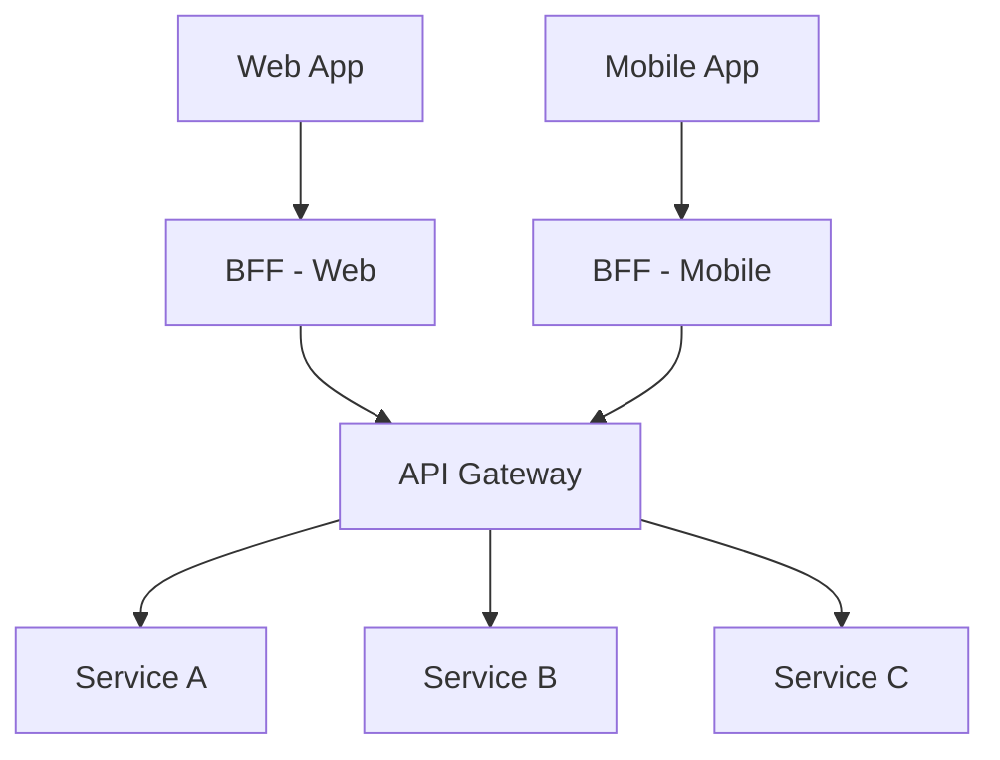
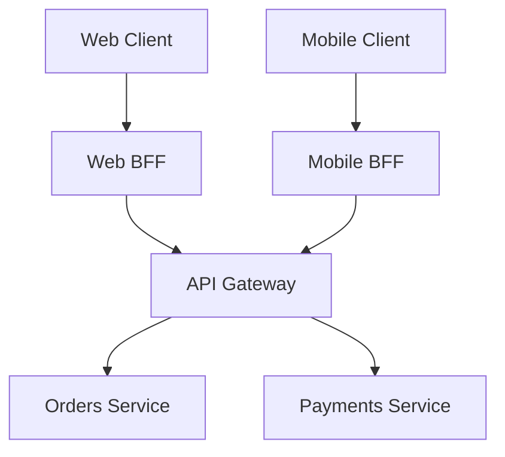

# API Gateway & Backend for Frontend (BFF) Pattern

## Introduction
In microservices architectures, clients (mobile apps, web apps, IoT devices) often need to interact with multiple backend services. Without an intermediary, clients must:  
- Make multiple calls to different services.  
- Handle authentication, retries, and data aggregation themselves.  
- Deal with inconsistent APIs.  

This leads to **tight coupling**, **complex client code**, and **security risks**.  

The **API Gateway Pattern** solves this by providing a **single entry point** for all clients, handling cross-cutting concerns like:  
- Authentication & authorization.  
- Request routing.  
- Aggregation of responses.  
- Rate limiting, logging, and monitoring.  

The **Backend for Frontend (BFF) Pattern** extends this idea by providing **separate gateways per client type** (e.g., web vs mobile), tailoring APIs to each client’s needs.  

---

## Intent
> **The API Gateway Pattern centralizes cross-cutting concerns and simplifies client communication with microservices. The BFF Pattern tailors APIs to specific clients (web, mobile, IoT) to optimize performance and UX.**  

---

## Structure

### API Gateway
- Acts as facade/proxy between clients and services.  
- Routes requests, aggregates responses, applies policies.  

### BFF (Backend for Frontend)
- Separate gateway layer per client type.  
- Customizes endpoints for web, mobile, IoT.  



✅ API Gateway = single entry point.  
✅ BFF = tailored gateways for clients.  

---

## Participants

1. **Clients**  
   - Web, mobile, IoT apps.  

2. **API Gateway**  
   - Central router, policy enforcer, aggregator.  

3. **BFF Gateways**  
   - Client-specific facades.  

4. **Backend Services**  
   - Microservices providing functionality.  

---

## Collaboration Flow
1. Client sends request → BFF (or API Gateway directly).  
2. Gateway authenticates, routes, or aggregates.  
3. Backend services process request.  
4. Gateway/BFF returns optimized response.  

---

## Implementation in Java

### API Gateway (Spring Cloud Gateway)
```java
@SpringBootApplication
public class ApiGatewayApp {
    public static void main(String[] args) {
        SpringApplication.run(ApiGatewayApp.class, args);
    }

    @Bean
    public RouteLocator routes(RouteLocatorBuilder builder) {
        return builder.routes()
            .route("order", r -> r.path("/orders/**").uri("lb://ORDER-SERVICE"))
            .route("payment", r -> r.path("/payments/**").uri("lb://PAYMENT-SERVICE"))
            .build();
    }
}
```

### BFF Example
- Web app needs detailed responses.  
- Mobile app needs lightweight summaries.  

**Web BFF**
```java
@RestController
@RequestMapping("/web")
public class WebBffController {
    @GetMapping("/dashboard")
    public Dashboard getDashboard() {
        // Aggregate multiple services
        Orders orders = orderClient.getRecentOrders();
        Payments payments = paymentClient.getRecentPayments();
        return new Dashboard(orders, payments);
    }
}
```

**Mobile BFF**
```java
@RestController
@RequestMapping("/mobile")
public class MobileBffController {
    @GetMapping("/summary")
    public Summary getSummary() {
        // Lightweight response for mobile
        return new Summary(orderClient.getSummary(), paymentClient.getSummary());
    }
}
```

---

## Consequences

### Benefits
1. **Simplifies Clients** – Clients only call one endpoint.  
2. **Centralizes Cross-Cutting Concerns** – Auth, logging, rate limiting.  
3. **Improves Security** – Clients never call services directly.  
4. **Optimizes UX (BFF)** – Tailored APIs per client.  
5. **Scalability** – Gateways can scale independently.  

### Drawbacks
1. **Single Point of Failure** – Gateway must be resilient.  
2. **Added Latency** – Extra hop in network.  
3. **Complexity** – More moving parts.  
4. **Versioning Overhead** – BFFs may require frequent updates.  

---

## Real-World Case Studies

### 1. Netflix API Gateway
- Handles billions of requests daily.  
- Provides security, routing, and aggregation.  

### 2. Spotify BFFs
- Different BFFs for web, mobile, TV clients.  
- Each optimized for device needs.  

### 3. Amazon
- Uses gateways for routing traffic at scale.  
- Provides caching, rate limiting, and failover.  

---

## Extended Case Study: E-commerce Platform

### Problem
Mobile and web clients call multiple services directly, leading to:  
- Too many requests.  
- Inconsistent responses.  
- Security gaps.  

### Solution: API Gateway + BFF
- Clients call **BFF layer**.  
- BFF aggregates and transforms data.  
- API Gateway routes to microservices.  

✅ Improved performance on mobile (fewer requests).  
✅ Consistent APIs across web and mobile.  
✅ Easier to evolve backend services.  

---

## Interview Prep

### Q1: *What is the API Gateway Pattern?*  
**Answer:** A single entry point for client requests, handling routing, authentication, and cross-cutting concerns.  

### Q2: *What is the BFF Pattern?*  
**Answer:** Extension of API Gateway — separate gateways tailored to each client type (web, mobile, IoT).  

### Q3: *What are pros and cons of API Gateway?*  
**Answer:** Pros: simplified clients, centralized concerns, security. Cons: single point of failure, latency, complexity.  

### Q4: *Why use BFFs instead of one gateway?*  
**Answer:** Different clients have different needs (data size, format, frequency). BFFs optimize for each.  

### Q5: *Give a real-world example.*  
**Answer:** Spotify uses separate BFFs for web, mobile, and TV apps.  

---

## Visualizing API Gateway + BFF


✅ Web and Mobile get tailored APIs.  
✅ API Gateway secures and routes traffic.  

---

## Key Takeaways
- **API Gateway Pattern** = single entry point, centralized concerns.  
- **BFF Pattern** = separate gateways for client types.  
- Benefits: simplicity, security, optimized UX.  
- Drawbacks: extra complexity, latency, versioning overhead.  
- Used at Netflix, Spotify, Amazon at massive scale.  

---

## Next Lesson
Next, we’ll explore the **Database per Service Pattern** — designing database ownership in microservices.  

[Continue to Database per Service Pattern →](/interview-section/architectural-design-patterns/database-per-service)

---

<footer>
  <p>Connect: <a href="https://www.linkedin.com/in/ravi-shankar-a725b0225/">LinkedIn</a></p>
  <p>&copy; 2025 Official CTO. All rights reserved.</p>
</footer>
