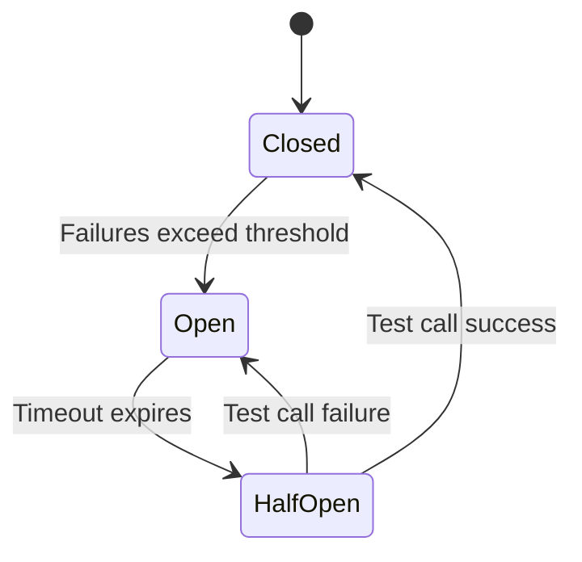
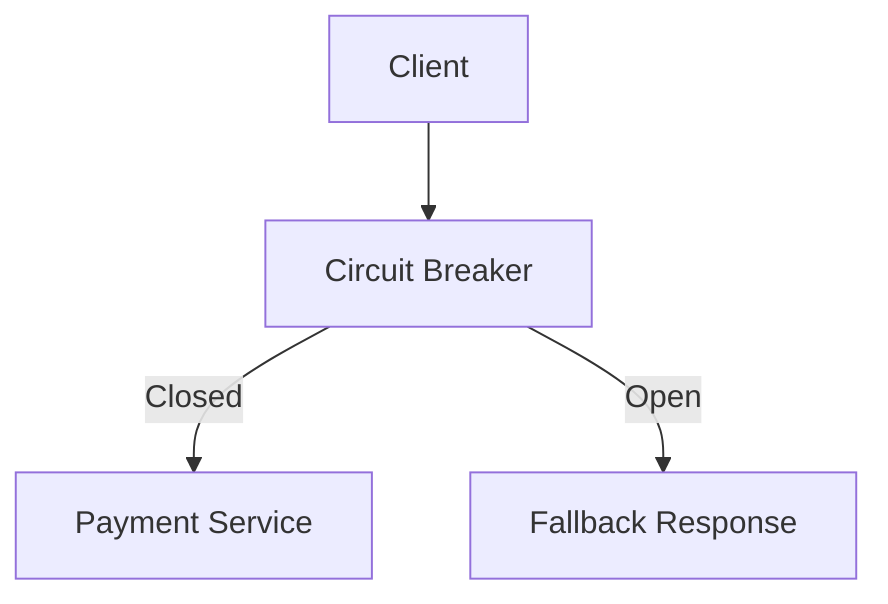

# Circuit Breaker Pattern

## Introduction
In distributed systems, remote calls to services and databases can fail due to:  
- Network issues.  
- Service downtime.  
- High latency or overload.  

Without protection, repeated failed calls can:  
- Waste resources.  
- Cause cascading failures.  
- Take down entire systems.  

The **Circuit Breaker Pattern** solves this by **wrapping calls to external services in a protective mechanism** that:  
- Detects failures.  
- Stops repeated failing calls (opens the circuit).  
- Allows recovery after a cooldown.  

---

## Intent
> **The Circuit Breaker Pattern prevents cascading failures by monitoring service calls, short-circuiting failures, and allowing recovery after failures subside.**  

---

## Structure

### Circuit States
1. **Closed (Normal)**  
   - Calls flow normally.  
   - Failures monitored.  

2. **Open (Tripped)**  
   - Too many failures → stop calling service.  
   - Fail fast with error/fallback.  

3. **Half-Open (Test Mode)**  
   - After cooldown, allow a few test calls.  
   - If success → close again, else reopen.  



✅ Prevents continuous failure storm.  
✅ Gives service time to recover.  

---

## Participants

1. **Service Caller**  
   - Makes calls wrapped by circuit breaker.  

2. **Circuit Breaker Component**  
   - Tracks failures and state (Closed, Open, Half-Open).  

3. **Fallback Logic**  
   - Provides default behavior when circuit open.  

---

## Collaboration Flow
1. Caller invokes service via circuit breaker.  
2. Circuit breaker decides whether to allow or block call.  
3. On repeated failures, breaker opens.  
4. After cooldown, breaker half-opens to test recovery.  

---

## Implementation in Java

### Using Resilience4j (Popular Library)
```java
CircuitBreakerConfig config = CircuitBreakerConfig.custom()
    .failureRateThreshold(50)
    .waitDurationInOpenState(Duration.ofSeconds(10))
    .slidingWindowSize(20)
    .build();

CircuitBreaker circuitBreaker = CircuitBreaker.of("paymentService", config);

Supplier<String> decoratedSupplier = 
    CircuitBreaker.decorateSupplier(circuitBreaker, () -> paymentService.call());

Try<String> result = Try.ofSupplier(decoratedSupplier)
    .recover(throwable -> "Payment service unavailable");
```

✅ Automatically tracks failures.  
✅ Provides fallback on open circuit.  

---

### Manual Implementation (Simplified)
```java
public class SimpleCircuitBreaker {
    private int failureCount = 0;
    private final int threshold = 3;
    private boolean open = false;
    private long lastFailureTime;

    public String call(Supplier<String> service) {
        if(open && System.currentTimeMillis() - lastFailureTime < 10000) {
            return "Service unavailable (circuit open)";
        }

        try {
            String result = service.get();
            failureCount = 0;
            open = false;
            return result;
        } catch(Exception e) {
            failureCount++;
            lastFailureTime = System.currentTimeMillis();
            if(failureCount >= threshold) open = true;
            throw e;
        }
    }
}
```

---

## Consequences

### Benefits
1. **Prevents Cascading Failures** – Stops storm of retries.  
2. **Fail Fast** – Users get quick error instead of hanging.  
3. **Recovery Support** – Half-open state tests recovery.  
4. **Fallbacks** – Provide degraded functionality.  

### Drawbacks
1. **Complexity** – Adds state machine logic.  
2. **Configuration Tuning** – Thresholds, cooldowns tricky.  
3. **False Positives** – May block service that was temporarily slow.  

---

## Real-World Case Studies

### 1. Netflix (Hystrix → Resilience4j)
- Pioneered circuit breaker in microservices.  
- Prevented cascading failures in streaming platform.  

### 2. Amazon
- Uses circuit breakers for payment & recommendation services.  
- Ensures checkout not blocked by optional services.  

### 3. Banking Systems
- Circuit breakers prevent outages from external payment gateways.  

---

## Extended Java Case Study: E-commerce Checkout

### Problem
Checkout depends on Payment Service. If Payment is down, repeated calls overwhelm system.  

### Solution: Apply Circuit Breaker
```java
CircuitBreakerConfig config = CircuitBreakerConfig.custom()
    .failureRateThreshold(50)
    .waitDurationInOpenState(Duration.ofSeconds(5))
    .build();

CircuitBreaker cb = CircuitBreaker.of("payment", config);

Supplier<String> supplier = 
    CircuitBreaker.decorateSupplier(cb, () -> paymentService.process(order));

Try<String> result = Try.ofSupplier(supplier)
    .recover(ex -> "Payment temporarily unavailable, try again later");
```

✅ Checkout service fails fast.  
✅ Customers get friendly fallback.  

---

## Interview Prep

### Q1: *What problem does the Circuit Breaker Pattern solve?*  
**Answer:** Prevents cascading failures by stopping repeated calls to a failing service.  

### Q2: *What are the states of a circuit breaker?*  
**Answer:** Closed, Open, Half-Open.  

### Q3: *How does it differ from retries?*  
**Answer:** Retries keep trying; circuit breaker stops calling after threshold.  

### Q4: *What’s a real-world example?*  
**Answer:** Netflix Hystrix used to protect microservices from failures.  

### Q5: *How do you configure thresholds?*  
**Answer:** Based on failure rate, time window, and business SLAs.  

---

## Visualizing Circuit Breaker Pattern


✅ Circuit breaker between client and service.  
✅ Prevents storm of failing calls.  

---

## Key Takeaways
- **Circuit Breaker Pattern** protects against cascading failures.  
- States: Closed, Open, Half-Open.  
- Provides **fast failure** and **fallbacks**.  
- Used heavily in Netflix, Amazon, and banking systems.  
- Best combined with retries, timeouts, and bulkheads.  

---

## Next Lesson
Next, we’ll explore the **API Gateway / Backend for Frontend (BFF) Pattern** — managing cross-cutting concerns at the service entry point.  

[Continue to API Gateway / BFF Pattern →](/interview-section/architectural-design-patterns/api-gateway-bff)

---

<footer>
  <p>Connect: <a href="https://www.linkedin.com/in/ravi-shankar-a725b0225/">LinkedIn</a></p>
  <p>&copy; 2025 Official CTO. All rights reserved.</p>
</footer>
