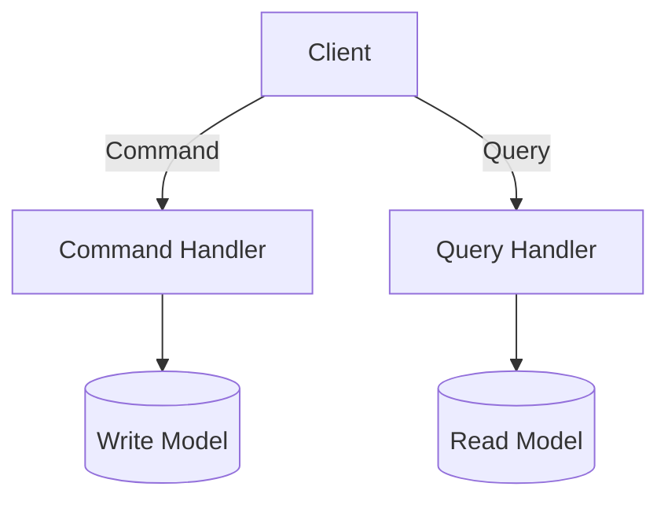

# CQRS (Command Query Responsibility Segregation) Pattern

## Introduction
In traditional CRUD-based systems, the same data model is used for both **reads (queries)** and **writes (commands)**. While simple, this approach struggles at scale:  
- Queries often require complex joins or aggregations.  
- Writes may need strict validation and transactional guarantees.  
- The same model ends up overcomplicated, trying to satisfy both needs.  

The **CQRS Pattern (Command Query Responsibility Segregation)** addresses this by **separating read and write responsibilities**.  
- **Commands**: Modify state (writes).  
- **Queries**: Retrieve state (reads).  

This separation simplifies models, improves performance, and works well with **event-driven systems**.  

---

## Intent
> **The intent of the CQRS Pattern is to separate command (write) and query (read) responsibilities into distinct models to improve scalability, clarity, and performance.**  

---

## Structure

### Core Components
1. **Command Model**
   - Handles state changes.  
   - Enforces business rules.  

2. **Query Model**
   - Handles data retrieval.  
   - Optimized for reads (e.g., denormalized views).  

3. **Command Handlers**
   - Execute commands (e.g., placeOrder).  

4. **Query Handlers**
   - Execute queries (e.g., getOrderHistory).  



✅ Separation of concerns.  
✅ Optimized for both read and write paths.  

---

## Participants

1. **Commands**
   - Represent user intent to change state.  
   - Example: `PlaceOrderCommand`.  

2. **Command Handlers**
   - Validate and apply business logic.  
   - Persist changes to write model.  

3. **Queries**
   - Represent data retrieval requests.  
   - Example: `GetOrderHistoryQuery`.  

4. **Query Handlers**
   - Fetch from read-optimized model.  

---

## Collaboration Flow
1. Client issues **command** → Command Handler → Write Model.  
2. Client issues **query** → Query Handler → Read Model.  
3. (Optional) Event sourcing or replication keeps read model updated.  

---

## Implementation in Java

### Command
```java
public class PlaceOrderCommand {
    private final String orderId;
    private final double total;
    public PlaceOrderCommand(String orderId, double total) {
        this.orderId = orderId; this.total = total;
    }
    public String getOrderId() { return orderId; }
    public double getTotal() { return total; }
}
```

### Command Handler
```java
@Service
public class PlaceOrderHandler {
    private final OrderRepository repository;
    public PlaceOrderHandler(OrderRepository repository) { this.repository = repository; }

    public void handle(PlaceOrderCommand cmd) {
        if(cmd.getTotal() <= 0) throw new IllegalArgumentException();
        repository.save(new Order(cmd.getOrderId(), cmd.getTotal()));
    }
}
```

### Query
```java
public class GetOrderQuery {
    private final String orderId;
    public GetOrderQuery(String orderId) { this.orderId = orderId; }
    public String getOrderId() { return orderId; }
}
```

### Query Handler
```java
@Service
public class GetOrderHandler {
    private final JdbcTemplate jdbc;
    public GetOrderHandler(JdbcTemplate jdbc) { this.jdbc = jdbc; }

    public Order handle(GetOrderQuery query) {
        return jdbc.queryForObject("SELECT * FROM orders WHERE id = ?",
            new Object[]{query.getOrderId()},
            (rs, rowNum) -> new Order(rs.getString("id"), rs.getDouble("total")));
    }
}
```

✅ Write model handles validation.  
✅ Read model optimized for queries.  

---

## Consequences

### Benefits
1. **Optimized Models** – Separate read/write models tailored for their purpose.  
2. **Scalability** – Independent scaling of read vs write workloads.  
3. **Clarity** – Commands express intent, queries express retrieval.  
4. **Event Sourcing Friendly** – Commands emit events, queries read projections.  
5. **Security** – Easier to enforce different authorization on commands vs queries.  

### Drawbacks
1. **Complexity** – More moving parts than CRUD.  
2. **Consistency** – Eventual consistency between write and read models.  
3. **Learning Curve** – Developers must understand commands, queries, events.  

---

## Real-World Case Studies

### 1. Banking Systems
- Commands enforce strict rules for transactions.  
- Queries optimized for statements/history.  

### 2. E-commerce Platforms
- Order placement (command).  
- Order history lookup (query).  

### 3. Event-Sourced Systems
- Commands emit events.  
- Read models updated asynchronously for queries.  

---

## Extended Java Case Study

### Traditional CRUD (Monolithic)
```java
@RestController
@RequestMapping("/orders")
public class OrderController {
    @Autowired private OrderRepository repo;

    @PostMapping
    public void placeOrder(@RequestBody Order order) { repo.save(order); }

    @GetMapping("/{id}")
    public Order getOrder(@PathVariable String id) { return repo.findById(id).orElseThrow(); }
}
```

❌ Same model for reads/writes.  
❌ Hard to optimize queries without breaking writes.  

### CQRS Approach
- `PlaceOrderCommand` handled by `PlaceOrderHandler`.  
- `GetOrderQuery` handled by `GetOrderHandler`.  
- Separation allows different optimizations.  

✅ Clean separation of responsibilities.  

---

## Interview Prep

### Q1: *What is CQRS?*  
**Answer:** A pattern that separates read (query) and write (command) responsibilities into different models and handlers.  

### Q2: *What are pros and cons of CQRS?*  
**Answer:** Pros: optimized models, scalability, clarity. Cons: complexity, eventual consistency.  

### Q3: *How does CQRS relate to event sourcing?*  
**Answer:** CQRS works well with event sourcing: commands produce events, read models consume them.  

### Q4: *When should you use CQRS?*  
**Answer:** For complex domains with different read/write workloads. Avoid in simple CRUD apps.  

### Q5: *Give a real-world example.*  
**Answer:** Banking: money transfer = command, account balance lookup = query.  

---

## Visualizing CQRS Pattern


✅ Clear separation of paths.  

---

## Key Takeaways
- **CQRS Pattern** separates read and write models.  
- **Commands** modify state, **queries** fetch state.  
- Benefits: scalability, optimized models, clarity.  
- Drawbacks: complexity, eventual consistency.  
- Works well with **event sourcing and microservices**.  

---

## Next Lesson
Next, we’ll dive into **Event Sourcing Pattern** — persisting events instead of state, often combined with CQRS for full power.  

[Continue to Event Sourcing Pattern →](/interview-section/architectural-design-patterns/event-sourcing-pattern)

---

<footer>
  <p>Connect: <a href="https://www.linkedin.com/in/ravi-shankar-a725b0225/">LinkedIn</a></p>
  <p>&copy; 2025 Official CTO. All rights reserved.</p>
</footer>
