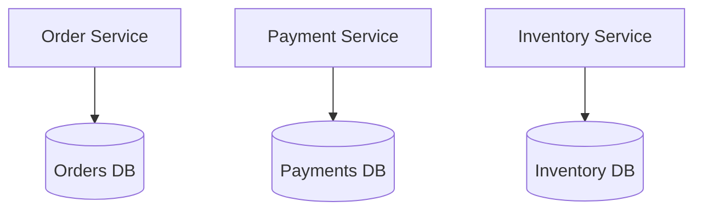
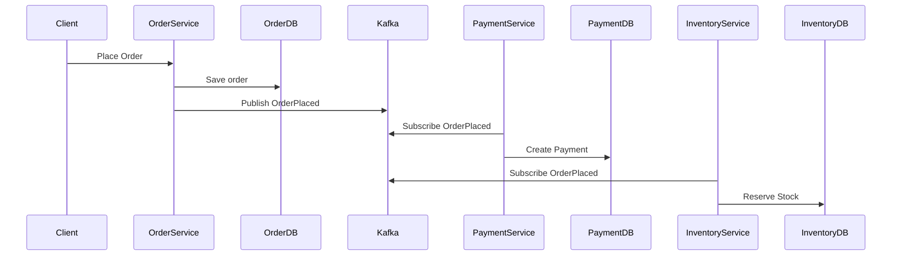
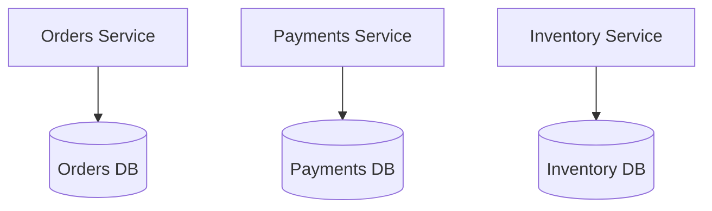

# Database per Service Pattern

## Introduction
One of the most debated topics in microservices architecture is **how to manage data**. In monolithic systems, a single **shared database** is common. All modules read and write to the same schema.  

But in microservices, this creates tight coupling, hidden dependencies, and performance bottlenecks. The **Database per Service Pattern** solves this by giving **each microservice its own database**:  
- Service owns its schema and data.  
- No direct cross-service DB access.  
- Communication happens via APIs or events.  

This enforces **strong boundaries** and aligns with the principle: *“A microservice owns its data store.”*  

---

## Intent
> **The Database per Service Pattern enforces service autonomy by giving each service exclusive ownership of its database, preventing hidden coupling and enabling independent scalability.**  

---

## Structure

### Database per Service
- Each service → separate schema/database.  
- No direct joins across services.  
- Services communicate through APIs/events.  

### Anti-Pattern: Shared Database
- Multiple services share single schema.  
- Leads to tight coupling and “hidden integration.”  



✅ Each service owns its DB.  
✅ Communication only through APIs/events.  

---

## Participants

1. **Service**  
   - Business logic + API.  

2. **Service Database**  
   - Exclusive to that service.  

3. **Integration Mechanism**  
   - API calls or event-driven messages.  

---

## Collaboration Flow
1. Service receives request.  
2. Reads/writes only to its own DB.  
3. If other data needed → call other service API or subscribe to events.  

---

## Implementation in Java

### Spring Boot with Separate Databases
```java
@Configuration
@EnableJpaRepositories(
  basePackages = "com.example.orders",
  entityManagerFactoryRef = "ordersEntityManager",
  transactionManagerRef = "ordersTxManager"
)
public class OrdersDbConfig {

    @Bean
    @ConfigurationProperties("spring.datasource.orders")
    public DataSourceProperties ordersDataSourceProperties() {
        return new DataSourceProperties();
    }

    @Bean
    public DataSource ordersDataSource() {
        return ordersDataSourceProperties().initializeDataSourceBuilder().build();
    }
}
```

✅ Each microservice configures its own DB.  

---

### Communication Between Services
- **Option 1: REST API**  
  ```java
  @RestController
  public class PaymentController {
      @GetMapping("/payments/{orderId}")
      public Payment getPayment(@PathVariable String orderId) {
          return paymentRepository.findByOrderId(orderId);
      }
  }
  ```

- **Option 2: Event-Driven (Kafka)**  
  ```java
  @Service
  public class PaymentEventPublisher {
      private final KafkaTemplate<String, PaymentEvent> kafkaTemplate;

      public void publish(PaymentEvent event) {
          kafkaTemplate.send("payments", event);
      }
  }
  ```

---

## Consequences

### Benefits
1. **Service Autonomy** – Each service evolves independently.  
2. **Scalability** – Scale services + DB independently.  
3. **Fault Isolation** – DB failure limited to one service.  
4. **Tech Flexibility** – Each service chooses DB tech (SQL, NoSQL).  

### Drawbacks
1. **Complex Queries** – No cross-service joins. Must use APIs/events.  
2. **Data Duplication** – Services may store overlapping data.  
3. **Consistency Challenges** – Eventual consistency replaces ACID transactions.  
4. **Operational Overhead** – Managing many databases.  

---

## Real-World Case Studies

### 1. Netflix
- Uses **Database per Service** to allow massive scaling.  
- Services replicate necessary data via events.  

### 2. Amazon
- Each team/service owns its data store.  
- Enables “you build it, you run it” model.  

### 3. Banking Systems
- Account service, loan service, transaction service each have separate databases.  
- Ensures regulatory isolation.  

---

## Extended Case Study: E-commerce Platform

### Problem
E-commerce monolith has single DB with orders, payments, inventory tables. Tight coupling → schema changes break multiple modules.  

### Solution: Database per Service
- Split into OrderDB, PaymentDB, InventoryDB.  
- Order Service publishes `OrderPlaced` event.  
- Payment & Inventory subscribe and update their own DBs.  



✅ Loosely coupled services.  
✅ Each DB owned independently.  

---

## Interview Prep

### Q1: *Why not use a shared database?*  
**Answer:** Shared DB couples services, hides dependencies, and prevents independent scaling.  

### Q2: *What are challenges of Database per Service?*  
**Answer:** No joins, eventual consistency, duplication, operational overhead.  

### Q3: *How do services share data?*  
**Answer:** Via APIs or event-driven replication.  

### Q4: *Can services use different DB technologies?*  
**Answer:** Yes — polyglot persistence is a benefit.  

### Q5: *Give a real-world example.*  
**Answer:** Amazon uses Database per Service across its microservices.  

---

## Visualizing Database per Service


✅ Clear service-to-DB ownership.  

---

## Key Takeaways
- Database per Service = **one DB per microservice**.  
- Prevents tight coupling of shared DBs.  
- Enables autonomy, scalability, tech diversity.  
- Challenges: joins, duplication, consistency.  
- Used by Amazon, Netflix, banks at scale.  

---

## Next Lesson
Next, we’ll wrap up the series with **case studies and interview prep** that tie all principles and patterns together.  

---

<footer>
  <p>Connect: <a href="https://www.linkedin.com/in/ravi-shankar-a725b0225/">LinkedIn</a></p>
  <p>&copy; 2025 Official CTO. All rights reserved.</p>
</footer>
