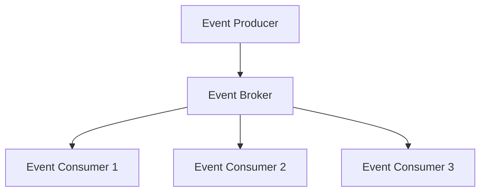

# Event-Driven Architecture Pattern

## Introduction
In an era of **real-time applications**, **high concurrency**, and **global-scale platforms**, traditional synchronous request-response models often fail to meet performance and scalability needs.  

The **Event-Driven Architecture (EDA) Pattern** is designed to solve this problem by using **asynchronous events** as the backbone of communication. Instead of direct service-to-service calls, components produce and consume events via an event channel (broker).  

This pattern powers companies like **Netflix**, **Uber**, **Airbnb**, and **Amazon**, where millions of events flow every second to keep systems responsive and scalable.  

---

## Intent
> **The Event-Driven Architecture Pattern’s intent is to decouple producers and consumers by communicating through asynchronous events, enabling scalability, responsiveness, and extensibility.**  

---

## Structure

### Core Components
1. **Event Producers**  
   - Generate events (e.g., `OrderPlaced`).  

2. **Event Channels (Brokers)**  
   - Transport events asynchronously (Kafka, RabbitMQ, AWS SNS/SQS).  

3. **Event Consumers**  
   - Subscribe to events and react to them.  

4. **Event Store (Optional)**  
   - Persistent storage of events for replay, auditing, recovery.  



✅ Producers don’t know consumers.  
✅ Consumers can scale independently.  

---

## Participants

1. **Producers**
   - Emit domain events.  
   - Example: Order Service emits `OrderPlaced`.  

2. **Consumers**
   - React to domain events.  
   - Example: Payment Service listens to `OrderPlaced`.  

3. **Event Broker**
   - Middleware that ensures reliable delivery.  
   - Examples: Kafka, RabbitMQ, ActiveMQ, AWS EventBridge.  

4. **Event Store (Optional)**
   - Append-only log of events for replay.  
   - Ensures event sourcing and recovery.  

---

## Collaboration Flow
1. Producer emits event.  
2. Event broker delivers to all subscribed consumers.  
3. Consumers react independently.  

✅ Loose coupling.  
✅ Independent scalability.  

---

## Implementation in Java

### Producer (Spring Boot + Kafka)
```java
@Service
public class OrderService {
    private final KafkaTemplate<String, String> kafkaTemplate;

    public OrderService(KafkaTemplate<String, String> kafkaTemplate) {
        this.kafkaTemplate = kafkaTemplate;
    }

    public void placeOrder(Order order) {
        // Save order to DB...
        kafkaTemplate.send("orders", "OrderPlaced:" + order.getId());
    }
}
```

### Consumer (Spring Boot + Kafka)
```java
@Service
public class PaymentService {
    @KafkaListener(topics = "orders", groupId = "payment-service")
    public void handleOrder(String message) {
        if(message.startsWith("OrderPlaced:")) {
            System.out.println("Processing payment for " + message);
        }
    }
}
```

✅ Asynchronous.  
✅ Multiple consumers can react independently.  

---

## Consequences

### Benefits
1. **Scalability** – Consumers can scale independently.  
2. **Loose Coupling** – Producers unaware of consumers.  
3. **Extensibility** – Add new consumers without changing producers.  
4. **Resilience** – Failures in one consumer don’t block others.  
5. **Real-Time Processing** – Enables streaming analytics.  

### Drawbacks
1. **Complex Debugging** – Tracing asynchronous flows is hard.  
2. **Eventual Consistency** – No global transaction guarantee.  
3. **Operational Complexity** – Requires managing brokers and monitoring.  
4. **Message Ordering** – Hard to guarantee in distributed brokers.  

---

## Real-World Case Studies

### 1. Netflix
- Event-driven microservices for streaming recommendations.  
- Events like “UserWatched” trigger recommendation engines.  

### 2. Uber
- Trips, drivers, and payments updated asynchronously via events.  
- Ensures responsiveness even during surge load.  

### 3. Amazon
- Order lifecycle managed via events (`OrderPlaced`, `PaymentCompleted`, `Shipped`).  
- Allows independent teams to evolve services.  

---

## Extended Java Case Study

### Scenario: E-commerce Order Workflow

**Step 1: Order Service produces event**
```java
kafkaTemplate.send("orders", "OrderPlaced:" + order.getId());
```

**Step 2: Payment Service consumes event**
```java
@KafkaListener(topics = "orders")
public void handle(String event) { ... }
```

**Step 3: Shipping Service also consumes event**
```java
@KafkaListener(topics = "orders")
public void prepareShipment(String event) { ... }
```

✅ Payment and Shipping independent.  
✅ Adding new services (e.g., Notifications) requires no changes to Order Service.  

---

## Common Pitfalls

1. **Over-Using Events**
   - Not all interactions need events.  
   - Use when decoupling/asynchronicity needed.  

2. **Event Storming Without Discipline**
   - Too many fine-grained events → chaos.  

3. **Eventual Consistency Misunderstood**
   - Consumers see data at different times.  

4. **Broker as Bottleneck**
   - Poorly scaled broker slows entire system.  

---

## Interview Prep

### Q1: *What is the Event-Driven Architecture Pattern?*  
**Answer:** A pattern where producers emit events to a broker, and consumers subscribe to them, enabling decoupled, asynchronous workflows.  

### Q2: *What are pros and cons of event-driven systems?*  
**Answer:** Pros: scalability, extensibility, decoupling. Cons: debugging complexity, eventual consistency.  

### Q3: *What is the role of an event broker?*  
**Answer:** Middleware that routes events reliably between producers and consumers (e.g., Kafka).  

### Q4: *How does EDA impact consistency?*  
**Answer:** Strong consistency is hard; most systems accept eventual consistency.  

### Q5: *Where is event-driven architecture best applied?*  
**Answer:** High-scale, asynchronous, real-time systems like e-commerce, streaming, ride-sharing.  

---

## Visualizing Event-Driven Architecture Pattern
```mermaid
graph TD
  P[Order Service (Producer)] --> B[Kafka Broker]
  B --> Pay[Payment Service (Consumer)]
  B --> Ship[Shipping Service (Consumer)]
  B --> Notif[Notification Service (Consumer)]
```

✅ One event → many consumers.  
✅ Extensible without modifying producer.  

---

## Key Takeaways
- **Event-Driven Architecture** enables decoupled, asynchronous communication.  
- **Producers** emit events, **consumers** subscribe.  
- **Brokers** ensure delivery.  
- Enables scalability, extensibility, and resilience.  
- Challenges: debugging, eventual consistency, broker ops.  

---

## Next Lesson
Next, we’ll explore **CQRS (Command Query Responsibility Segregation)** — separating read and write models for scalability and clarity.  

[Continue to CQRS Pattern →](/interview-section/architectural-design-patterns/cqrs-pattern)

---

<footer>
  <p>Connect: <a href="https://www.linkedin.com/in/ravi-shankar-a725b0225/">LinkedIn</a></p>
  <p>&copy; 2025 Official CTO. All rights reserved.</p>
</footer>
