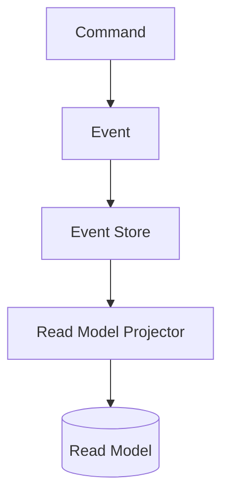
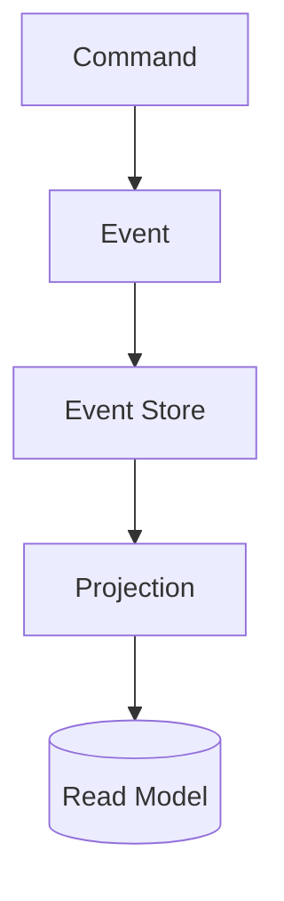

# Event Sourcing Pattern

## Introduction
Traditional systems persist **current state** in a database:  
- Orders table has the latest order record.  
- Bank accounts store the latest balance.  

But this approach loses valuable **history**. For example:  
- How did the account balance change over time?  
- Which events led to the current state?  

The **Event Sourcing Pattern** solves this by **storing all changes (events) to application state as an append-only log**.  
- Current state is reconstructed by replaying events.  
- Provides complete audit trails, replayability, and integration opportunities.  

---

## Intent
> **The Event Sourcing Pattern’s intent is to persist application state as a sequence of events, not just the latest snapshot, enabling auditability, traceability, and replay.**  

---

## Structure

### Core Components
1. **Event Store**
   - Append-only log of domain events.  

2. **Event Publisher**
   - Persists and publishes new events.  

3. **Event Handlers / Projectors**
   - Consume events to update read models.  

4. **Read Models (Projections)**
   - Query-optimized views derived from events.  



✅ Source of truth = events.  
✅ Read models are projections.  

---

## Participants

1. **Commands**
   - User intent that triggers domain behavior.  

2. **Domain Events**
   - Immutable records of what happened.  
   - Example: `OrderPlaced`, `PaymentCompleted`.  

3. **Event Store**
   - Stores events in order, append-only.  

4. **Projections**
   - Build query-optimized models.  

---

## Collaboration Flow
1. Command executes business logic.  
2. Emits domain event.  
3. Event persisted in Event Store.  
4. Handlers project event into read models.  

---

## Implementation in Java

### Domain Event
```java
public class OrderPlacedEvent {
    private final String orderId;
    private final double total;
    private final Instant timestamp;

    public OrderPlacedEvent(String orderId, double total) {
        this.orderId = orderId; this.total = total;
        this.timestamp = Instant.now();
    }
    public String getOrderId() { return orderId; }
    public double getTotal() { return total; }
    public Instant getTimestamp() { return timestamp; }
}
```

### Event Store
```java
public interface EventStore {
    void save(Object event);
    List<Object> getEvents(String aggregateId);
}
```

### Event-Sourced Repository
```java
public class OrderRepository implements EventStore {
    private final Map<String, List<Object>> store = new HashMap<>();

    @Override
    public void save(Object event) {
        store.computeIfAbsent("orders", k -> new ArrayList<>()).add(event);
    }

    @Override
    public List<Object> getEvents(String aggregateId) {
        return store.getOrDefault(aggregateId, new ArrayList<>());
    }
}
```

### Projection (Read Model)
```java
@Service
public class OrderProjection {
    private final Map<String, Double> orderTotals = new HashMap<>();

    public void on(OrderPlacedEvent event) {
        orderTotals.put(event.getOrderId(), event.getTotal());
    }

    public Double getTotal(String orderId) {
        return orderTotals.get(orderId);
    }
}
```

✅ Events stored, not just final state.  
✅ Read model derived from replay.  

---

## Consequences

### Benefits
1. **Auditability** – Complete history of changes.  
2. **Replayability** – Rebuild state anytime.  
3. **Integration** – Events published to other systems.  
4. **Debugging** – Understand exact sequence of actions.  
5. **Event-Driven Friendly** – Naturally integrates with CQRS.  

### Drawbacks
1. **Complexity** – More moving parts.  
2. **Storage Growth** – Event store grows indefinitely.  
3. **Event Versioning** – Schema evolution is tricky.  
4. **Consistency** – Must rebuild projections carefully.  

---

## Real-World Case Studies

### 1. Banking Systems
- Transactions stored as events.  
- Balance derived by summing transactions.  

### 2. E-commerce Platforms
- Orders tracked as events (`OrderPlaced`, `OrderShipped`).  
- Enables customer history and analytics.  

### 3. Event Stores (Tools)
- Axon Framework, EventStoreDB, Kafka.  
- Provide ready-made support for event sourcing.  

---

## Extended Java Case Study

### Traditional Approach (CRUD)
```java
// Latest state only
public class BankAccount {
    private String id;
    private double balance;

    public void deposit(double amount) { balance += amount; }
    public void withdraw(double amount) { balance -= amount; }
}
```

❌ Loses history of deposits/withdrawals.  

### Event Sourcing Approach
```java
public class BankAccount {
    private String id;
    private double balance;
    private List<Object> changes = new ArrayList<>();

    public void deposit(double amount) {
        applyChange(new MoneyDepositedEvent(id, amount));
    }

    public void withdraw(double amount) {
        applyChange(new MoneyWithdrawnEvent(id, amount));
    }

    private void applyChange(Object event) {
        if(event instanceof MoneyDepositedEvent e) balance += e.getAmount();
        if(event instanceof MoneyWithdrawnEvent e) balance -= e.getAmount();
        changes.add(event);
    }
}
```

✅ Full history retained.  
✅ Balance reconstructed from events.  

---

## Interview Prep

### Q1: *What is the Event Sourcing Pattern?*  
**Answer:** A pattern where application state is persisted as a sequence of events, not just final state, enabling auditability and replay.  

### Q2: *What are pros and cons of event sourcing?*  
**Answer:** Pros: auditability, replayability, integration. Cons: complexity, storage growth, event versioning.  

### Q3: *How does event sourcing relate to CQRS?*  
**Answer:** Commands produce events (write side). Queries read projections built from events (read side).  

### Q4: *When should you use event sourcing?*  
**Answer:** In systems needing auditability, history, or replay (banking, trading, e-commerce).  

### Q5: *What challenges exist?*  
**Answer:** Event schema evolution, storage growth, rebuilding projections.  

---

## Visualizing Event Sourcing Pattern


✅ Events as source of truth.  
✅ Read models derived from projections.  

---

## Key Takeaways
- **Event Sourcing** stores events, not just final state.  
- Benefits: auditability, replayability, integration.  
- Challenges: complexity, storage, event versioning.  
- Works well with **CQRS and event-driven systems**.  

---

## Next Lesson
Next, we’ll cover **Saga Pattern** — managing long-running distributed transactions in microservices.  

[Continue to Saga Pattern →](/interview-section/architectural-design-patterns/saga-pattern)

---

<footer>
  <p>Connect: <a href="https://www.linkedin.com/in/ravi-shankar-a725b0225/">LinkedIn</a></p>
  <p>&copy; 2025 Official CTO. All rights reserved.</p>
</footer>
