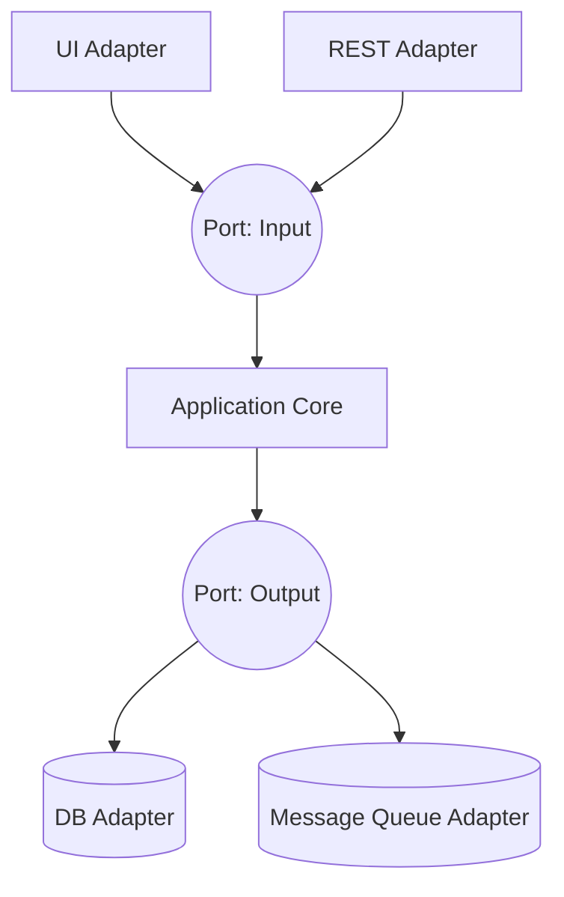
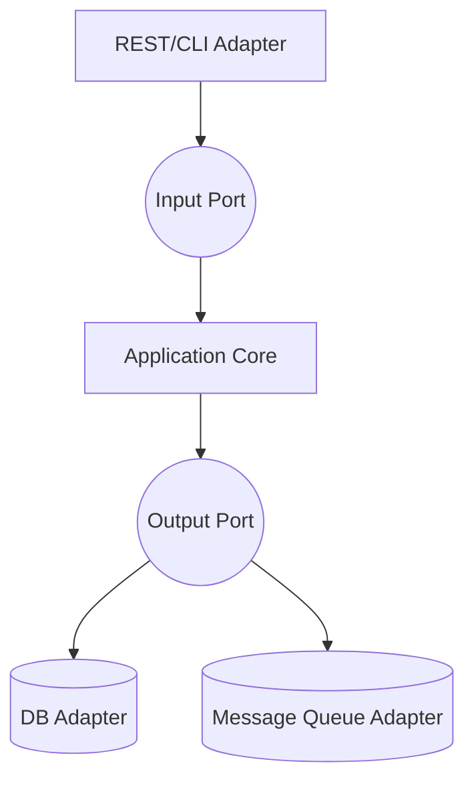

# Hexagonal Architecture Pattern (Ports & Adapters)

## Introduction
As systems evolve, the limitations of the **Layered Architecture Pattern** become evident:  
- Tight coupling between layers.  
- Dependency on frameworks and databases.  
- Difficulty replacing external components.  

To address these challenges, **Alistair Cockburn** introduced the **Hexagonal Architecture Pattern**, also known as the **Ports and Adapters Pattern**, in the early 2000s.  

This pattern emphasizes **independence of the core domain logic** from external concerns like databases, UIs, and frameworks.  
It is one of the foundations of modern approaches like **Onion Architecture** and **Clean Architecture**.  

---

## Intent
> **The Hexagonal Architecture Pattern’s intent is to make the application core independent of external systems by interacting through abstract ports and concrete adapters.**  

This ensures:  
- Business logic is **framework-agnostic**.  
- Easy replacement of external systems (DB, UI, APIs).  
- Improved testability and modularity.  

---

## Structure

### Core Concepts
- **Application Core** (Domain + Use Cases): Contains the business rules.  
- **Ports**: Abstract interfaces defining how the core interacts with the outside world.  
- **Adapters**: Implementations of ports for specific technologies (e.g., REST, SQL, Kafka).  



✅ Core depends only on **ports** (interfaces).  
✅ Adapters depend on core, not vice versa.  

---

## Participants

1. **Application Core**
   - Contains domain models and business use cases.  
   - Framework-agnostic, pure logic.  

2. **Ports**
   - Interfaces that define entry/exit points.  
   - Input Ports: define use cases (what system can do).  
   - Output Ports: define required services (what system needs).  

3. **Adapters**
   - Implement ports with specific technologies.  
   - Example: REST adapter, SQL repository, Kafka publisher.  

---

## Collaboration
- External requests enter via **input adapters** (UI, REST).  
- They invoke **input ports** → handled by application core.  
- Core uses **output ports** to request services (DB, external API).  
- **Output adapters** implement these ports.  

---

## Implementation in Java

### Input Port (Use Case)
```java
public interface OrderUseCase {
    void placeOrder(Order order);
}
```

### Application Core (Use Case Implementation)
```java
public class OrderService implements OrderUseCase {
    private final OrderRepository repository;

    public OrderService(OrderRepository repository) {
        this.repository = repository;
    }

    @Override
    public void placeOrder(Order order) {
        if(order.getTotal() <= 0) throw new IllegalArgumentException();
        repository.save(order);
    }
}
```

### Output Port (Repository Port)
```java
public interface OrderRepository {
    void save(Order order);
}
```

### Output Adapter (JDBC Implementation)
```java
@Repository
public class JdbcOrderRepository implements OrderRepository {
    private final JdbcTemplate jdbc;

    public JdbcOrderRepository(JdbcTemplate jdbc) { this.jdbc = jdbc; }

    @Override
    public void save(Order order) {
        jdbc.update("INSERT INTO orders (id, total) VALUES (?, ?)",
            order.getId(), order.getTotal());
    }
}
```

### Input Adapter (REST Controller)
```java
@RestController
@RequestMapping("/orders")
public class OrderController {
    private final OrderUseCase orderUseCase;

    public OrderController(OrderUseCase orderUseCase) {
        this.orderUseCase = orderUseCase;
    }

    @PostMapping
    public ResponseEntity<String> placeOrder(@RequestBody Order order) {
        orderUseCase.placeOrder(order);
        return ResponseEntity.ok("Order placed");
    }
}
```

✅ Core (`OrderService`) depends only on interfaces.  
✅ Adapters implement ports.  
✅ Easy to replace DB, API, or UI.  

---

## Consequences

### Benefits
1. **Framework Independence** – Core is pure logic, independent of Spring, Hibernate, etc.  
2. **Testability** – Core can be unit-tested by mocking ports.  
3. **Replaceability** – Swap adapters (SQL → NoSQL) without touching core.  
4. **Clear Boundaries** – Business logic isolated from infrastructure.  

### Drawbacks
1. **Complexity** – More interfaces and indirections.  
2. **Over-Engineering Risk** – Small apps may not need hexagonal.  
3. **Learning Curve** – Requires discipline to enforce boundaries.  

---

## Real-World Case Studies

### 1. Banking Systems
- Core domain logic must be independent of frameworks.  
- Hexagonal architecture ensures compliance rules enforced regardless of DB or UI.  

### 2. E-commerce
- Amazon-style cart systems benefit from hexagonal pattern to switch persistence engines (Oracle → DynamoDB).  

### 3. Microservices
- Each microservice can be implemented with hexagonal style, ensuring adaptability.  

---

## Comparison with Layered Architecture

| Aspect              | Layered Architecture | Hexagonal Architecture |
|---------------------|----------------------|-------------------------|
| **Dependency Flow** | Top → Bottom         | Inward (ports/adapters) |
| **Core Isolation**  | Not strict           | Strict core isolation   |
| **Framework Coupling** | Higher            | Lower                   |
| **Best For**        | Simple enterprise apps | Complex, evolving systems |

---

## Extended Java Case Study

### Problem: Switching Database

**Layered Architecture (Rigid)**  
- Business layer depends on JPA repository.  
- Switching DB requires changes across business logic.  

**Hexagonal Architecture (Flexible)**  
- Core depends only on `OrderRepository` interface.  
- Switching from MySQL → MongoDB = implement new adapter, no core change.  

```java
// MongoDB adapter
@Repository
public class MongoOrderRepository implements OrderRepository {
    private final MongoTemplate mongo;
    public MongoOrderRepository(MongoTemplate mongo) { this.mongo = mongo; }

    @Override
    public void save(Order order) {
        mongo.save(order);
    }
}
```

✅ Core unchanged.  
✅ Adapter swapped.  

---

## Interview Prep

### Q1: *What is the Hexagonal Architecture Pattern?*  
**Answer:** A pattern where application core communicates with external systems via abstract ports and adapters, ensuring independence of business logic.  

### Q2: *How does it differ from layered architecture?*  
**Answer:** Layered architecture enforces top-to-bottom dependencies, while hexagonal inverts dependencies: core depends only on ports, adapters depend on core.  

### Q3: *What are input vs output ports?*  
**Answer:** Input ports define use cases (actions system can perform). Output ports define required services (actions system needs).  

### Q4: *What are pros and cons of hexagonal?*  
**Answer:** Pros: independence, testability, replaceability. Cons: complexity, over-engineering risk.  

### Q5: *Where is hexagonal architecture useful?*  
**Answer:** Large, evolving systems with frequent tech changes, such as banking, e-commerce, and microservices.  

---

## Visualizing Hexagonal Architecture Pattern


✅ Core isolated.  
✅ Adapters replaceable.  

---

## Key Takeaways
- **Hexagonal Architecture Pattern** (Ports & Adapters) isolates business logic from frameworks and infrastructure.  
- **Ports** = abstract contracts; **Adapters** = concrete implementations.  
- Provides **testability, replaceability, framework independence**.  
- More complex than layered architecture, but valuable for evolving systems.  

---

## Next Lesson
Next, we’ll explore the **Onion Architecture Pattern**, which builds on the same principles of core independence with concentric rings of abstraction.  

[Continue to Onion Architecture Pattern →](/interview-section/architectural-design-patterns/onion-architecture)

---

<footer>
  <p>Connect: <a href="https://www.linkedin.com/in/ravi-shankar-a725b0225/">LinkedIn</a></p>
  <p>&copy; 2025 Official CTO. All rights reserved.</p>
</footer>
