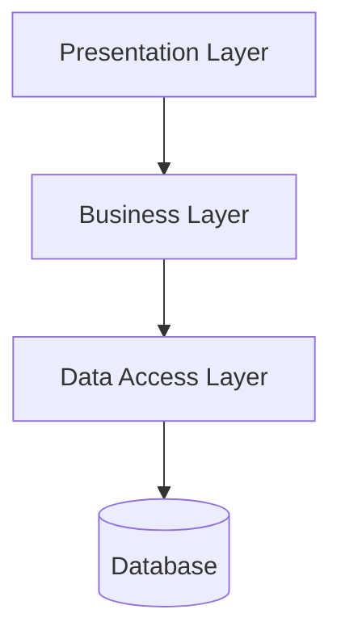
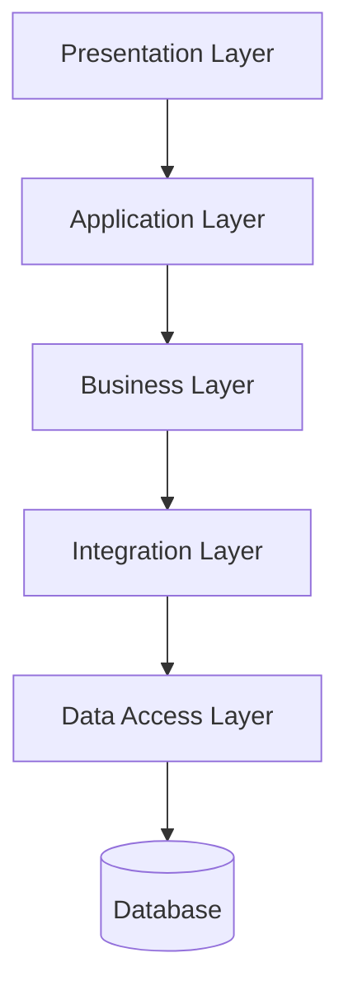
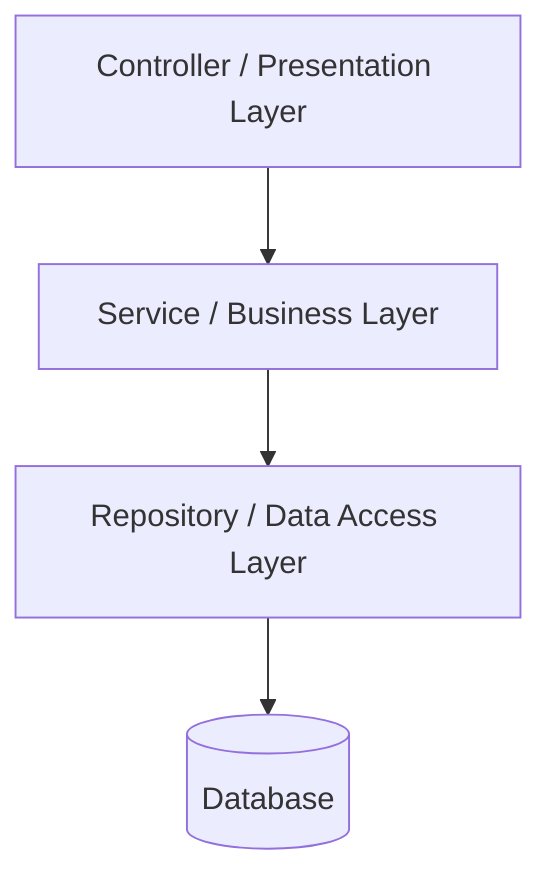

# Layered Architecture Pattern

## Introduction
The **Layered Architecture Pattern**, also known as the **n-tier architecture pattern**, is one of the most widely adopted patterns in enterprise application development.  
It organizes software into distinct **layers**, each with specific responsibilities, and enforces rules about how layers interact.  

This pattern has been the backbone of **enterprise Java applications**, **banking systems**, **e-commerce platforms**, and even served as the starting point for companies like **Amazon and Netflix** before they moved toward microservices.  

In this lesson, we’ll cover:  
1. **Intent of the Layered Architecture Pattern**.  
2. **Structure (3-tier and n-tier variants)**.  
3. **Participants and responsibilities**.  
4. **How layers collaborate**.  
5. **Consequences: benefits and drawbacks**.  
6. **Implementation in Java (Spring Boot)**.  
7. **Real-world case studies**.  
8. **Interview questions**.  

---

## Intent
> **The Layered Architecture Pattern’s intent is to separate concerns by organizing software into layers, each responsible for a specific role, ensuring maintainability, testability, and modularity.**  

---

## Structure

### Classic 3-Tier Architecture
- **Presentation Layer (UI)**: Handles user interactions.  
- **Business Layer (Service/Domain)**: Implements business rules.  
- **Data Access Layer (Persistence/Repository)**: Manages data storage.  



### N-Tier Architecture
Extends the 3-tier model by adding more layers such as:  
- **Application Layer**: Orchestration and workflows.  
- **Integration Layer**: Communicating with external systems.  
- **Service Layer**: Providing APIs for other systems.  



---

## Participants

1. **Presentation Layer**
   - UI screens, REST controllers, APIs.  
   - Converts user requests into service calls.  

2. **Business Layer**
   - Domain logic, policies, and workflows.  
   - Core of the system.  

3. **Data Access Layer**
   - Repositories, DAOs.  
   - Hides persistence details (SQL, NoSQL, etc.).  

4. **Optional Layers**
   - Application Layer: Orchestration between services.  
   - Integration Layer: External API communication.  

---

## Collaboration

- **Strict Dependency Rule**: Each layer can only call the layer directly below it.  
- Presentation → Business → Data.  
- No “skipping layers” (e.g., controller querying DB directly).  

---

## Implementation in Java

### Controller (Presentation Layer)
```java
@RestController
@RequestMapping("/orders")
public class OrderController {
    private final OrderService orderService;
    public OrderController(OrderService orderService) { this.orderService = orderService; }

    @PostMapping
    public ResponseEntity<String> placeOrder(@RequestBody Order order) {
        orderService.placeOrder(order);
        return ResponseEntity.ok("Order placed");
    }
}
```

### Service (Business Layer)
```java
@Service
public class OrderService {
    private final OrderRepository repository;
    public OrderService(OrderRepository repository) { this.repository = repository; }

    public void placeOrder(Order order) {
        if(order.getTotal() <= 0) throw new IllegalArgumentException();
        repository.save(order);
    }
}
```

### Repository (Data Access Layer)
```java
@Repository
public class OrderRepository {
    private final JdbcTemplate jdbc;
    public OrderRepository(JdbcTemplate jdbc) { this.jdbc = jdbc; }

    public void save(Order order) {
        jdbc.update("INSERT INTO orders (id, total) VALUES (?, ?)", order.getId(), order.getTotal());
    }
}
```

✅ Separation of concerns enforced.  
✅ Business rules isolated from persistence.  

---

## Consequences

### Benefits
1. **Separation of Concerns** – Clean modularization.  
2. **Reusability** – Business logic reused across UIs.  
3. **Testability** – Each layer testable in isolation.  
4. **Maintainability** – Changes localized to one layer.  
5. **Standardization** – Widely known pattern, easy onboarding.  

### Drawbacks
1. **Rigidity** – Hard to bypass layers when performance optimization needed.  
2. **Overhead** – Extra layers can slow execution.  
3. **Anemic Business Layer** – Logic sometimes leaks into controllers or DAOs.  
4. **Layer Skipping Temptation** – Developers may break rules for shortcuts.  

---

## Real-World Case Studies

### 1. Spring Framework (Java EE)
- Encourages `@Controller`, `@Service`, `@Repository`.  
- Enforces 3-tier layering by convention.  

### 2. Banking Systems
- Strict separation to enforce compliance rules.  
- Business logic in service layer, not in controllers.  

### 3. Amazon (Early Days)
- Monolithic layered architecture.  
- Later evolved into services, but layering principles still apply inside services.  

### 4. Netflix (Early Monolith)
- Before microservices, layered Java monolith handled streaming workflows.  
- Layers allowed separation of playback, billing, recommendations.  

---

## Related Patterns
- **Repository Pattern**: Encapsulates persistence.  
- **Service Facade**: Expose business logic through a simplified API.  
- **Dependency Rule (Clean Architecture)**: Dependency direction always points inward.  
- **Hexagonal Architecture**: Evolutionary improvement over layered, using ports/adapters.  

---

## Interview Prep

### Q1: *What is the Layered Architecture Pattern?*  
**Answer:** A design pattern that organizes systems into layers (presentation, business, data) with clear responsibilities and strict dependency rules.  

### Q2: *What’s the difference between 3-tier and n-tier?*  
**Answer:** 3-tier has 3 layers (UI, business, data). N-tier extends with application, integration, or service layers.  

### Q3: *What are pros and cons of layered architecture?*  
**Answer:** Pros: modularity, testability, maintainability. Cons: rigidity, potential performance overhead, risk of anemic business layer.  

### Q4: *How do you enforce layering in Java?*  
**Answer:** Use packages, interfaces, and Spring stereotypes (`@Controller`, `@Service`, `@Repository`).  

### Q5: *Why is layered architecture still relevant with microservices?*  
**Answer:** Each microservice often uses layered design internally, even if the overall system is distributed.  

---

## Visualizing Layered Architecture Pattern


✅ Clean dependency flow.  
✅ No cross-layer leakage.  

---

## Key Takeaways
- **Layered Architecture Pattern** organizes software into distinct layers.  
- **Classic 3-tier**: Presentation, Business, Data.  
- **N-tier**: Adds more specialized layers.  
- **Benefits**: modularity, maintainability, testability.  
- **Drawbacks**: rigidity, overhead, temptation to skip layers.  
- Still foundational for **enterprise systems and microservices internals**.  

---

## Next Lesson
Next, we’ll continue exploring architectural patterns and compare layered approaches with modern alternatives like **Hexagonal (Ports & Adapters)** and **Onion Architecture**.  

[Continue to Hexagonal Architecture Pattern →](/interview-section/architectural-design-patterns/hexagonal-architecture)

---

<footer>
  <p>Connect: <a href="https://www.linkedin.com/in/ravi-shankar-a725b0225/">LinkedIn</a></p>
  <p>&copy; 2025 Official CTO. All rights reserved.</p>
</footer>
