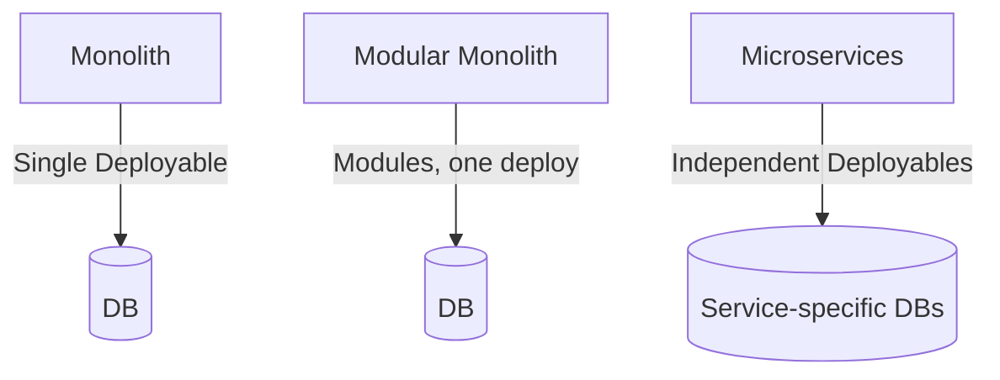
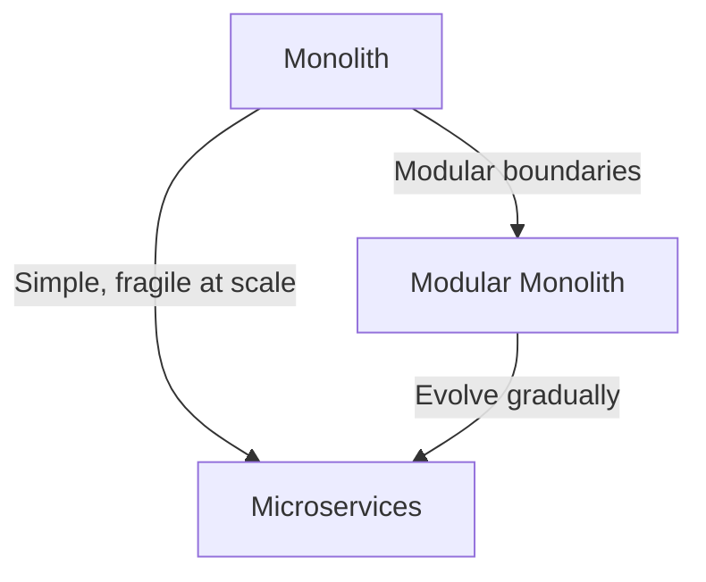

# Microservices vs Modular Monolith

## Introduction
One of the most debated questions in modern software architecture is:  
**Should we build a system as a monolith or as microservices?**  

- **Monoliths**: Single deployable unit, simple to start with but can become a “big ball of mud.”  
- **Microservices**: Independent deployables, great for scaling teams and systems, but add operational complexity.  
- **Modular Monolith**: A middle ground — one deployable, but internally modular with strict boundaries.  

Understanding the trade-offs is critical for system design interviews and real-world architecture decisions.  

---

## Intent
> **The goal is not microservices for their own sake, but the right level of modularity for your organization’s needs and scale.**  

---

## Structure

### Monolith
- All code in one deployable.  
- Shared DB.  
- Simple deployment, but grows fragile.  

### Modular Monolith
- One deployable.  
- Internally modularized (packages, bounded contexts).  
- Enforced boundaries prevent chaos.  

### Microservices
- Multiple deployables.  
- Independent DBs.  
- Independent scaling & deployments.  



---

## Conway’s Law
> **Organizations design systems that mirror their communication structures.**  

- If teams are siloed, architecture tends to mirror silos.  
- If teams are cross-functional, modular/micro boundaries emerge naturally.  

**Example:**  
- “Payments Team” and “Orders Team” → separate services.  
- One team building everything → monolith or modular monolith.  

---

## Java Example – Modular Monolith

```java
// Sales Module
package com.shop.sales;
public class OrderService { ... }

// Inventory Module
package com.shop.inventory;
public class InventoryService { ... }
```

✅ Clear separation inside one deployable.  
✅ Easier to evolve into microservices later.  

---

## Java Example – Microservices

**Order Service**
```java
@RestController
@RequestMapping("/orders")
public class OrderController {
    @PostMapping
    public String placeOrder(@RequestBody Order order) {
        return "Order placed: " + order.getId();
    }
}
```

**Inventory Service**
```java
@RestController
@RequestMapping("/inventory")
public class InventoryController {
    @GetMapping("/{id}")
    public String checkStock(@PathVariable String id) {
        return "Stock available for: " + id;
    }
}
```

✅ Independent deployables.  
✅ Independent DBs.  

---

## Consequences

### Monolith
- ✅ Simple deployment.  
- ✅ Easier debugging.  
- ❌ Becomes fragile at scale.  

### Modular Monolith
- ✅ Simplicity of monolith + discipline of modularity.  
- ✅ Easier migration path to microservices.  
- ❌ Still one deployable (scaling limits).  

### Microservices
- ✅ Team autonomy, independent scaling.  
- ✅ Tech heterogeneity possible.  
- ❌ Complex ops (network, monitoring, CI/CD).  
- ❌ Risk of distributed monolith.  

---

## Real-World Case Studies

### 1. Amazon
- Started as monolith.  
- Conway’s Law → service-per-team.  
- Migrated to microservices as teams scaled.  

### 2. Netflix
- Early monolith for streaming.  
- Migrated to microservices for global scale.  
- Invested heavily in DevOps/observability.  

### 3. Shopify
- Runs a **modular monolith** at huge scale.  
- Strict modularization inside monolith.  
- Demonstrates modular monoliths can scale far.  

---

## Decision Framework: When to Split?

### Stay Monolith/Modular Monolith if:
- Small/medium team.  
- Traffic manageable.  
- Deployment overhead should stay minimal.  

### Move to Microservices if:
- Multiple teams need autonomy.  
- Different modules evolve at different speeds.  
- Scaling requirements differ (Orders vs Recommendations).  
- Organization has DevOps maturity.  

---

## Extended Java Case Study

**Monolithic Design (Bad at Scale)**
```java
public class OrderController {
    private final InventoryService inventory = new InventoryService();
    public void placeOrder(Order order) {
        if(inventory.hasStock(order.getId())) { ... }
    }
}
```

❌ Direct coupling inside monolith.  

**Modular Monolith**
```java
// Order Module
public class OrderService {
    private final InventoryService inventory;
    public OrderService(InventoryService inventory) { this.inventory = inventory; }
    public void placeOrder(Order order) {
        if(inventory.hasStock(order.getId())) { ... }
    }
}
```

✅ Clear module boundaries, even in monolith.  

**Microservices**
- Order and Inventory run independently.  
- API contracts replace in-process calls.  

---

## Interview Prep

### Q1: *What’s the difference between monolith, modular monolith, and microservices?*  
**Answer:** Monolith = one deployable, tightly coupled. Modular Monolith = one deployable but modularized. Microservices = multiple independent deployables.  

### Q2: *What is Conway’s Law and why does it matter?*  
**Answer:** Systems mirror team communication structures. If teams are siloed, architecture follows. Drives modular/micro boundaries.  

### Q3: *When should you split into microservices?*  
**Answer:** When multiple teams need autonomy, scaling needs differ, and org has DevOps maturity.  

### Q4: *Why use modular monolith first?*  
**Answer:** Provides discipline inside monolith, easier path to microservices later.  

### Q5: *What are risks of microservices?*  
**Answer:** Operational complexity, risk of distributed monolith, higher costs.  

---

## Visualizing the Trade-offs


✅ Modular monolith is often a stepping stone.  

---

## Key Takeaways
- **Monolith** → good for small teams, early stage.  
- **Modular Monolith** → adds discipline, scales better, easier migration path.  
- **Microservices** → autonomy, flexibility, global scale, but complex ops.  
- **Conway’s Law** drives natural architectural boundaries.  
- Best architects balance org maturity, team structure, and business needs.  

---

## Next Lesson
Next, we’ll explore the **Event-Driven Architecture Pattern** — building scalable, decoupled systems using events and asynchronous communication.  

[Continue to Event-Driven Architecture Pattern →](/interview-section/architectural-design-patterns/event-driven-architecture)

---

<footer>
  <p>Connect: <a href="https://www.linkedin.com/in/ravi-shankar-a725b0225/">LinkedIn</a></p>
  <p>&copy; 2025 Official CTO. All rights reserved.</p>
</footer>
