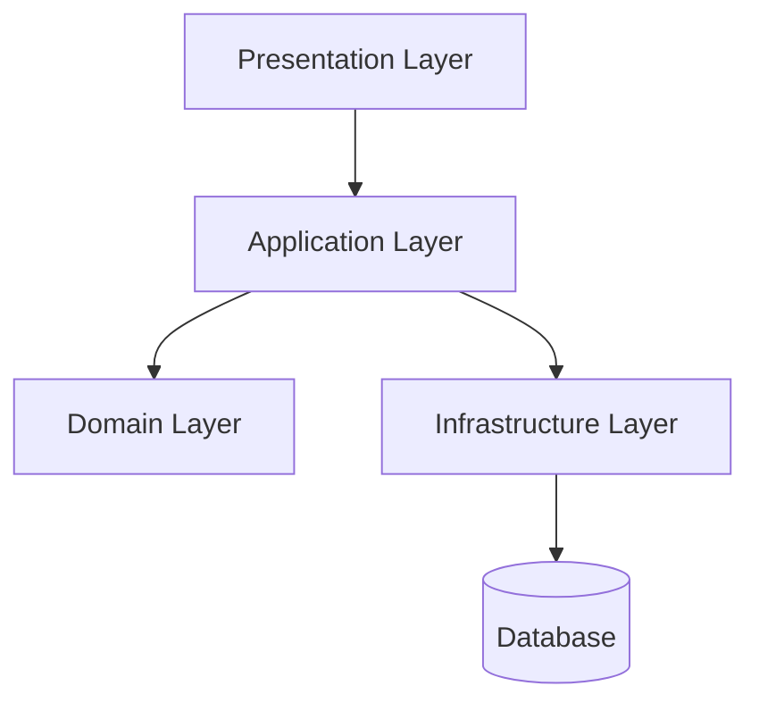

# Onion Architecture Pattern

## Introduction
As enterprise applications grow, **traditional layered architecture** often struggles with:  
- Business logic leaking into controllers or DAOs.  
- Strong coupling to frameworks and databases.  
- Difficulty evolving the core domain model.  

The **Onion Architecture Pattern**, introduced by **Jeffrey Palermo in 2008**, addresses these issues by placing the **domain model at the core** and enforcing **dependency inversion**.  
It builds upon the same principles as **Hexagonal Architecture (Ports & Adapters)** but visualizes the system as concentric rings, where **dependencies point inward toward the core domain**.  

---

## Intent
> **The Onion Architecture Pattern’s intent is to enforce domain-centric design by layering software in concentric rings, where the core domain has no dependencies on external systems.**  

---

## Structure

### Onion Layers
1. **Domain Layer (Core)**  
   - Entities, Value Objects, Aggregates.  
   - Pure business logic, no external dependencies.  

2. **Application Layer (Use Cases)**  
   - Orchestrates business rules.  
   - Defines contracts for external systems.  

3. **Infrastructure Layer**  
   - Implements repositories, messaging, persistence.  
   - Contains frameworks, DB adapters, external APIs.  

4. **Presentation Layer (Optional Outer Ring)**  
   - Controllers, UI, APIs.  



✅ Dependencies always point inward.  
✅ Domain remains framework-agnostic.  

---

## Participants

1. **Domain Layer**
   - Entities: core data and behavior.  
   - Value Objects: immutable domain concepts.  
   - Aggregates: enforce consistency.  

2. **Application Layer**
   - Services coordinating use cases.  
   - Defines ports for persistence, messaging, etc.  

3. **Infrastructure Layer**
   - Adapters implementing persistence and integration.  
   - DB, frameworks, APIs.  

4. **Presentation Layer**
   - REST controllers, CLI, UI.  

---

## Collaboration
- UI calls **application services**.  
- Application services coordinate domain entities.  
- Application depends on domain, not vice versa.  
- Infrastructure implements ports defined in application layer.  

---

## Implementation in Java

### Domain Layer (Entity)
```java
public class Order {
    private final String id;
    private final double total;

    public Order(String id, double total) {
        if(total <= 0) throw new IllegalArgumentException();
        this.id = id;
        this.total = total;
    }
    public double getTotal() { return total; }
}
```

### Application Layer (Use Case)
```java
public interface OrderUseCase {
    void placeOrder(Order order);
}

public class OrderService implements OrderUseCase {
    private final OrderRepository repository;
    public OrderService(OrderRepository repository) {
        this.repository = repository;
    }
    public void placeOrder(Order order) { repository.save(order); }
}
```

### Infrastructure Layer (Adapter)
```java
@Repository
public class JdbcOrderRepository implements OrderRepository {
    private final JdbcTemplate jdbc;
    public JdbcOrderRepository(JdbcTemplate jdbc) { this.jdbc = jdbc; }

    @Override
    public void save(Order order) {
        jdbc.update("INSERT INTO orders (id, total) VALUES (?, ?)",
            order.getId(), order.getTotal());
    }
}
```

### Presentation Layer (Controller)
```java
@RestController
@RequestMapping("/orders")
public class OrderController {
    private final OrderUseCase orderUseCase;
    public OrderController(OrderUseCase orderUseCase) {
        this.orderUseCase = orderUseCase;
    }

    @PostMapping
    public ResponseEntity<String> placeOrder(@RequestBody Order order) {
        orderUseCase.placeOrder(order);
        return ResponseEntity.ok("Order placed");
    }
}
```

✅ Domain logic isolated.  
✅ Infrastructure interchangeable.  
✅ Controllers depend only on application layer.  

---

## Consequences

### Benefits
1. **Domain-Centric** – Core domain fully isolated.  
2. **Testability** – Domain logic testable without DB or frameworks.  
3. **Flexibility** – Easy to replace infrastructure (DB, UI).  
4. **Evolvability** – Supports long-term system evolution.  

### Drawbacks
1. **Complexity** – More layers and abstractions.  
2. **Boilerplate** – Many interfaces (repositories, services).  
3. **Learning Curve** – Requires strict discipline.  

---

## Real-World Case Studies

### 1. Banking Systems
- Domain rules critical → onion ensures independence.  
- Persistence hidden in infrastructure.  

### 2. E-commerce Platforms
- Order, Payment, and Inventory domains modeled at core.  
- Repositories in outer layer.  

### 3. Microservices
- Each microservice can follow onion pattern internally.  
- Domain-first approach fits DDD (Domain-Driven Design).  

---

## Comparison with Other Patterns

| Aspect                | Layered Architecture | Hexagonal Architecture | Onion Architecture |
|-----------------------|----------------------|-------------------------|--------------------|
| **Dependency Flow**   | Top → Bottom         | Inward (ports/adapters) | Inward (rings)     |
| **Domain Isolation**  | Weak                 | Strong                  | Strongest          |
| **Framework Coupling**| High                 | Low                     | Very Low           |
| **Best For**          | Simple enterprise apps | Complex systems | Domain-driven systems |

---

## Extended Java Case Study

### Problem: Migrating Database from SQL → NoSQL

**Without Onion Architecture (Layered)**  
- Business logic tied to JPA repository.  
- Migration touches service layer.  

**With Onion Architecture**  
- Domain unchanged.  
- Application layer defines `OrderRepository`.  
- Swap infrastructure implementation.  

```java
@Repository
public class MongoOrderRepository implements OrderRepository {
    private final MongoTemplate mongo;
    public MongoOrderRepository(MongoTemplate mongo) { this.mongo = mongo; }

    @Override
    public void save(Order order) { mongo.save(order); }
}
```

✅ Domain unaffected.  
✅ Migration seamless.  

---

## Interview Prep

### Q1: *What is the Onion Architecture Pattern?*  
**Answer:** A domain-centric architecture where software is organized in concentric rings, with dependencies always pointing inward to the core domain.  

### Q2: *How does onion differ from layered architecture?*  
**Answer:** Layered allows business logic to depend on infrastructure. Onion enforces inversion: core domain has no external dependencies.  

### Q3: *How is it related to hexagonal architecture?*  
**Answer:** Both enforce core independence. Onion visualizes system as concentric rings; hexagonal uses ports/adapters metaphor.  

### Q4: *What are pros and cons?*  
**Answer:** Pros: domain isolation, testability, flexibility. Cons: complexity, boilerplate.  

### Q5: *Where is onion architecture best applied?*  
**Answer:** Large, domain-driven systems like banking, e-commerce, and microservices.  

---

## Visualizing Onion Architecture Pattern


✅ Domain at core.  
✅ Dependencies point inward.  

---

## Key Takeaways
- **Onion Architecture Pattern** enforces domain-centric design.  
- Dependencies point inward toward the domain core.  
- Combines DDD, inversion of control, and separation of concerns.  
- More complex than layered, but enables long-term evolvability.  
- Useful for **banking, e-commerce, and large-scale microservices**.  

---

## Next Lesson
Next, we’ll explore the **Event-Driven Architecture Pattern**, enabling scalable, decoupled communication via asynchronous events.  

[Continue to Event-Driven Architecture Pattern →](/interview-section/architectural-design-patterns/event-driven-architecture)

---

<footer>
  <p>Connect: <a href="https://www.linkedin.com/in/ravi-shankar-a725b0225/">LinkedIn</a></p>
  <p>&copy; 2025 Official CTO. All rights reserved.</p>
</footer>
