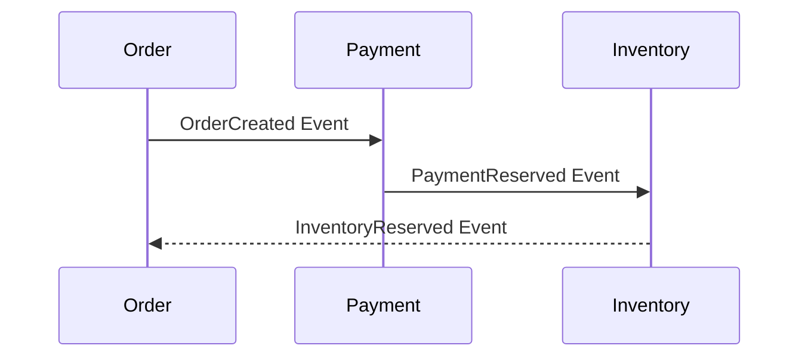
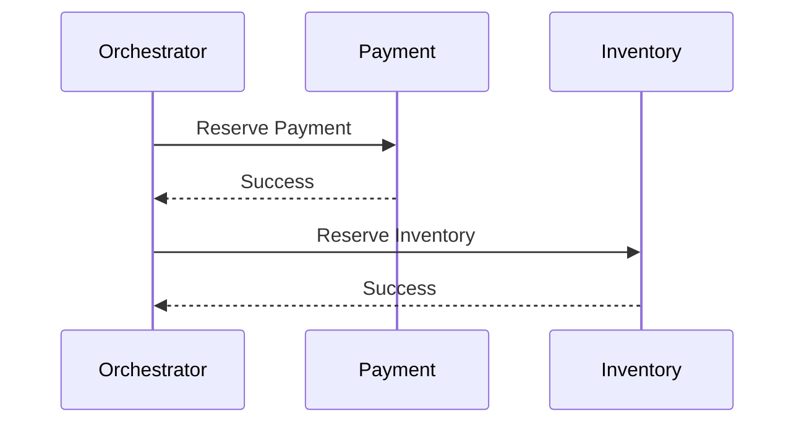

# Saga Pattern

## Introduction
In monolithic systems, transactions are typically handled by a **single database transaction**:  
- ACID guarantees (Atomicity, Consistency, Isolation, Durability) ensure reliability.  

But in **microservices architectures**, each service owns its own database.  
- Global transactions spanning multiple services are not feasible.  
- Two-phase commit (2PC) is too slow and fragile for distributed systems.  

The **Saga Pattern** solves this by coordinating **distributed transactions** through a sequence of local transactions, with **compensating actions** to roll back when failures occur.  

---

## Intent
> **The Saga Pattern’s intent is to manage distributed transactions across microservices by breaking them into a series of local transactions, coordinated via choreography or orchestration, with compensating actions for failure recovery.**  

---

## Structure

### Core Concepts
1. **Saga**  
   - A sequence of local transactions.  
   - Each transaction updates its service’s database and publishes an event.  

2. **Compensating Transaction**  
   - Undo logic when a step fails.  

3. **Coordination Styles**  
   - **Choreography** – Services listen to each other’s events.  
   - **Orchestration** – Central coordinator tells services what to do.  

```mermaid
sequenceDiagram
  participant A as Order Service
  participant B as Payment Service
  participant C as Inventory Service

  A->>B: Reserve Payment
  B-->>A: Payment Reserved
  A->>C: Reserve Inventory
  C-->>A: Inventory Reserved
  Note over A,B,C: Saga completes if all succeed
```

---

## Participants

1. **Services with Local Transactions**
   - Each service owns data + transaction.  

2. **Events**
   - Communicate success/failure.  

3. **Compensating Actions**
   - Undo local changes if needed.  

4. **Coordinator**
   - Can be implicit (choreography) or explicit (orchestration).  

---

## Collaboration Styles

### Choreography (Event-Driven)
- Services communicate by publishing/subscribing to events.  
- No central controller.  

✅ Simple, decentralized.  
❌ Harder to track flow.  

### Orchestration (Central Controller)
- A saga orchestrator tells each service to execute steps.  

✅ Clear control, visibility.  
❌ Central point of failure.  

---

## Implementation in Java

### Example: E-commerce Order Saga

#### Choreography Style

**Order Service (Producer)**
```java
@Service
public class OrderService {
    private final KafkaTemplate<String, String> kafka;

    public void placeOrder(Order order) {
        // Save order with status PENDING
        kafka.send("orders", "OrderCreated:" + order.getId());
    }
}
```

**Payment Service (Consumer)**
```java
@Service
public class PaymentService {
    @KafkaListener(topics = "orders")
    public void handleOrder(String event) {
        if(event.startsWith("OrderCreated:")) {
            // Reserve payment...
            kafka.send("payments", "PaymentReserved:" + orderId);
        }
    }
}
```

**Inventory Service (Consumer)**
```java
@Service
public class InventoryService {
    @KafkaListener(topics = "payments")
    public void handlePayment(String event) {
        if(event.startsWith("PaymentReserved:")) {
            // Reserve inventory...
            kafka.send("inventory", "InventoryReserved:" + orderId);
        }
    }
}
```

✅ Decentralized coordination.  

---

#### Orchestration Style

**Saga Orchestrator**
```java
@Service
public class OrderSagaOrchestrator {
    private final PaymentClient paymentClient;
    private final InventoryClient inventoryClient;

    public void execute(Order order) {
        try {
            paymentClient.reserve(order);
            inventoryClient.reserve(order);
            // Mark order as confirmed
        } catch (Exception e) {
            paymentClient.compensate(order);
            inventoryClient.compensate(order);
            // Mark order as failed
        }
    }
}
```

✅ Centralized coordination.  

---

## Consequences

### Benefits
1. **Distributed Transactions Without 2PC** – Works with independent DBs.  
2. **Resilience** – Failures handled via compensating actions.  
3. **Scalability** – Each service owns local transaction.  
4. **Flexibility** – Works with event-driven and orchestrated systems.  

### Drawbacks
1. **Complexity** – Requires careful design.  
2. **Compensating Logic** – Not always straightforward.  
3. **Choreography Spaghetti** – Hard to manage at scale.  
4. **Orchestrator Bottleneck** – Central point of failure.  

---

## Real-World Case Studies

### 1. E-commerce (Amazon)
- Orders, Payments, and Inventory coordinated via sagas.  
- Uses event-driven choreography for resilience.  

### 2. Banking Systems
- Money transfer = distributed transaction.  
- Debit one account, credit another → saga ensures rollback on failure.  

### 3. Travel Booking (Flights, Hotels, Cars)
- Bookings involve multiple services.  
- Sagas ensure consistency across vendors.  

---

## Extended Java Case Study

### Scenario: Flight Booking

1. Book flight.  
2. Reserve hotel.  
3. Rent car.  
4. If car rental fails → compensate (cancel hotel + flight).  

```java
public class TravelSaga {
    private final FlightClient flight;
    private final HotelClient hotel;
    private final CarClient car;

    public void bookTrip(TripRequest req) {
        try {
            flight.book(req);
            hotel.reserve(req);
            car.rent(req);
        } catch(Exception e) {
            car.compensate(req);
            hotel.cancel(req);
            flight.cancel(req);
        }
    }
}
```

✅ End-to-end consistency.  
✅ Compensations ensure rollback.  

---

## Interview Prep

### Q1: *What is the Saga Pattern?*  
**Answer:** A pattern for managing distributed transactions by sequencing local transactions and using compensating actions on failure.  

### Q2: *What are choreography vs orchestration?*  
**Answer:** Choreography = decentralized via events. Orchestration = centralized controller.  

### Q3: *What are pros and cons?*  
**Answer:** Pros: resilience, no 2PC. Cons: complexity, compensating logic.  

### Q4: *Where is Saga used?*  
**Answer:** E-commerce, banking, travel booking.  

### Q5: *How does Saga differ from 2PC?*  
**Answer:** Saga = eventual consistency with compensation. 2PC = strong consistency but low scalability.  

---

## Visualizing Saga Pattern

### Choreography


### Orchestration


---

## Key Takeaways
- **Saga Pattern** manages distributed transactions without 2PC.  
- Two styles: **Choreography (event-driven)** and **Orchestration (central controller)**.  
- Requires compensating transactions to handle failures.  
- Widely used in **e-commerce, banking, and travel systems**.  

---

## Next Lesson
Next, we’ll cover the **Strangler Fig Pattern** — gradually modernizing legacy systems by incrementally replacing parts with new implementations.  

[Continue to Strangler Fig Pattern →](/interview-section/architectural-design-patterns/strangler-fig)

---

<footer>
  <p>Connect: <a href="https://www.linkedin.com/in/ravi-shankar-a725b0225/">LinkedIn</a></p>
  <p>&copy; 2025 Official CTO. All rights reserved.</p>
</footer>
