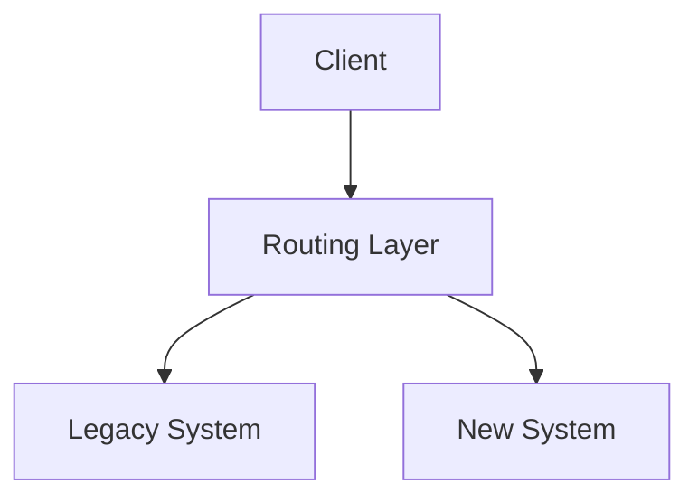
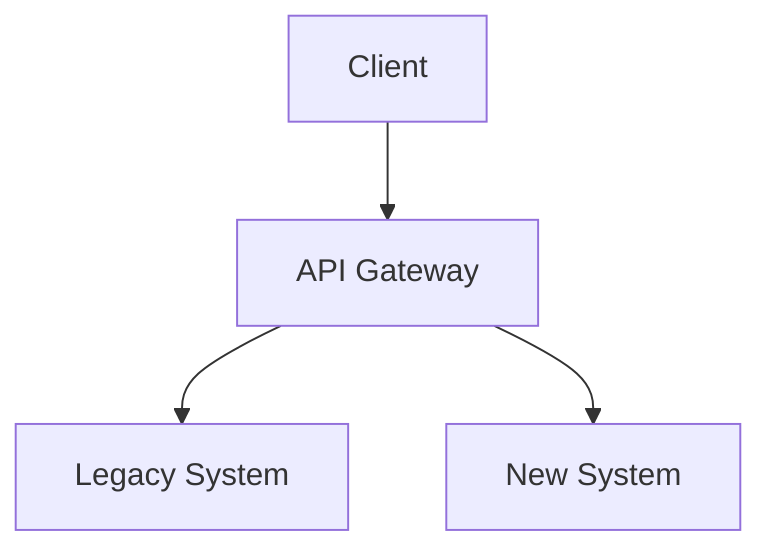

# Strangler Fig Pattern

## Introduction
Many enterprises rely on **legacy systems** that are:  
- Critical for business operations.  
- Hard to change due to technical debt.  
- Risky to replace in a “big bang” rewrite.  

The **Strangler Fig Pattern** offers a safe alternative. Inspired by the **strangler fig tree** that grows around its host until it eventually replaces it, this architectural pattern allows teams to **incrementally modernize legacy systems**:  
- New functionality is built in a new system.  
- Old functionality is gradually redirected and replaced.  
- Eventually, the legacy system is decommissioned.  

---

## Intent
> **The Strangler Fig Pattern’s intent is to modernize legacy systems by incrementally replacing functionality with new implementations, reducing risk and enabling continuous delivery.**  

---

## Structure

### Core Concepts
1. **Legacy System**  
   - The existing system to be replaced.  

2. **New System (Strangler Application)**  
   - Contains modernized functionality.  

3. **Routing Layer (Facade/Proxy)**  
   - Directs requests between legacy and new components.  

4. **Incremental Replacement**  
   - Gradually move functionality to new system.  



✅ Client always calls the proxy.  
✅ Proxy decides whether to call legacy or new system.  

---

## Participants

1. **Proxy / API Gateway**
   - Intercepts client requests.  
   - Routes to old or new implementation.  

2. **Legacy System**
   - Still handles un-migrated features.  

3. **New System**
   - Hosts migrated/rebuilt features.  

4. **Migration Strategy**
   - Plan for gradually moving functionality.  

---

## Collaboration Flow
1. Client sends request → Proxy.  
2. Proxy routes to legacy or new system.  
3. Over time, more routes point to new system.  
4. Legacy eventually removed.  

---

## Implementation in Java

### Routing Layer (Spring Cloud Gateway)
```java
@SpringBootApplication
public class ApiGatewayApp {
    public static void main(String[] args) {
        SpringApplication.run(ApiGatewayApp.class, args);
    }

    @Bean
    public RouteLocator routes(RouteLocatorBuilder builder) {
        return builder.routes()
            .route("legacy", r -> r.path("/legacy/**").uri("http://legacy-system"))
            .route("new", r -> r.path("/new/**").uri("http://new-system"))
            .build();
    }
}
```

### Gradual Migration
- `/legacy/orders` handled by old system.  
- `/new/orders` handled by new system.  
- Proxy ensures clients don’t need to change.  

---

## Real-World Migration Example

### E-commerce Platform
1. Start with legacy monolith handling all requests.  
2. Introduce API Gateway.  
3. New product catalog service built.  
4. Proxy routes `/catalog` to new service, rest to monolith.  
5. Over time, cart, checkout, and user modules replaced.  
6. Monolith eventually decommissioned.  

---

## Consequences

### Benefits
1. **Reduced Risk** – No big bang rewrite.  
2. **Incremental Migration** – Replace module by module.  
3. **Continuous Delivery Friendly** – New features go to new system.  
4. **Client Transparency** – Clients unaware of backend migration.  

### Drawbacks
1. **Complexity** – Proxy adds extra layer.  
2. **Dual Maintenance** – Legacy and new system run in parallel.  
3. **Inconsistent Data** – Must manage data migration carefully.  

---

## Extended Java Case Study

### Problem
Bank runs legacy COBOL system for transactions. Too risky to replace in one go.  

### Solution: Strangler Fig Pattern
1. Introduce API Gateway.  
2. Build new Java microservices for customer onboarding.  
3. Route onboarding requests to new system.  
4. Transactions still handled by COBOL.  
5. Gradually migrate transaction logic.  

**Gateway Route Example**
```java
@Bean
public RouteLocator routes(RouteLocatorBuilder builder) {
    return builder.routes()
        .route("onboarding", r -> r.path("/customers/**").uri("http://new-customer-service"))
        .route("transactions", r -> r.path("/transactions/**").uri("http://legacy-cobol-system"))
        .build();
}
```

✅ Business continues without disruption.  
✅ Legacy gradually replaced.  

---

## Case Studies

### 1. Amazon
- Migrated from monolithic architecture to microservices.  
- Used strangler fig pattern with API routing.  

### 2. Netflix
- Legacy systems gradually replaced with cloud-native microservices.  

### 3. Government Systems
- Many gov IT projects use strangler fig to modernize mainframes.  

---

## Interview Prep

### Q1: *What is the Strangler Fig Pattern?*  
**Answer:** An architectural pattern for incrementally replacing legacy systems with new implementations, using a routing layer.  

### Q2: *Why use this pattern instead of a rewrite?*  
**Answer:** Safer, less risky, enables gradual migration and continuous delivery.  

### Q3: *How does the routing layer help?*  
**Answer:** Clients don’t need to change; routing directs traffic to legacy or new systems.  

### Q4: *What are drawbacks?*  
**Answer:** Complexity, dual maintenance, data consistency issues.  

### Q5: *Give a real-world example.*  
**Answer:** Migrating from a COBOL banking system to Java microservices.  

---

## Visualizing Strangler Fig Pattern


✅ Clients unaware of backend migration.  
✅ Legacy gradually replaced.  

---

## Key Takeaways
- Strangler Fig Pattern = safe modernization strategy.  
- Uses proxy/gateway to split requests between old and new.  
- Benefits: reduced risk, incremental migration, client transparency.  
- Challenges: added complexity, dual maintenance.  
- Used by Amazon, Netflix, banks, and governments for large migrations.  

---

## Next Lesson
Next, we’ll cover the **Circuit Breaker Pattern** — protecting systems from cascading failures when dependencies fail.  

[Continue to Circuit Breaker Pattern →](/interview-section/architectural-design-patterns/circuit-breaker)

---

<footer>
  <p>Connect: <a href="https://www.linkedin.com/in/ravi-shankar-a725b0225/">LinkedIn</a></p>
  <p>&copy; 2025 Official CTO. All rights reserved.</p>
</footer>
