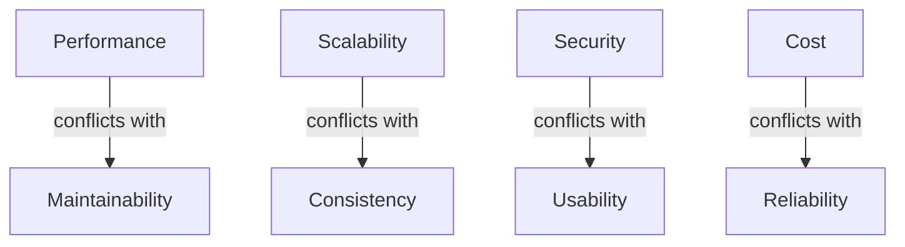

# Architectural Trade-offs

## Introduction
Every architectural decision comes with a **trade-off**.  
Choosing one design principle or pattern often means sacrificing something else. For example:  
- Strong consistency vs availability.  
- Simplicity vs flexibility.  
- Performance vs maintainability.  

Great architects are not those who avoid trade-offs, but those who **recognize them, evaluate them, and make conscious decisions** based on context.  

In this lesson, we’ll cover:  
1. The nature of trade-offs in architecture.  
2. Common dimensions: performance, scalability, flexibility, complexity, security, cost.  
3. Real-world trade-off scenarios.  
4. Java-inspired examples.  
5. Case studies (Amazon, Netflix, Banking).  
6. Interview Q&A.  

---

## Why Trade-offs Are Inevitable
- Systems must balance **conflicting priorities** (speed vs safety).  
- Business goals, budget, and team maturity influence decisions.  
- Over-optimizing for one quality often weakens another.  

Example: **Microservices** improve flexibility but increase operational complexity.  

---

## Dimensions of Trade-offs

### 1. Performance vs Maintainability
- Highly optimized code may sacrifice readability.  
- Clean, abstracted code may introduce overhead.  

**Java Example – Performance Over Maintainability**
```java
// Optimized but unreadable
for(int i=0;i<n;i++){for(int j=0;j<m;j++){...}}
```

**Java Example – Maintainability Over Performance**
```java
// Cleaner, modular code (slower but maintainable)
public class MatrixProcessor {
    public void process(int[][] matrix) { ... }
}
```

---

### 2. Scalability vs Consistency
- Distributed systems must balance CAP theorem dimensions.  
- E-commerce carts → prioritize availability.  
- Banking → prioritize consistency.  

---

### 3. Flexibility vs Simplicity
- Microservices = more flexible, but complex to operate.  
- Modular monolith = simpler, but less flexible at scale.  

---

### 4. Security vs Usability
- Stronger authentication improves security but reduces usability.  
- Example: Multi-factor authentication vs seamless login.  

---

### 5. Cost vs Reliability
- 5 nines (99.999%) uptime requires huge investment.  
- Trade-off: Is 99.9% good enough for your business?  

---

## Real-World Case Studies

### 1. Amazon
- **Trade-off**: Availability over strong consistency in DynamoDB.  
- **Reason**: Shopping carts can tolerate eventual consistency.  

### 2. Netflix
- **Trade-off**: Microservices flexibility vs operational complexity.  
- **Reason**: Needed global scale, accepted higher DevOps cost.  

### 3. Banking Systems
- **Trade-off**: Consistency over availability.  
- **Reason**: Cannot allow inconsistent account balances.  

---

## Extended Java Case Study

### Scenario: Order Processing

**Strong Consistency (CP system)**
```java
public class OrderService {
    public synchronized void placeOrder(Order order) {
        // write order to DB before confirmation
    }
}
```

✅ Consistent, but blocks under heavy load.  

**Eventual Consistency (AP system)**
```java
public class OrderService {
    private final MessageQueue queue;
    public void placeOrder(Order order) {
        queue.publish(order); // async processing
    }
}
```

✅ Highly available.  
❌ Risk of temporary inconsistency.  

---

## Framework for Evaluating Trade-offs

1. **Identify Qualities**: Performance, reliability, cost, etc.  
2. **Define Priorities**: Which qualities matter most to stakeholders?  
3. **Evaluate Alternatives**: Compare patterns against priorities.  
4. **Communicate Clearly**: Explain trade-offs to stakeholders.  
5. **Document Decisions**: Future teams must know why choices were made.  

---

## Common Pitfalls

1. **Silver Bullet Thinking**
   - Believing microservices, serverless, or any single approach solves all problems.  

2. **Over-Engineering**
   - Optimizing for scale when system only has 100 users.  

3. **Ignoring Business Context**
   - Technical decisions must align with business priorities.  

4. **Undocumented Trade-offs**
   - Future teams don’t know why decisions were made.  

---

## Interview Prep

### Q1: *What are architectural trade-offs?*  
**Answer:** Balancing competing qualities like performance, flexibility, cost, and security when making design decisions.  

### Q2: *Give an example of availability vs consistency trade-off.*  
**Answer:** DynamoDB chooses availability and partition tolerance over strict consistency.  

### Q3: *How do you decide when to move from monolith to microservices?*  
**Answer:** Based on trade-off: simplicity vs flexibility. Stay monolith until team/org complexity requires microservices.  

### Q4: *What’s the relationship between CAP theorem and trade-offs?*  
**Answer:** CAP forces consistency vs availability trade-offs in distributed systems.  

### Q5: *How should architects handle trade-offs?*  
**Answer:** Identify qualities, set priorities with stakeholders, evaluate alternatives, and document decisions.  

---

## Visualizing Trade-offs


✅ No perfect balance — trade-offs are context-driven.  

---

## Key Takeaways
- Every design choice has trade-offs.  
- Common dimensions: performance, scalability, consistency, security, usability, cost.  
- Real-world leaders (Amazon, Netflix, Banking) prioritize differently.  
- Great architects evaluate, document, and communicate trade-offs.  

---

## Next Lesson
Finally, we’ll explore **Evolutionary Architecture Principles** — building systems that can adapt through continuous delivery, strangler patterns, and fitness functions.  

[Continue to Evolutionary Architecture →](/interview-section/architectural-design-principles/evolutionary-architecture)

---

<footer>
  <p>Connect: <a href="https://www.linkedin.com/in/ravi-shankar-a725b0225/">LinkedIn</a></p>
  <p>&copy; 2025 Official CTO. All rights reserved.</p>
</footer>
