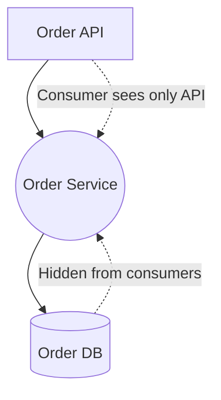

# Information Hiding in Architecture

## Introduction
One of the oldest and most powerful principles in software design is **information hiding**, first articulated by David Parnas in 1972.  
While at the class level this means hiding fields behind methods, at the **architectural level**, it means:  

- Exposing **APIs and contracts**.  
- Hiding **implementation details** (databases, frameworks, algorithms).  
- Ensuring consumers only know *what* a service does, not *how* it does it.  

This principle underpins modularity, encapsulation, and service-oriented design. Without it, systems become fragile, tightly coupled, and insecure.  

---

## Why Information Hiding Matters
1. **Modularity** – Each component can change internally without breaking others.  
2. **Maintainability** – Teams can refactor behind stable APIs.  
3. **Security** – Internal logic and data are protected from external misuse.  
4. **Abstraction** – Encourages “black box” thinking: use the service, not its guts.  

---

## Information Hiding at Different Levels

### 1. Within a Monolith
- Expose package-level APIs.  
- Hide internal classes/methods.  

### 2. Across Modules
- Define contracts via interfaces.  
- Hide data persistence and infrastructure details.  

### 3. Across Services (Microservices)
- Public interface = REST/GraphQL/gRPC API.  
- Internal details (framework, DB, caches) hidden.  

---

## Java Example – Violating Information Hiding
```java
// Service exposing DB details directly
public class OrderService {
    public Connection getDatabaseConnection() {
        // exposing DB details to consumers (bad!)
    }
}
```

❌ Consumers now depend on database technology.  
❌ Any DB change breaks consumers.  

---

## Java Example – Following Information Hiding
```java
// Public contract
public interface OrderService {
    void placeOrder(Order order);
    Order getOrder(String orderId);
}

// Implementation (hidden details)
public class OrderServiceImpl implements OrderService {
    private final OrderRepository repository;
    public void placeOrder(Order order) { repository.save(order); }
    public Order getOrder(String orderId) { return repository.find(orderId); }
}
```

✅ Consumers use `OrderService` API.  
✅ Implementation details hidden behind interface.  
✅ Repository or DB can change without breaking consumers.  

---

## Information Hiding in APIs
A well-designed API:  
- Exposes **use cases**, not data structures.  
- Hides storage models and algorithms.  
- Provides stable contracts for consumers.  

**Bad REST API:**
```http
GET /orders?table=order_table&column=order_id&id=123
```

❌ Exposes table/column details.  

**Good REST API:**
```http
GET /orders/123
```

✅ Consumer doesn’t know or care how order is stored.  

---

## Information Hiding in Microservices
- Each service owns its **database**.  
- Other services interact only via APIs.  
- No direct access to another service’s DB.  

**Anti-Pattern (Shared Database):**
- OrderService queries InventoryService’s DB directly.  
- Breaks information hiding.  

**Correct Approach (API Boundary):**
- OrderService calls InventoryService API: `/inventory/checkStock/{id}`.  
- Inventory hides schema, indexes, optimizations.  

---

## Real-World Case Studies

### 1. Amazon
- Each team owns a service and **cannot access another team’s DB**.  
- Only APIs are exposed.  
- Information hiding enabled massive scalability.  

### 2. Netflix
- Services hide encoding, recommendation algorithms.  
- Consumers only see APIs like `/recommendations`.  
- Allows algorithm updates without breaking clients.  

### 3. Banking
- Compliance rules hidden behind APIs.  
- External partners cannot see internal schemas.  
- Information hiding ensures regulatory safety.  

---

## Common Pitfalls

1. **Leaky Abstractions**
   - API exposes DB schema.  
   - Change in schema breaks clients.  

2. **God Interfaces**
   - API exposes too much (all internal details).  
   - Hard to maintain or evolve.  

3. **Shared Database Access**
   - Multiple services sharing a DB.  
   - Breaks encapsulation and independence.  

---

## Extended Java Case Study

### Without Information Hiding
```java
public class InventoryService {
    public int getStock(String productId) {
        // Exposing DB queries directly
        String query = "SELECT stock FROM inventory WHERE id = " + productId;
        return jdbc.execute(query);
    }
}
```

❌ Any DB schema change breaks consumers.  

### With Information Hiding
```java
// Public API contract
public interface InventoryService {
    boolean hasStock(String productId);
}

// Implementation (hidden details)
public class InventoryServiceImpl implements InventoryService {
    private final InventoryRepository repository;
    public boolean hasStock(String productId) {
        return repository.getStock(productId) > 0;
    }
}
```

✅ API contract remains stable.  
✅ Repository logic hidden.  
✅ DB schema changes invisible to consumers.  

---

## Interview Prep

### Q1: *What is information hiding in architecture?*  
**Answer:** Exposing contracts (APIs) while hiding implementation details (DBs, frameworks, algorithms).  

### Q2: *Why is it important?*  
**Answer:** Enables modularity, maintainability, and security. Consumers depend only on stable contracts.  

### Q3: *What’s the difference between abstraction and information hiding?*  
**Answer:** Abstraction focuses on *what* a service does. Information hiding ensures consumers can’t see *how* it does it.  

### Q4: *How do microservices enforce information hiding?*  
**Answer:** Each service owns its DB and exposes only APIs. No direct cross-service DB access.  

### Q5: *Give an example of leaky abstraction.*  
**Answer:** An API exposing table names or SQL queries. Any DB schema change then breaks clients.  

---

## Visualizing Information Hiding


✅ Consumers only see API.  
✅ DB hidden behind service.  

---

## Key Takeaways
- **Information Hiding** = exposing behavior, hiding implementation.  
- Applies across classes, modules, and services.  
- Prevents fragile dependencies on internals.  
- Real-world systems (Amazon, Netflix, Banking) rely heavily on this principle.  

---

## Next Lesson
Next, we explore the **Principle of Least Knowledge at Service Boundaries** — designing interactions that minimize dependencies between distributed services.  

[Continue to Least Knowledge Principles →](/interview-section/architectural-design-principles/least-knowledge-services)

---

<footer>
  <p>Connect: <a href="https://www.linkedin.com/in/ravi-shankar-a725b0225/">LinkedIn</a></p>
  <p>&copy; 2025 Official CTO. All rights reserved.</p>
</footer>
