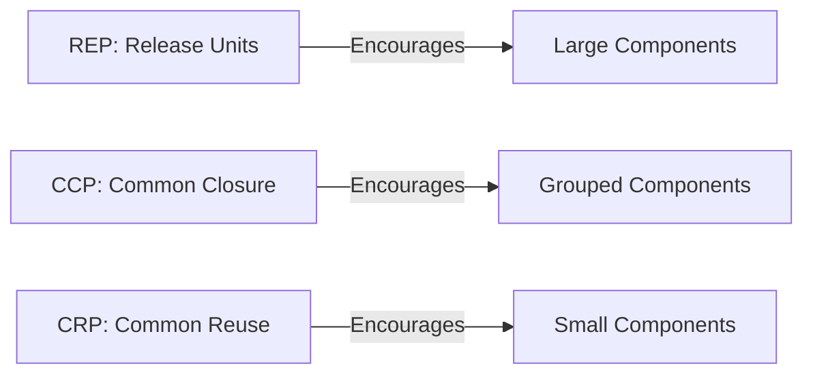

# Component Cohesion Principles (REP, CCP, CRP)

## Introduction
In software architecture, **cohesion** refers to how well the elements of a module or component belong together.  
At the class level, high cohesion means each class has a single, focused responsibility.  
At the **component level** (packages, modules, microservices), cohesion determines:  

- **How reusable** the component is across systems.  
- **How resilient** it is to change.  
- **How independently** it can evolve without ripple effects.  

Robert C. Martin (Uncle Bob) introduced **three key principles** to guide component cohesion:  
1. **REP – Reuse/Release Equivalence Principle**  
2. **CCP – Common Closure Principle**  
3. **CRP – Common Reuse Principle**  

These principles help architects decide *what belongs together in a component* and how to balance stability with flexibility.  

---

## 1. REP – Reuse/Release Equivalence Principle
> **The unit of reuse is the unit of release.**  

This means that a reusable component must be packaged, versioned, and released as a whole.  

### Why REP Matters
- Teams should consume components through **stable releases**, not ad hoc source code copies.  
- Reusability requires versioning, documentation, and release control.  
- Without REP, projects end up with “copy-paste libraries” and inconsistent dependencies.  

### Java Example – Good REP
```java
// Payment module packaged as a reusable JAR
module com.officialcto.payment {
    exports com.officialcto.payment.api;
}

// Public API
package com.officialcto.payment.api;

public interface PaymentProcessor {
    void charge(Order order);
}
```

This payment module can be versioned (1.0.0, 1.1.0) and reused across projects.  

### Bad Example – Violating REP
```java
// Payment logic scattered across unrelated modules
public class StripeHelper { ... }
public class RazorpayUtils { ... }
public class PaymentValidator { ... }
```

Here, payment code is scattered, unversioned, and hard to reuse.  

---

## 2. CCP – Common Closure Principle
> **Classes that change for the same reasons should be grouped together.**  

### Why CCP Matters
- Isolates changes inside one component.  
- Prevents ripple effects across unrelated modules.  
- Aligns with the **Open/Closed Principle (OCP)** at a larger scale.  

### Java Example – Good CCP
```java
// Order domain module
public class Order { ... }
public class OrderValidator { ... }
public class OrderRepository { ... }
public class OrderService { ... }
```

All **order-related classes** are grouped in one package/module.  
If order rules change, only this module is rebuilt.  

### Bad Example – Violating CCP
```java
// Scattered across modules
// order domain in core module
public class Order { ... }
// validation in utils module
public class OrderValidator { ... }
// persistence in repository module
public class OrderRepository { ... }
```

Now, a small change in order logic requires changes across three modules.  

---

## 3. CRP – Common Reuse Principle
> **Classes that are used together should be packaged together.**  

### Why CRP Matters
- Prevents consumers from depending on unnecessary code.  
- Keeps dependency graphs smaller and cleaner.  
- Reduces build times and coupling.  

### Bad Example – Violating CRP
```java
// Utility package (bad cohesion)
public class StringUtils { ... }
public class FileUtils { ... }
public class NetworkUtils { ... }
```

A consumer that only needs `StringUtils` is forced to import the entire utility package.  

### Good Example – Following CRP
- `string-utils.jar`  
- `file-utils.jar`  
- `network-utils.jar`  

Now, consumers only depend on what they actually use.  

---

## Balancing the Principles
- **REP** pushes towards **larger components** (for versioning).  
- **CCP** pushes towards **grouping by reason to change**.  
- **CRP** pushes towards **smaller components** (only what’s reused together).  

These principles often **pull in different directions**. Architects must balance them based on context.  

### Diagram: Trade-offs


No single principle dominates — architecture is about trade-offs.  

---

## Real-World Case Studies

### 1. Android SDK
- **REP**: SDK released as stable versions (30, 31, etc.).  
- **CCP**: Related APIs (UI widgets) grouped together.  
- **CRP**: Separate modules for networking, persistence, etc.  

### 2. Spring Framework
- **REP**: Released as cohesive versions (Spring 5.x, 6.x).  
- **CCP**: Related functionality grouped (Spring Web, Spring Data).  
- **CRP**: Developers can import only `spring-web` without `spring-data`.  

### 3. Amazon Services
- **REP**: Services version APIs before releasing.  
- **CCP**: Order, Inventory, and Payment domains isolated.  
- **CRP**: Teams only depend on APIs they consume.  

---

## Common Pitfalls

1. **God Modules**  
   - All utilities lumped together.  
   - Violates CRP, leads to unnecessary dependencies.  

2. **Over-Fragmentation**  
   - Splitting too aggressively (e.g., 50 micro-modules).  
   - Violates REP, increases versioning overhead.  

3. **Scattered Domain Logic**  
   - Order rules across multiple modules.  
   - Violates CCP, increases ripple effects.  

---

## Interview Prep

### Q1: *What are the component cohesion principles?*  
**Answer:** REP, CCP, CRP. They guide how to group classes/modules to maximize reusability, stability, and clarity.  

### Q2: *How do REP and CRP conflict?*  
**Answer:** REP pushes for larger release units, CRP pushes for smaller, narrowly scoped ones. Architects must balance based on context.  

### Q3: *Give an example of CCP in practice.*  
**Answer:** All order-related logic in an e-commerce platform is grouped together, so changes to order rules only affect one module.  

### Q4: *What happens if CRP is violated?*  
**Answer:** Consumers depend on unnecessary code, leading to bloated dependency graphs and harder upgrades.  

### Q5: *How does this apply in microservices?*  
**Answer:** Each microservice should group logic that changes together (CCP), be reusable across systems (REP), and avoid exposing unnecessary APIs (CRP).  

---

## Extended Java Case Study

### Scenario: Payment & Order Services

**Bad Design (Violating Cohesion Principles):**
```java
// payment scattered across utils and repositories
public class PaymentHelper { ... }
public class PaymentUtils { ... }
public class OrderRepository { ... } // also has payment logic
```

- Payment logic scattered across unrelated modules.  
- Hard to reuse, impossible to release as one unit.  

**Good Design (Following REP, CCP, CRP):**
```java
// Payment module
public interface PaymentProcessor { void charge(Order order); }
public class StripeProcessor implements PaymentProcessor { ... }
public class RazorpayProcessor implements PaymentProcessor { ... }

// Order module
public class Order { ... }
public class OrderService { ... }
public class OrderValidator { ... }
```

✅ Payment logic grouped (REP).  
✅ Order logic grouped (CCP).  
✅ Consumers only depend on what they need (CRP).  

---

## Key Takeaways
- **REP** → A reusable component must be a releasable unit.  
- **CCP** → Classes that change together belong together.  
- **CRP** → Classes used together should be packaged together.  
- These principles often conflict, but balancing them leads to modular, stable systems.  

---

## Next Lesson
Having covered cohesion, we now turn to **Component Coupling Principles (ADP, SDP, SAP)** — rules for how components should depend on one another.  

[Continue to Component Coupling Principles →](/interview-section/architectural-design-principles/component-coupling)

---

<footer>
  <p>Connect: <a href="https://www.linkedin.com/in/ravi-shankar-a725b0225/">LinkedIn</a></p>
  <p>&copy; 2025 Official CTO. All rights reserved.</p>
</footer>
