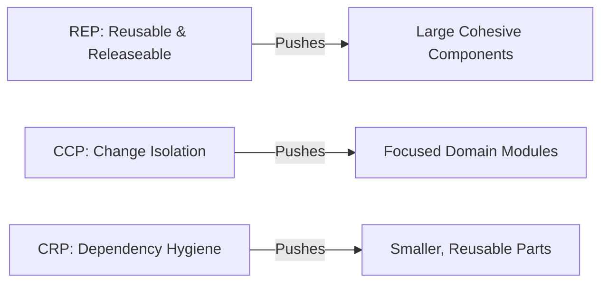

# Component Cohesion Principles (REP, CCP, CRP)

## Introduction

In software architecture, **cohesion** refers to how well the elements within a module or component belong together.  
At the **class level**, cohesion ensures each class has one focused responsibility.  
At the **component level** (modules, packages, microservices), cohesion determines:

- **How reusable** a component is across systems.  
- **How resilient** it is to change.  
- **How independently** it can evolve without ripple effects.  

Robert C. Martin (Uncle Bob) identified three key principles that define *component-level cohesion*:

1. **REP – Reuse/Release Equivalence Principle**  
2. **CCP – Common Closure Principle**  
3. **CRP – Common Reuse Principle**  

These principles guide architects in deciding *which classes belong together* and *how components should be structured* for long-term maintainability and scalability.

---

## 1. REP – Reuse/Release Equivalence Principle

> **“The unit of reuse is the unit of release.”**

### Concept

A component cannot truly be reusable unless it is **independently releaseable** — with its own versioning, distribution, and release lifecycle.

Think of software like Lego blocks.  
Each block (component) can only be reused easily if it’s shaped and standardized correctly — that’s what **REP** demands.

### Why REP Matters

- Encourages **formal versioning** and controlled releases.  
- Prevents the “copy-paste” anti-pattern of sharing source code.  
- Promotes **stability and consistency** across teams or systems.  

Without REP, teams end up duplicating code and losing track of which version of a library is being used — making debugging and upgrades painful.

### ✅ Example: Good REP in Java

```java
// Payment module packaged as a reusable JAR
module com.officialcto.payment {
    exports com.officialcto.payment.api;
}

// Public API
package com.officialcto.payment.api;

public interface PaymentProcessor {
    void charge(Order order);
}
```

Here, the payment module:
- Has a defined API surface.  
- Can be versioned (e.g., 1.0.0, 1.1.0).  
- Can be reused by multiple services independently.

### ❌ Violating REP

```java
// Payment logic scattered across modules
public class StripeHelper { ... }
public class RazorpayUtils { ... }
public class PaymentValidator { ... }
```

These classes are scattered, unversioned, and tightly coupled — not releaseable as a single unit.

### 🔍 Quick REP Checklist
- [ ] Can this component be versioned and released independently?  
- [ ] Does it have clear release notes or API documentation?  
- [ ] Are its dependencies clearly defined and stable?  

---

## 2. CCP – Common Closure Principle

> **“Classes that change for the same reasons should be grouped together.”**

### Concept

The **CCP** ensures that when a requirement changes, only **one component** needs to be modified.  
It extends the **Open/Closed Principle (OCP)** to the component level.

In other words:
> If two classes usually change together, they belong together.

### Why CCP Matters

- Minimizes **ripple effects** when making changes.  
- Keeps **build times and testing effort** localized.  
- Enhances **maintainability** — a single change = one component rebuild.  

### ✅ Example: Good CCP

```java
// Order domain module
public class Order { ... }
public class OrderValidator { ... }
public class OrderRepository { ... }
public class OrderService { ... }
```

All order-related classes are grouped together.  
If business rules for orders change, only this component is affected.

### ❌ Violating CCP

```java
// Scattered across modules
public class Order { ... }         // in core module
public class OrderValidator { ... } // in utils module
public class OrderRepository { ... } // in repository module
```

Now, a single change in order logic impacts multiple modules, creating friction and regression risk.

### 🧠 Analogy
Imagine a restaurant kitchen where the chef, stove, and ingredients are in separate rooms. Every change in the recipe requires coordination across rooms — inefficient and error-prone.  
CCP says: *Keep everything needed for a specific recipe together.*

### 🔍 Quick CCP Checklist
- [ ] Do all classes in this component change for the same reason?  
- [ ] Does a requirement change trigger multiple component builds?  
- [ ] Can one team own and modify this component without cross-team coordination?  

---

## 3. CRP – Common Reuse Principle

> **“Classes that are used together should be packaged together.”**

### Concept

If two classes are *always reused together*, they should be in the same component.  
If not, keep them separate — otherwise, consumers are forced to depend on things they don’t need.

This principle focuses on **dependency hygiene**.

### Why CRP Matters

- Prevents **unnecessary dependencies** and bloated imports.  
- Keeps **build and deploy cycles** fast.  
- Makes components lightweight and focused.  

### ❌ Violating CRP

```java
// Utility package (bad cohesion)
public class StringUtils { ... }
public class FileUtils { ... }
public class NetworkUtils { ... }
```

A user who only needs `StringUtils` is forced to import and depend on `FileUtils` and `NetworkUtils` too — adding unnecessary baggage.

### ✅ Following CRP

Break it into separate components:

```
string-utils.jar
file-utils.jar
network-utils.jar
```

Now, consumers pick only what they need — lightweight, decoupled, and flexible.

### 🧠 Analogy
Buying a *combo meal* when you only wanted fries wastes resources and money.  
CRP tells us: *Package only what users always consume together.*

### 🔍 Quick CRP Checklist
- [ ] Do consumers of one class always use the others in this component?  
- [ ] Are unnecessary dependencies being introduced?  
- [ ] Would splitting this module make it easier to maintain or reuse?  

---

## ⚖️ Balancing REP, CCP, and CRP

These principles often **pull in different directions**:

| Principle | Encourages | Risk if Over-Applied |
|------------|-------------|----------------------|
| **REP** | Larger components | Harder to modify quickly |
| **CCP** | Group by reason to change | Components may grow large |
| **CRP** | Smaller components | Too many micro-modules, hard to manage |

### Visualizing the Tension



Finding the **sweet spot** is the art of component design.  
Well-balanced systems minimize change impact while maximizing reuse.

---

## 🧪 Real-World Case Studies

### 1. Android SDK
- **REP:** Released as versioned SDKs (API 30, 31…).  
- **CCP:** Related APIs (e.g., UI widgets) grouped together.  
- **CRP:** Networking, storage, and UI packages separated.  

### 2. Spring Framework
- **REP:** Entire Spring stack versioned (e.g., 5.x, 6.x).  
- **CCP:** Spring Web, Spring Data, and Spring Security are logically grouped.  
- **CRP:** Developers can import only `spring-web` without pulling `spring-data`.  

### 3. Amazon Microservices
- **REP:** Each service is versioned independently.  
- **CCP:** Each domain (Orders, Inventory, Payments) is isolated.  
- **CRP:** Teams depend only on APIs they actually consume.  

---

## ⚠️ Common Pitfalls

| Pitfall | Violation | Impact |
|----------|------------|--------|
| **God Modules** | CRP | Forces consumers to depend on unrelated code |
| **Over-Fragmentation** | REP | Too many small modules, heavy release management |
| **Scattered Domain Logic** | CCP | Changes ripple across multiple components |

---

## 🧩 Extended Java Case Study

### Scenario: Payment & Order Services

#### ❌ Bad Design
```java
// payment scattered across utils and repositories
public class PaymentHelper { ... }
public class PaymentUtils { ... }
public class OrderRepository { ... } // also has payment logic
```
- Payment logic spread across unrelated modules.  
- Hard to reuse or version as one unit.  
- Changes ripple through the system.

#### ✅ Good Design
```java
// Payment module
public interface PaymentProcessor { void charge(Order order); }
public class StripeProcessor implements PaymentProcessor { ... }
public class RazorpayProcessor implements PaymentProcessor { ... }

// Order module
public class Order { ... }
public class OrderService { ... }
public class OrderValidator { ... }
```

**Results:**
- Payment module = independently releasable (REP).  
- Order module = isolated from unrelated changes (CCP).  
- Consumers depend only on what they need (CRP).  

---

## 💬 Interview Prep

**Q1:** What are the component cohesion principles?  
**A:** REP, CCP, and CRP — they define how to group classes into stable, reusable components.

**Q2:** How do REP and CRP conflict?  
**A:** REP encourages larger, stable components; CRP encourages smaller, reusable ones. Architects must balance them contextually.

**Q3:** Example of CCP in action?  
**A:** Grouping all order-related logic in one module so business rule changes affect only that component.

**Q4:** What happens when CRP is violated?  
**A:** Consumers depend on unnecessary code, creating bloated dependency graphs.

**Q5:** How do these apply in microservices?  
**A:** Each microservice should group logic that changes together (CCP), be versioned independently (REP), and avoid exposing unneeded APIs (CRP).

---

## 🧭 Key Takeaways

| Principle | Essence | Goal |
|------------|----------|------|
| **REP** | Reuse = Release | Enables reuse through independent versioning |
| **CCP** | Change Together | Minimizes ripple effects from change |
| **CRP** | Use Together | Prevents unnecessary dependencies |

> Balancing these three is the hallmark of a modular, maintainable architecture.

---

## 🔗 Next Lesson
Now that we understand **how to group components**, the next step is to learn **how they should depend on each other** — the **Component Coupling Principles (ADP, SDP, SAP)**.

[Continue to Component Coupling Principles →](/interview-section/architectural-design-principles/component-coupling)

---

<footer>
  <p>Connect: <a href="https://www.linkedin.com/in/ravi-shankar-a725b0225/">LinkedIn</a></p>
  <p>&copy; 2025 Official CTO. All rights reserved.</p>
</footer>
