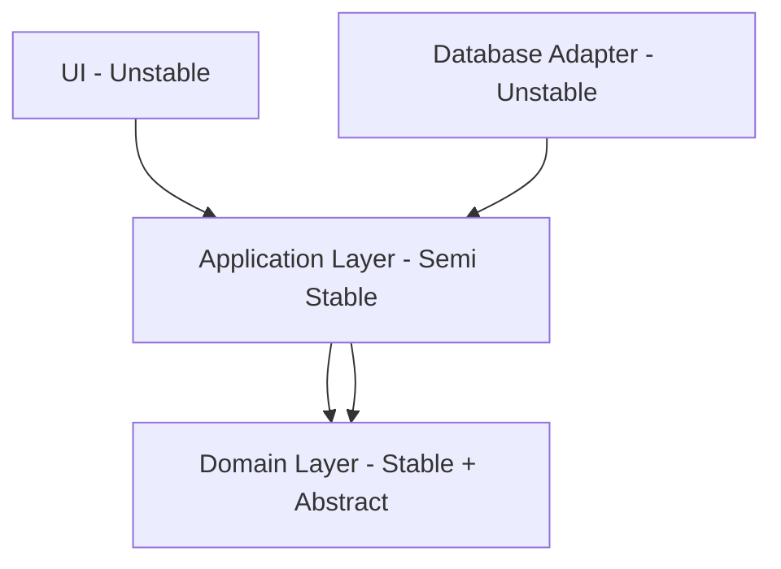

# Component Coupling Principles (ADP, SDP, SAP)

## Introduction
Once we’ve grouped classes into **cohesive components** (using REP, CCP, and CRP), the next big question is:  
**How should these components depend on one another?**  

This is where **coupling principles** come in.  
Robert C. Martin (Uncle Bob) introduced three rules to guide component dependencies:  
1. **ADP – Acyclic Dependencies Principle**  
2. **SDP – Stable Dependencies Principle**  
3. **SAP – Stable Abstractions Principle**  

Together, these principles ensure that dependency graphs remain clean, maintainable, and resilient as systems grow.  

---

## 1. ADP – Acyclic Dependencies Principle
> **Allow no cycles in the component dependency graph.**  

### Why?
- Cyclic dependencies create a “big ball of mud.”  
- They make it impossible to isolate, test, or deploy components independently.  
- A cycle in a dependency graph means you can’t reason about stability.  

### Analogy
Imagine three teams: Orders, Payments, and Inventory. If Orders depends on Payments, Payments depends on Inventory, and Inventory depends on Orders → no team can move independently.  

### Java Example – Bad (Cycle Present)
```java
// Module A depends on Module B
public class InventoryService {
    private PaymentService payment;
}

// Module B depends on Module A
public class PaymentService {
    private InventoryService inventory;
}
```

This creates a **cyclic dependency**. Any change in one ripples to the other.  

### Fix – Introduce Abstraction
```java
// Boundary interface
public interface PaymentProcessor {
    void process(Order order);
}

// Module A (depends on abstraction)
public class InventoryService {
    private final PaymentProcessor processor;
    public InventoryService(PaymentProcessor processor) {
        this.processor = processor;
    }
}

// Module B (implements abstraction)
public class PaymentService implements PaymentProcessor {
    public void process(Order order) { /* logic */ }
}
```

✅ Cycle broken.  
✅ Clear dependency direction.  

---

## 2. SDP – Stable Dependencies Principle
> **Depend in the direction of stability.**  

### What is Stability?
- A stable component is **widely depended upon** and changes rarely.  
- An unstable component is volatile, changing frequently.  

### Rule
- A stable component should **never depend on an unstable one**.  
- Otherwise, ripple effects from unstable modules break the system.  

### Measuring Stability (simplified)
- **Fan-in**: How many components depend on it (incoming).  
- **Fan-out**: How many dependencies it has (outgoing).  
- Stability increases with more incoming and fewer outgoing dependencies.  

### Java Example – Good SDP
```java
// Stable core business rules (rarely change)
public class LoanCalculator {
    public double calculateEMI(double principal, double rate, int years) {
        return (principal * rate * years) / 100;
    }
}

// Unstable UI framework (changes often)
public class LoanController {
    private LoanCalculator calculator = new LoanCalculator();
    public void handleRequest(...) { ... }
}
```

✅ UI (unstable) depends on LoanCalculator (stable).  
❌ Never the other way around.  

---

## 3. SAP – Stable Abstractions Principle
> **A component should be as abstract as it is stable.**  

### Why?
- A stable but concrete component is **rigid**.  
- A stable and abstract component is **flexible**.  
- Abstractions allow extension without modification.  

### Example – Good SAP
```java
// Stable and abstract
public interface NotificationService {
    void send(String message);
}

// Concrete implementations (unstable)
public class EmailNotification implements NotificationService { ... }
public class SMSNotification implements NotificationService { ... }
```

✅ NotificationService is both stable and abstract.  
✅ Flexible: add PushNotification later without modifying existing clients.  

### Bad Example – Violating SAP
```java
// Stable but concrete (rigid)
public class EmailNotification {
    public void sendEmail(String msg) { ... }
}
```

All clients now depend on a stable **but inflexible** class.  

---

## How They Work Together
- **ADP**: Keep the dependency graph free of cycles.  
- **SDP**: Depend only on stable components.  
- **SAP**: Stable components should also be abstract.  

### Diagram: Coupling Principles in Action


✅ UI & DB adapters (unstable) depend on Application Layer.  
✅ Application Layer depends inward on stable, abstract Domain Layer.  
✅ Domain remains insulated.  

---

## Real-World Case Studies

### 1. Spring Framework
- **ADP**: Clear separation between modules (Spring Core, Spring Web, Spring Data). No cycles.  
- **SDP**: Spring Web (unstable) depends on Spring Core (stable).  
- **SAP**: Spring Core defines abstractions (e.g., `ApplicationContext`) while implementations live outside.  

### 2. Netflix OSS
- **ADP**: Services avoid cycles by communicating via APIs.  
- **SDP**: Core libraries (Hystrix, Ribbon) stable; services depend on them, not vice versa.  
- **SAP**: Abstractions provided (service discovery APIs), implementations pluggable (Eureka, Consul).  

### 3. Banking Systems
- **ADP**: Regulatory compliance core insulated from volatile frontends.  
- **SDP**: UI depends on compliance rules, not vice versa.  
- **SAP**: Compliance rules exposed as abstract contracts, implementations vary by country.  

---

## Common Pitfalls

1. **Cyclic Dependencies**
   - Microservices that call each other directly.  
   - Solution: Break cycle with events, interfaces, or message queues.  

2. **Stable Concrete Components**
   - Core logic locked into rigid classes.  
   - Solution: Introduce abstractions at the boundary.  

3. **Depending on Unstable Modules**
   - Domain logic relying on volatile UI frameworks.  
   - Solution: Invert dependency direction.  

---

## Extended Java Case Study

### Scenario: Order + Payment + Inventory

**Bad Design (Cycle & Instability):**
```java
public class OrderService {
    private PaymentService payment; // depends on Payment
}

public class PaymentService {
    private InventoryService inventory; // depends on Inventory
}

public class InventoryService {
    private OrderService order; // depends on Order
}
```

- Cyclic dependency.  
- No clear stability direction.  

**Good Design (Following ADP, SDP, SAP):**
```java
// Stable abstraction
public interface PaymentProcessor {
    void process(Order order);
}

// Order Service depends only on abstraction
public class OrderService {
    private final PaymentProcessor processor;
    public OrderService(PaymentProcessor processor) {
        this.processor = processor;
    }
}

// Payment implementation (unstable)
public class StripePaymentProcessor implements PaymentProcessor {
    public void process(Order order) { /* Stripe logic */ }
}
```

✅ Cycle eliminated.  
✅ Stable dependency direction.  
✅ Stable abstraction ensures flexibility.  

---

## Interview Prep

### Q1: *What is the Acyclic Dependencies Principle (ADP)?*  
**Answer:** No cycles in the dependency graph. Break cycles with abstractions or event-driven communication.  

### Q2: *How do you measure stability in SDP?*  
**Answer:** By fan-in (incoming dependencies) and fan-out (outgoing). More incoming, fewer outgoing = more stable.  

### Q3: *What happens if a stable component is not abstract?*  
**Answer:** It becomes rigid. Stable + concrete = difficult to change. SAP solves this by pairing stability with abstraction.  

### Q4: *Can you give a microservices example of ADP?*  
**Answer:** Avoid cyclic service calls (A → B → C → A). Use an event bus to decouple services.  

### Q5: *How do these principles work together?*  
**Answer:**  
- ADP: Break cycles.  
- SDP: Depend inward toward stable modules.  
- SAP: Make stable modules abstract.  

---

## Key Takeaways
- **ADP** → Eliminate cycles in component dependencies.  
- **SDP** → Depend in the direction of stability.  
- **SAP** → Stable components must be abstract.  
- Together, they create dependency structures that are **modular, testable, and evolvable**.  

---

## Next Lesson
Now that we’ve covered coupling, we extend these ideas to the **system level**: applying high cohesion and low coupling to **services and modules** across the architecture.  

[Continue to System-Level Cohesion & Coupling →](/interview-section/architectural-design-principles/system-cohesion-coupling)

---

<footer>
  <p>Connect: <a href="https://www.linkedin.com/in/ravi-shankar-a725b0225/">LinkedIn</a></p>
  <p>&copy; 2025 Official CTO. All rights reserved.</p>
</footer>
