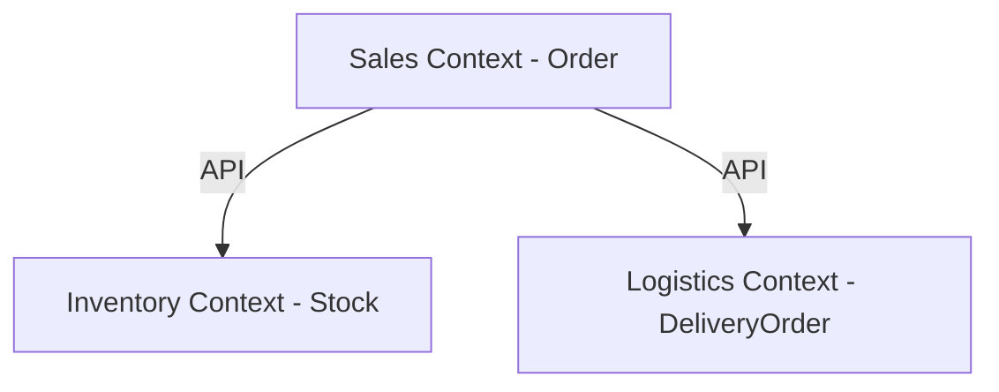

# Domain-Driven Design Principles (DDD Lite)

## Introduction
When systems grow in size and complexity, the hardest problems are rarely technical — they are **conceptual**.  
Different teams interpret business rules differently, leading to misaligned models, duplicated logic, and brittle integrations.  

**Domain-Driven Design (DDD)**, popularized by Eric Evans in his book *Domain-Driven Design: Tackling Complexity in the Heart of Software*, provides a framework for solving these problems.  

While “full DDD” can be heavy and academic, a **practical, lightweight version (DDD Lite)** is highly valuable for modern system design interviews and enterprise systems.  

In this lesson, we’ll cover:  
1. The core goals of DDD.  
2. Key principles: **ubiquitous language**, **bounded contexts**, and **aggregates**.  
3. Java-based examples.  
4. Real-world case studies (Amazon, Uber, Banking).  
5. Interview Q&A for DDD.  

---

## Why DDD?
- Aligns **business experts** and **developers** using a shared language.  
- Reduces ambiguity in requirements.  
- Encourages modular boundaries that scale with teams.  
- Improves system maintainability and testability.  

Without DDD, systems often suffer from:  
- Conflicting models of the same domain (e.g., “order” means different things to sales vs logistics).  
- Shared databases across services leading to tight coupling.  
- Bloated models with unrelated responsibilities.  

---

## Core Principles of DDD (Lite)

### 1. Ubiquitous Language
> **Use the same language across business experts, developers, and code.**  

- Domain terms (e.g., *Order*, *Customer*, *Invoice*) should be consistent in discussions, documentation, and class names.  
- Eliminates the gap between business and code.  

**Bad Example (inconsistent language):**
```java
// Developer names class "Txn" but business calls it "Payment"
public class Txn { ... }
```

**Good Example (ubiquitous language):**
```java
// Consistent with business vocabulary
public class Payment { ... }
```

✅ Everyone (business + tech) uses the word “Payment.”  

---

### 2. Bounded Contexts
> **A bounded context defines a clear boundary around a domain model.**  

- Within a context, terms have **specific meaning**.  
- Prevents conflicts where the same word means different things in different domains.  

**Example: The term “Order”**
- In **E-commerce**, an order is a customer purchase.  
- In **Logistics**, an order is a delivery request.  
- Both are valid, but must live in separate bounded contexts.  

**Java Example – Bounded Context Separation:**
```java
// Sales bounded context
package com.shop.sales;
public class Order { ... } // Represents customer purchase

// Logistics bounded context
package com.shop.logistics;
public class Order { ... } // Represents delivery request
```

✅ Each context owns its own model of “Order.”  
✅ No confusion between sales vs logistics.  

---

### 3. Aggregates
> **Aggregates group related entities and define consistency boundaries.**  

- An aggregate has a **root entity** that controls access to its members.  
- Ensures business invariants are enforced consistently.  

**Java Example – Aggregate Root:**
```java
// Aggregate root: Order
public class Order {
    private String orderId;
    private List<OrderItem> items = new ArrayList<>();

    public void addItem(OrderItem item) {
        // Enforce business rule
        if (item.getQuantity() <= 0) throw new IllegalArgumentException();
        items.add(item);
    }
}

// Entity inside aggregate
public class OrderItem {
    private String productId;
    private int quantity;
}
```

✅ All changes to `OrderItem` go through `Order`.  
✅ Business rules (no negative quantities) enforced at aggregate root.  

---

## Real-World Case Studies

### 1. Amazon
- **Ubiquitous Language**: Clear distinction between *Order* (customer purchase) and *Fulfillment Request* (logistics).  
- **Bounded Contexts**: Sales, Inventory, and Delivery domains isolated.  
- **Aggregates**: Order as root, containing OrderItems.  

### 2. Uber
- **Bounded Contexts**: Rider, Driver, and Trip domains separate.  
- **Aggregates**: Trip entity aggregates locations, driver, rider.  
- **Result**: Allows scaling teams independently without conflicting models.  

### 3. Banking Systems
- **Bounded Contexts**: Loans, Accounts, Compliance modeled separately.  
- **Aggregates**: Account as root, containing Transactions.  
- **Result**: Ensures compliance rules enforced consistently.  

---

## Common Pitfalls

1. **Shared Database Across Contexts**
   - Violates bounded contexts.  
   - Leads to fragile schema coupling.  

2. **Anemic Domain Models**
   - Entities are data bags with no business rules.  
   - Violates the purpose of aggregates.  

3. **Over-Engineering DDD**
   - Applying all tactical patterns blindly.  
   - Leads to unnecessary complexity.  

**DDD Lite → focus on bounded contexts, aggregates, and language alignment.**  

---

## Extended Java Case Study

### Scenario: Online Store

**Without DDD (Confusion):**
```java
// One "Order" class used everywhere
public class Order {
    private String id;
    private String status;
    private String deliveryAddress;
    private double total;
}
```

❌ Sales, Inventory, and Logistics all share one `Order` class.  
❌ Changes in logistics break sales.  

**With DDD Lite (Bounded Contexts & Aggregates):**
```java
// Sales bounded context
package com.store.sales;
public class Order {
    private String orderId;
    private double totalAmount;
}

// Logistics bounded context
package com.store.logistics;
public class DeliveryOrder {
    private String deliveryId;
    private String address;
}

// Aggregate root in Sales
public class Order {
    private String id;
    private List<OrderItem> items;
    public void addItem(OrderItem item) {
        if (item.getQuantity() <= 0) throw new IllegalArgumentException();
        items.add(item);
    }
}
```

✅ Clear boundaries (Sales vs Logistics).  
✅ Aggregates enforce rules at root.  
✅ Each bounded context evolves independently.  

---

## Interview Prep

### Q1: *What is a bounded context in DDD?*  
**Answer:** A bounded context defines a boundary around a domain model where terms have specific meaning. It avoids conflicts where the same word has different meanings in different contexts.  

### Q2: *How do aggregates help in DDD?*  
**Answer:** Aggregates enforce consistency rules by grouping related entities under a root. The root controls access, ensuring invariants are preserved.  

### Q3: *What’s the difference between DDD and CRUD modeling?*  
**Answer:** CRUD focuses on database tables; DDD focuses on domain concepts and business rules. DDD models richer behavior and enforces invariants.  

### Q4: *Give an example of ubiquitous language.*  
**Answer:** If the business calls it “Payment,” the code should use `Payment`, not `Txn` or `PayRecord`.  

### Q5: *Why is DDD important in microservices?*  
**Answer:** Microservices align well with bounded contexts. Each microservice owns its domain, preventing conflicts and ensuring independent evolution.  

---

## Visualizing DDD Lite


✅ Each context owns its own model.  
✅ Communication only via APIs.  

---

## Key Takeaways
- **Ubiquitous Language**: Consistency across business and code.  
- **Bounded Contexts**: Clear boundaries to avoid model conflicts.  
- **Aggregates**: Group related entities and enforce consistency via root.  
- **DDD Lite**: Focus on the essentials without over-engineering.  

---

## Next Lesson
Now that we’ve explored DDD Lite, the next step is tackling **Scalability & Availability Principles** — understanding CAP theorem, consistency trade-offs, and partition tolerance.  

[Continue to Scalability & Availability Principles →](/interview-section/architectural-design-principles/scalability-availability)

---

<footer>
  <p>Connect: <a href="https://www.linkedin.com/in/ravi-shankar-a725b0225/">LinkedIn</a></p>
  <p>&copy; 2025 Official CTO. All rights reserved.</p>
</footer>
