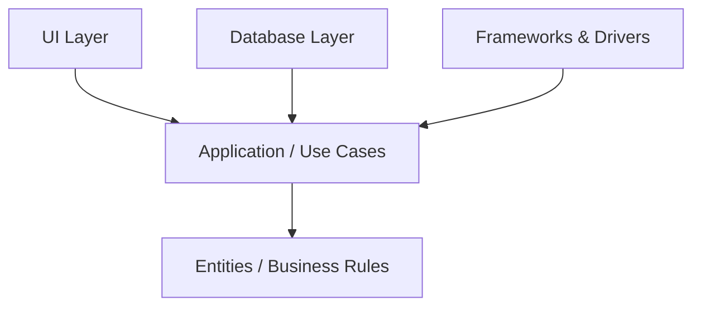
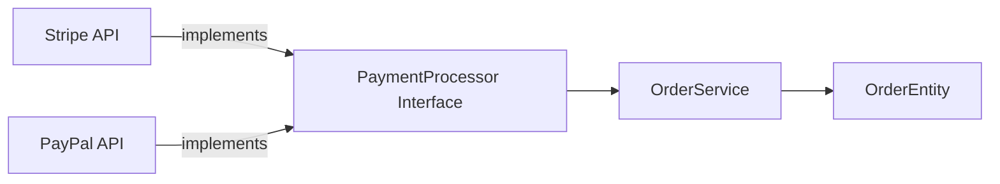

# Dependency Rule (Clean Architecture)

## Introduction
The **Dependency Rule** is one of the most important principles in **Clean Architecture** (Robert C. Martin).  
It tells us how to structure code so that the **business rules** of an application are insulated from external concerns like databases, frameworks, and user interfaces.  

This principle is what makes systems:  
- **Testable** without heavy frameworks.  
- **Maintainable** when external tools change.  
- **Adaptable** to new UIs, APIs, or storage technologies.  

In this lesson, we’ll explore:  
1. What the Dependency Rule means.  
2. Why it is critical in real-world systems.  
3. Java-based examples (with bad vs good implementations).  
4. Case studies from industry (Amazon, Netflix, Banking).  
5. Interview preparation with sample Q&As.  

---

## The Dependency Rule Defined
> **Source code dependencies must always point inward, toward the core business logic.**  

That means:  
- The **core** (business rules, domain entities) should not depend on **outer layers** (frameworks, DB, UI).  
- Outer layers may depend on inner layers.  
- Dependencies always flow **inward**.  

### Onion Model (Clean Architecture Rings)


- **Entities (Core)** → Enterprise-wide business logic, rules that never change.  
- **Use Cases (Application Layer)** → Application-specific workflows.  
- **Interface Adapters** → Controllers, presenters, gateways.  
- **Frameworks & Drivers (Outer)** → Databases, UI, frameworks.  

**Rule:** Dependencies point *inward* only.  

---

## Why the Dependency Rule Matters

### 1. Testability
- If business logic depends on frameworks, tests become **slow and fragile**.  
- Isolating the core makes **unit testing** fast and independent.  

### 2. Maintainability
- Frameworks, UIs, and databases evolve.  
- By isolating the core, you can replace these technologies without rewriting the business rules.  

### 3. Adaptability
- Core logic can serve multiple frontends (web, mobile, APIs).  
- A single business rule can be reused across interfaces.  

### 4. Independence
- Business logic should not be dictated by external schema or APIs.  
- Example: A bank’s interest calculation should not depend on a SQL table column.  

---

## Java Example – Bad (Violating the Rule)
```java
@Entity  // Business object tied to JPA
public class Order {
    @Id
    private String id;
    private double totalAmount;
}

@Service  // Framework-specific annotation in core logic
public class OrderService {
    @Autowired
    private PaymentRepository repository; // direct dependency

    public void placeOrder(Order order) {
        repository.save(order);
        // Business logic here tightly coupled to DB
    }
}
```

**Problems:**  
- Core domain object (`Order`) polluted with JPA annotations.  
- Business service depends directly on persistence.  
- Hard to test `OrderService` without Spring + DB.  

---

## Java Example – Good (Following the Rule)
```java
// Domain entity (no framework annotations)
public class Order {
    private String id;
    private double totalAmount;

    // Business rules only
    public boolean isValid() { return totalAmount > 0; }
}

// Application use case
public class OrderService {
    private final PaymentProcessor processor;

    public OrderService(PaymentProcessor processor) {
        this.processor = processor;
    }

    public void placeOrder(Order order) {
        processor.charge(order);
        // Additional business rules
    }
}

// Interface (boundary)
public interface PaymentProcessor {
    void charge(Order order);
}

// Infrastructure adapter (outer layer)
public class StripeProcessor implements PaymentProcessor {
    public void charge(Order order) {
        // Stripe API logic here
    }
}
```

✅ Domain free of framework annotations.  
✅ Business rules testable in isolation.  
✅ Payment provider swappable (Stripe → PayPal).  

---

## Real-World Case Studies

### 1. Amazon Payments
- **Challenge**: Multiple payment gateways (Visa, Mastercard, PayPal, local banks).  
- **Solution**: Core order/payment logic isolated; gateways implemented as **adapters**.  
- **Result**: Easy onboarding of new providers without touching business rules.  

### 2. Netflix
- **Challenge**: Support for multiple clients (TV, mobile, web).  
- **Solution**: Core streaming rules independent of UI frameworks. Clients adapt via APIs.  
- **Result**: Consistent experience across platforms with reusable core.  

### 3. Banking Systems
- **Challenge**: Legacy mainframes replaced with new tech stacks.  
- **Solution**: Core rules (interest, compliance) isolated from infrastructure.  
- **Result**: Migration possible without rewriting core banking logic.  

---

## Common Pitfalls & Anti-Patterns

1. **Framework in Core Domain**  
   - Adding Spring, Hibernate, or JPA annotations to entities.  
   - Problem: Core becomes dependent on external tools.  

2. **Database-Driven Design**  
   - Designing domain objects to match database schema.  
   - Problem: Business logic becomes fragile to schema changes.  

3. **Big Ball of Mud**  
   - Business rules spread across controllers, DAOs, and services.  
   - Problem: No clear separation; dependencies go both ways.  

4. **Anemic Domain Model**  
   - Entities as data bags with no behavior; all logic in services.  
   - Problem: Violates encapsulation and increases coupling.  

---

## Extended Java Example – End-to-End

### Without Dependency Rule
```java
// Controller directly tied to DB
@RestController
public class OrderController {
    @Autowired
    private OrderRepository repository;

    @PostMapping("/orders")
    public void placeOrder(@RequestBody Order order) {
        repository.save(order); // business rule mixed with persistence
    }
}
```

### With Dependency Rule
```java
// Domain entity (pure business)
public class Order {
    private String id;
    private double totalAmount;
    public boolean isValid() { return totalAmount > 0; }
}

// Application service (use case)
public class OrderService {
    private final OrderRepository repository;
    public OrderService(OrderRepository repository) {
        this.repository = repository;
    }
    public void placeOrder(Order order) {
        if (!order.isValid()) throw new IllegalArgumentException("Invalid order");
        repository.save(order);
    }
}

// Repository boundary
public interface OrderRepository {
    void save(Order order);
}

// Infrastructure adapter
@Repository
public class JpaOrderRepository implements OrderRepository {
    public void save(Order order) {
        // Persist using JPA/Hibernate
    }
}
```

✅ Clear separation of concerns.  
✅ Core logic reusable across REST, GraphQL, or CLI interfaces.  
✅ Testable OrderService with mock repository.  

---

## Interview Preparation

### Q1: *What is the Dependency Rule?*  
**Answer:** In Clean Architecture, source code dependencies must point inward. Business rules must not depend on frameworks, databases, or UI.  

### Q2: *Why is the Dependency Rule important?*  
**Answer:** It ensures testability, maintainability, and adaptability. Systems can evolve without rewriting the core.  

### Q3: *How do you enforce the Dependency Rule in Java?*  
**Answer:**  
- Keep domain entities free from annotations.  
- Use interfaces to abstract dependencies.  
- Place frameworks in the outer layer (adapters).  

### Q4: *What happens if you violate the Dependency Rule?*  
**Answer:**  
- Core logic tied to frameworks; hard to migrate.  
- Testing becomes slow and fragile.  
- Business rules evolve slower.  

### Q5: *Can you give a real-world example?*  
**Answer:** Amazon Payments: dependency rule allows swapping gateways without touching business rules.  

---

## Visualizing Dependency Flow


- Payment APIs (outer) implement contract.  
- Service depends only on the interface.  
- Core logic insulated from external details.  

---

## Key Takeaways
- **Dependency Rule** = dependencies always point inward.  
- Keep core domain free from frameworks and infrastructure.  
- Use **interfaces and adapters** to manage external concerns.  
- Benefits: testability, maintainability, adaptability.  
- Violations lead to fragile, tightly coupled systems.  

---

## Next Lesson
Now that we understand the Dependency Rule, the next step is learning about **Component Cohesion Principles** (REP, CCP, CRP) — how to decide what belongs inside a component.  

[Continue to Component Cohesion Principles →](/interview-section/architectural-design-principles/component-cohesion)

---

<footer>
  <p>Connect: <a href="https://www.linkedin.com/in/ravi-shankar-a725b0225/">LinkedIn</a></p>
  <p>&copy; 2025 Official CTO. All rights reserved.</p>
</footer>
