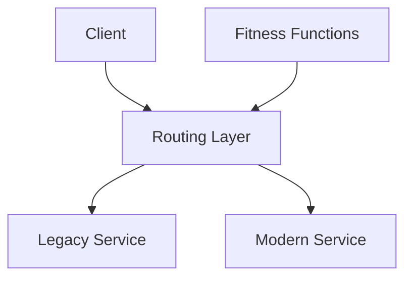

# Evolutionary Architecture Principles

## Introduction
Traditional architecture often focused on **big upfront design (BUFD)**, where architects attempted to anticipate all future requirements before implementation.  
But in today’s fast-changing world — with shifting markets, evolving regulations, and emerging technologies — this approach fails.  

Instead, we need **evolutionary architecture**:  
- Systems designed to **adapt to change** gracefully.  
- Emphasis on **incremental evolution** rather than massive rewrites.  
- Principles that allow systems to grow without becoming brittle.  

This lesson explores:  
1. What evolutionary architecture means.  
2. Core principles (strangler pattern, continuous delivery, fitness functions).  
3. Java examples.  
4. Real-world case studies (Amazon, Netflix, legacy modernization).  
5. Interview Q&A.  

---

## What is Evolutionary Architecture?
> **An architecture that supports incremental, guided change as a first-class concern.**  

Key qualities:  
- **Modularity** – small units evolve independently.  
- **Automated Testing** – safety net for continuous change.  
- **Observability** – monitor how the system behaves in production.  
- **Fitness Functions** – measurable criteria to validate architecture goals.  

---

## Principle 1: Strangler Fig Pattern
> Replace legacy systems incrementally by building new functionality around them, then strangling the old system.  

### Why?
- Big-bang rewrites often fail.  
- Incremental migration reduces risk.  

### Example: Legacy Order System
**Without Strangler:** Rewrite entire monolith → years of effort, risky.  
**With Strangler:**  
1. Route new `/orders` API calls to new service.  
2. Legacy continues serving old features.  
3. Gradually shift traffic until old system retired.  

**Java Example (Routing Layer):**
```java
@RestController
public class OrderController {
    private final LegacyOrderService legacy;
    private final NewOrderService modern;

    @PostMapping("/orders")
    public ResponseEntity<String> placeOrder(@RequestBody Order order) {
        if(order.isModern()) return modern.place(order);
        else return legacy.place(order);
    }
}
```

✅ Incremental migration.  
✅ Reduced risk.  

---

## Principle 2: Continuous Delivery
> Architectural evolution requires **rapid, safe deployments**.  

- Frequent releases reduce batch size of change.  
- Automation (CI/CD) ensures consistency.  
- Rollbacks minimize risk.  

**Practices:**  
- Automated tests at all levels.  
- Infrastructure as code.  
- Canary releases and feature flags.  

**Java Example – Feature Flag**
```java
public class PaymentService {
    private boolean useNewGateway = FeatureFlags.isEnabled("newGateway");

    public void process(Order order) {
        if(useNewGateway) newGateway.charge(order);
        else oldGateway.charge(order);
    }
}
```

✅ Safe rollout of new gateway.  
✅ Toggle without redeploy.  

---

## Principle 3: Fitness Functions
> **Automated checks that measure whether the system meets its architectural goals.**  

- Examples:  
  - Response time < 200ms.  
  - 99.99% uptime.  
  - No cyclic dependencies.  

Fitness functions ensure evolution doesn’t erode key qualities.  

**Java Example – Dependency Fitness Test**
```java
@Test
public void testNoCyclicDependencies() {
    Architecture arch = new ClassFileImporter().importPackages("com.shop");
    ArchRule rule = slices().matching("com.shop.(*)..").should().beFreeOfCycles();
    rule.check(arch);
}
```

✅ Automated check prevents cycles creeping into architecture.  

---

## Real-World Case Studies

### 1. Amazon
- Migrated from monolith to services incrementally (strangler pattern).  
- Heavy use of CI/CD pipelines.  
- Fitness functions: latency SLAs enforced in production.  

### 2. Netflix
- Adopted microservices evolution over years.  
- Continuous deployment → thousands of daily releases.  
- Fitness functions: chaos engineering (random failures) to ensure resilience.  

### 3. Legacy Banking Systems
- Gradual migration from COBOL to modern stacks.  
- Strangler pattern ensures zero downtime.  
- Automated compliance checks as fitness functions.  

---

## Common Pitfalls

1. **Big Bang Rewrite**
   - Risky, expensive, often fails.  

2. **Lack of Automation**
   - Without CI/CD, evolution is unsafe.  

3. **Ignoring Fitness Functions**
   - Architecture drifts from intended goals.  

4. **Premature Optimization**
   - Over-engineering for unknown future needs.  

---

## Extended Java Case Study

### Scenario: Migrating Payment System

**Legacy Service**
```java
public class LegacyPaymentService {
    public void pay(Order order) { ... } // old gateway
}
```

**Modern Service**
```java
public class ModernPaymentService {
    public void pay(Order order) { ... } // new gateway
}
```

**Strangler Router**
```java
public class PaymentRouter {
    private LegacyPaymentService legacy = new LegacyPaymentService();
    private ModernPaymentService modern = new ModernPaymentService();

    public void pay(Order order) {
        if(order.isModern()) modern.pay(order);
        else legacy.pay(order);
    }
}
```

✅ Incremental migration.  
✅ Switch routes gradually.  

---

## Interview Prep

### Q1: *What is evolutionary architecture?*  
**Answer:** An architecture designed to support incremental, guided change as a first-class concern, using principles like strangler pattern, CI/CD, and fitness functions.  

### Q2: *What is the strangler fig pattern?*  
**Answer:** A strategy to replace legacy systems incrementally by routing new functionality to modern services while old system continues to run, eventually strangling the old.  

### Q3: *How do fitness functions help?*  
**Answer:** They automate checks to ensure system evolution doesn’t break architectural qualities like performance, resilience, or modularity.  

### Q4: *Why is continuous delivery important for evolution?*  
**Answer:** Frequent, automated deployments enable safe incremental change and quick rollback.  

### Q5: *Give a real-world example of evolutionary architecture.*  
**Answer:** Netflix evolved from monolith to microservices incrementally, with continuous delivery and chaos testing as fitness functions.  

---

## Visualizing Evolutionary Architecture


✅ Routing layer enables gradual migration.  
✅ Fitness functions monitor evolution safety.  

---

## Key Takeaways
- **Evolutionary Architecture** embraces change as inevitable.  
- **Strangler Pattern** → replace legacy incrementally.  
- **Continuous Delivery** → safe, frequent evolution.  
- **Fitness Functions** → automated validation of goals.  
- Real-world leaders (Amazon, Netflix, Banking) practice these principles.  

---

## Next Lesson
Final step: **Interview & Case Studies** — practicing how to apply all architectural principles in real-world system design scenarios.  

---

<footer>
  <p>Connect: <a href="https://www.linkedin.com/in/ravi-shankar-a725b0225/">LinkedIn</a></p>
  <p>&copy; 2025 Official CTO. All rights reserved.</p>
</footer>
