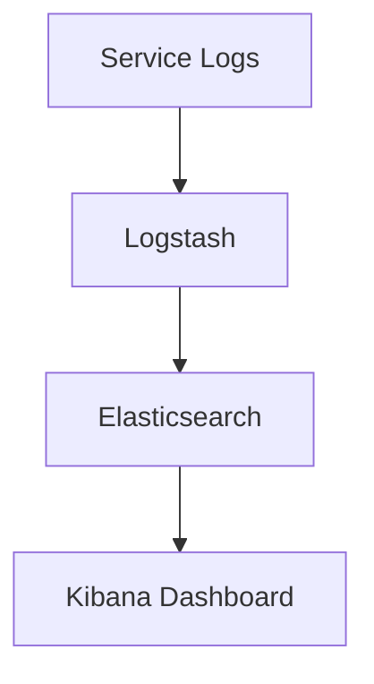
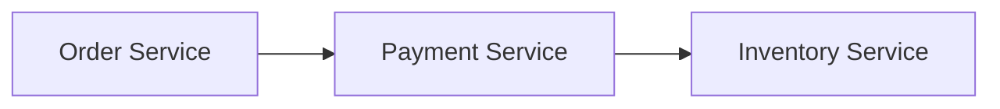
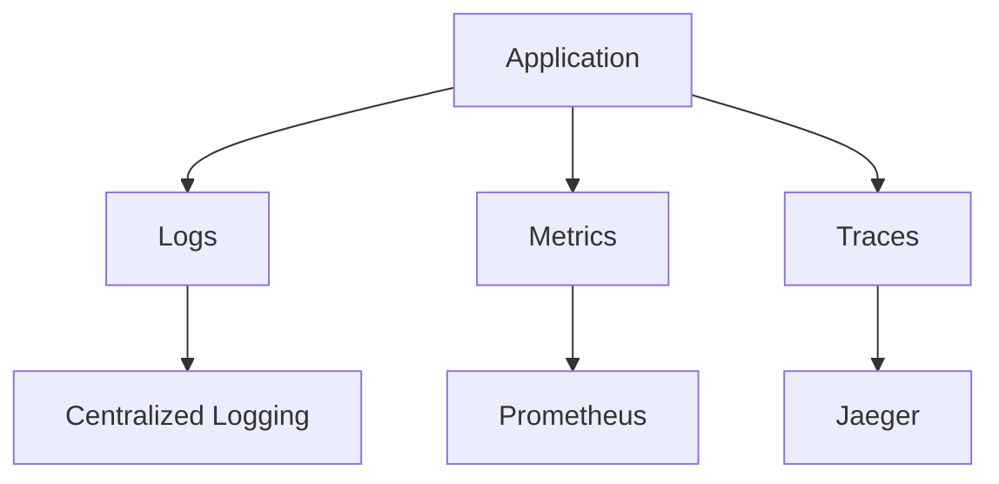

# Observability Principles

## Introduction
As systems evolve into **distributed microservices** and **cloud-native environments**, failures become harder to detect and diagnose. Traditional monitoring, which focuses only on system health (e.g., CPU usage), is not enough.  

This is where **Observability Principles** come in. Inspired by control theory, observability means:  
> *Can we understand a system’s internal state by examining its external outputs?*  

In software architecture, this translates into **logs, metrics, and traces** that together give engineers the ability to ask questions about the system without predefining them.  

Observability is essential for debugging, performance tuning, security auditing, and ensuring reliability at scale.  

---

## Intent
> **The intent of observability principles is to design systems that expose enough signals (logs, metrics, traces) to allow engineers to understand, troubleshoot, and improve system behavior in real time.**  

---

## Key Dimensions of Observability

### 1. Logs
- Detailed records of events in the system.  
- Provide context (errors, warnings, info).  
- Example: “Payment failed for order 123 due to insufficient funds.”  

### 2. Metrics
- Numerical measurements collected over time.  
- Examples: request latency, error rate, CPU usage.  
- Key for dashboards and alerting.  

### 3. Traces
- Distributed traces track requests across multiple services.  
- Example: a checkout request spanning Order → Payment → Inventory.  

### 4. Events
- High-level signals indicating state changes.  
- Often emitted as domain events (e.g., `OrderPlaced`).  

---

## Principles & Techniques

### 1. Structured Logging
- Use JSON or key-value logs.  
- Easier to parse and analyze than plain text.  

**Java Example (SLF4J + Logback)**
```java
logger.info("OrderPlaced event for orderId={} total={}", orderId, total);
```

---

### 2. Centralized Log Aggregation
- Collect logs from all services in one place.  
- Tools: ELK stack (Elasticsearch, Logstash, Kibana), Splunk, Loki.  



---

### 3. Metrics Collection
- Expose Prometheus metrics from services.  
- Use Grafana for visualization.  

**Java Example (Micrometer + Spring Boot)**
```java
Counter orderCounter = Counter.builder("orders.placed")
    .description("Number of orders placed")
    .register(meterRegistry);

orderCounter.increment();
```

---

### 4. Distributed Tracing
- Use trace IDs to follow requests.  
- Tools: OpenTelemetry, Jaeger, Zipkin.  

**Java Example (Spring Cloud Sleuth)**
```java
Span newSpan = tracer.nextSpan().name("checkout").start();
try (Tracer.SpanInScope ws = tracer.withSpan(newSpan.start())) {
    paymentService.process(order);
} finally {
    newSpan.end();
}
```

---

### 5. Dashboards & Alerting
- Dashboards show metrics in real time.  
- Alerts trigger on anomalies (e.g., error rate > 5%).  

---

### 6. SLOs, SLIs, SLAs
- **SLI (Indicator)**: measurable metric (latency < 100ms).  
- **SLO (Objective)**: target (99% of requests < 100ms).  
- **SLA (Agreement)**: contract with customers (refund if < 99.9% uptime).  

---

## Real-World Case Studies

### 1. Netflix
- Uses Atlas for metrics, centralized logging, and distributed tracing.  
- Ensures millions of requests can be monitored in real time.  

### 2. Uber
- Heavily invested in Jaeger (distributed tracing).  
- Helps debug latency in ride-matching services.  

### 3. Google SRE
- Popularized SLOs and error budgets.  
- Observability central to Site Reliability Engineering (SRE).  

---

## Extended Java Case Study: Checkout Flow

### Problem
Checkout spans Order, Payment, Inventory services. Failures hard to trace.  

### Solution: Apply Observability Principles
1. **Add structured logs** to each service.  
2. **Expose metrics** (latency, errors).  
3. **Use distributed tracing** with trace IDs.  

**Example Logs**
```text
2025-09-26 INFO OrderService - OrderPlaced orderId=123
2025-09-26 INFO PaymentService - PaymentProcessed orderId=123
2025-09-26 ERROR InventoryService - OutOfStock orderId=123
```

**Trace Visualization (Jaeger)**


✅ Engineers can trace the exact failure path.  

---

## Consequences

### Benefits
1. **Faster Debugging** – Quickly locate issues.  
2. **Proactive Alerting** – Detect issues before users complain.  
3. **Performance Insights** – Optimize latency and throughput.  
4. **Security Auditing** – Detect anomalies.  
5. **Reliability Metrics** – Track SLOs, SLIs.  

### Drawbacks
1. **Overhead** – Collecting logs/metrics consumes resources.  
2. **Noise** – Too many logs reduce signal quality.  
3. **Cost** – Centralized observability platforms can be expensive.  
4. **Privacy Concerns** – Logs must not leak sensitive data.  

---

## Interview Prep

### Q1: *What are the three pillars of observability?*  
**Answer:** Logs, metrics, and traces.  

### Q2: *What’s the difference between monitoring and observability?*  
**Answer:** Monitoring = predefined checks. Observability = ability to ask new questions without prior knowledge.  

### Q3: *What is distributed tracing?*  
**Answer:** Tracing a request across multiple services using trace IDs.  

### Q4: *What are SLIs, SLOs, and SLAs?*  
**Answer:** SLIs = indicators, SLOs = objectives, SLAs = contracts.  

### Q5: *Why is observability critical in microservices?*  
**Answer:** Distributed systems fail in complex ways, observability provides visibility to diagnose.  

---

## Visualizing Observability


✅ Logs, metrics, traces flow into central systems.  

---

## Key Takeaways
- Observability = logs + metrics + traces.  
- Enables debugging, alerting, auditing, and optimization.  
- Tools: ELK, Prometheus, Grafana, Jaeger, OpenTelemetry.  
- Essential for SRE and microservices.  

---

## Next Lesson
Next, we’ll move into **Layered Architecture Pattern**, transitioning from principles into concrete architectural patterns.  

[Continue to Layered Architecture Pattern →](/interview-section/architectural-design-patterns/layered-architecture)

---

<footer>
  <p>Connect: <a href="https://www.linkedin.com/in/ravi-shankar-a725b0225/">LinkedIn</a></p>
  <p>&copy; 2025 Official CTO. All rights reserved.</p>
</footer>
