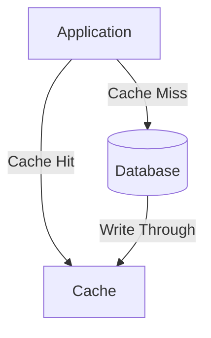

# Performance & Caching Principles

## Introduction
Modern software systems must deliver not only correctness but also **speed** and **scalability**.  
Two of the most critical metrics in system design are:  
- **Latency**: The time it takes to respond to a request.  
- **Throughput**: The number of requests a system can handle per unit of time.  

As systems grow, bottlenecks emerge in databases, APIs, and networks. Caching is often the most effective principle to improve performance, by reducing repeated computations and database calls.  

These principles are not optional — they determine user experience, cost efficiency, and business competitiveness.  

---

## Intent
> **Performance and caching principles aim to minimize latency, maximize throughput, and optimize resource usage, ensuring systems remain fast and cost-effective under load.**  

---

## Key Dimensions of Performance

### 1. Latency
- The time between a request and its response.  
- Measured in milliseconds.  
- Critical for user-facing apps (Amazon found 100ms of latency reduced sales).  

### 2. Throughput
- Number of operations per second the system can sustain.  
- Critical for backend systems under load.  

### 3. Scalability
- Ability to maintain performance as load grows.  
- Achieved through horizontal scaling + caching.  

### 4. Resource Utilization
- CPU, memory, disk, network usage.  
- Performance tuning balances trade-offs.  

---

## Caching Principles

### What is Caching?
Caching stores frequently used data in faster storage (memory, SSD, distributed systems) to avoid recomputation or expensive I/O.  

### Types of Caches
1. **In-Memory Cache (Local)**  
   - Stored in application memory.  
   - Example: Java HashMap, Guava Cache.  
   - ✅ Very fast, ❌ Limited to one node.  

2. **Distributed Cache**  
   - Shared across nodes.  
   - Examples: Redis, Memcached, Hazelcast.  
   - ✅ Works in clusters, ❌ Adds network hop.  

3. **Database Caching**  
   - DB-level caches (query cache, materialized views).  

4. **Content Delivery Network (CDN)**  
   - Edge caching for static content (images, CSS, JS).  

5. **Application-Level Caching**  
   - HTTP response caching, GraphQL caching, API Gateway caching.  

---

## Caching Strategies

### 1. Cache-Aside (Lazy Loading)
- Application checks cache first, then DB.  
- Data loaded into cache on miss.  
- Most common approach.  

### 2. Read-Through
- Application always reads from cache.  
- Cache auto-fetches from DB if needed.  

### 3. Write-Through
- Data written to cache and DB simultaneously.  
- Ensures cache consistency.  

### 4. Write-Behind (Write-Back)
- Write goes to cache first, asynchronously persisted to DB.  
- ✅ Faster writes, ❌ Risk of data loss if cache crashes.  

### 5. TTL (Time-To-Live)
- Cached items expire after set time.  
- Prevents stale data.  

### 6. Cache Invalidation
- Hardest problem in caching.  
- Strategies: TTL, versioning, explicit invalidation on updates.  

---

## Java Implementation Examples

### In-Memory Cache (Guava)
```java
LoadingCache<String, String> cache = CacheBuilder.newBuilder()
    .maximumSize(1000)
    .expireAfterWrite(10, TimeUnit.MINUTES)
    .build(new CacheLoader<String, String>() {
        public String load(String key) { return fetchFromDb(key); }
    });

String value = cache.get("user:123");
```

### Distributed Cache (Spring + Redis)
```java
@Service
public class UserService {
    @Cacheable(value = "users", key = "#id")
    public User getUser(String id) {
        // Will be cached in Redis
        return userRepository.findById(id).orElseThrow();
    }
}
```

### CDN Caching (HTTP Headers)
```http
Cache-Control: public, max-age=3600
ETag: "v1.0-resource"
```

---

## Consequences of Caching

### Benefits
1. **Lower Latency** – Memory/cache faster than DB.  
2. **Higher Throughput** – Fewer expensive operations.  
3. **Cost Savings** – Reduce DB load.  
4. **Scalability** – Handle spikes gracefully.  

### Drawbacks
1. **Stale Data** – Risk of serving outdated info.  
2. **Invalidation Complexity** – Hardest part of caching.  
3. **Cache Stampede** – Too many requests on cache miss.  
4. **Memory Cost** – Cache can grow expensive.  

---

## Performance Tuning Principles

1. **Measure First** – Profile system to find bottlenecks.  
2. **Use Appropriate Caches** – Choose between in-memory vs distributed.  
3. **Batching & Bulk Operations** – Reduce round-trips.  
4. **Asynchronous Processing** – Don’t block users for slow ops.  
5. **CDN for Static Content** – Offload edge requests.  
6. **Database Indexing** – Ensure queries optimized.  
7. **Circuit Breakers & Timeouts** – Fail fast, degrade gracefully.  

---

## Real-World Case Studies

### 1. Amazon
- Found 100ms extra latency caused 1% drop in sales.  
- Heavy use of CDN + caching for product pages.  

### 2. Netflix
- Uses **EVCache** (distributed cache) for fast streaming metadata.  
- Reduces DB load dramatically.  

### 3. Twitter
- Uses **Redis** for timelines.  
- Serving tweets from cache reduces latency from seconds → milliseconds.  

---

## Extended Java Case Study: E-commerce

### Problem: Slow Product Page Loads
- Product info fetched from DB repeatedly.  

### Solution: Add Cache-Aside Strategy
```java
public class ProductService {
    private final Map<String, Product> cache = new HashMap<>();
    private final ProductRepository repo;

    public ProductService(ProductRepository repo) { this.repo = repo; }

    public Product getProduct(String id) {
        if(cache.containsKey(id)) return cache.get(id);
        Product product = repo.findById(id).orElseThrow();
        cache.put(id, product);
        return product;
    }
}
```

✅ Faster page loads.  
✅ Reduces DB load.  

---

## Interview Prep

### Q1: *What’s the difference between latency and throughput?*  
**Answer:** Latency = time for a single request. Throughput = number of requests handled per unit time.  

### Q2: *What are caching strategies?*  
**Answer:** Cache-aside, read-through, write-through, write-behind, TTL, invalidation.  

### Q3: *What are pros and cons of caching?*  
**Answer:** Pros: speed, scalability, cost savings. Cons: stale data, invalidation complexity.  

### Q4: *What is cache stampede?*  
**Answer:** Too many requests hit DB when cache misses, solved with locking or request coalescing.  

### Q5: *How does CDN caching help?*  
**Answer:** Moves static content closer to users, reducing latency globally.  

---

## Visualizing Caching Strategies


✅ Cache in middle layer.  
✅ Improves speed + reduces DB load.  

---

## Key Takeaways
- **Performance metrics** = latency & throughput.  
- **Caching** is the #1 tool to improve performance.  
- Multiple caching strategies exist, each with trade-offs.  
- Proper invalidation is critical.  
- Real-world systems (Amazon, Netflix, Twitter) rely heavily on caching for speed and scale.  

---

## Next Lesson
Next, we’ll explore **Resilience & Fault Tolerance Principles** — handling retries, timeouts, and circuit breakers for robust distributed systems.  

[Continue to Resilience & Fault Tolerance Principles →](/interview-section/architectural-design-principles/resilience-fault-tolerance)

---

<footer>
  <p>Connect: <a href="https://www.linkedin.com/in/ravi-shankar-a725b0225/">LinkedIn</a></p>
  <p>&copy; 2025 Official CTO. All rights reserved.</p>
</footer>
