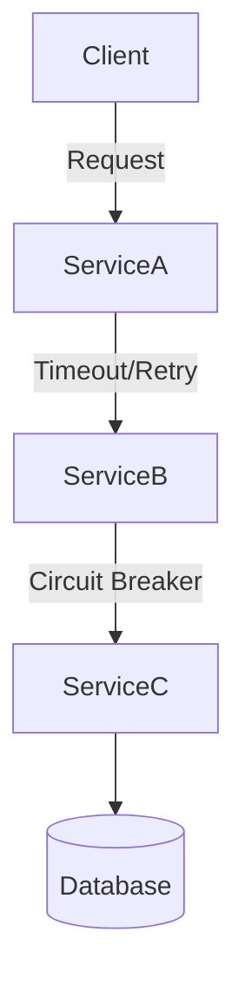

# Resilience & Fault Tolerance Principles

## Introduction
Modern distributed systems run in **unreliable environments**:  
- Services may crash.  
- Networks may drop packets.  
- Databases may time out under load.  

In such systems, **failure is not an exception — it is the norm**. The goal of resilience and fault tolerance is not to prevent all failures (impossible), but to ensure systems **continue operating gracefully when failures occur**.  

These principles are critical in **cloud-native, microservices, and large-scale distributed systems** where outages can cascade if not handled properly.  

---

## Intent
> **Resilience and fault tolerance principles ensure that systems can absorb failures, recover gracefully, and continue providing service without catastrophic breakdowns.**  

---

## Key Concepts

### 1. Resilience vs Fault Tolerance
- **Resilience**: Ability to recover from failures and continue operating.  
- **Fault Tolerance**: Ability to continue operating correctly despite faults.  

### 2. Failure Types
- **Transient Failures**: Temporary (e.g., network hiccups).  
- **Permanent Failures**: Long-lasting (service down).  
- **Partial Failures**: Common in distributed systems (one service down, others up).  

### 3. System Behaviors
- **Fail Fast**: Detect and stop processing quickly.  
- **Graceful Degradation**: Provide reduced functionality instead of failing completely.  
- **Self-Healing**: Automatically recover (e.g., retries, restarts).  

---

## Principles & Techniques

### 1. Timeouts
- Never wait forever for a response.  
- Set strict timeouts for DB calls, APIs.  

**Java Example**
```java
HttpClient client = HttpClient.newBuilder()
    .connectTimeout(Duration.ofSeconds(3))
    .build();
```

---

### 2. Retries with Backoff
- Retry transient failures.  
- Use exponential backoff to avoid flooding.  

**Java Example (Spring Retry)**
```java
@Retryable(maxAttempts = 3, backoff = @Backoff(delay = 2000))
public String callService() {
    return restTemplate.getForObject("http://inventory/api", String.class);
}
```

---

### 3. Circuit Breakers
- Prevent cascading failures.  
- Stop calling a failing service temporarily.  

**Java Example (Resilience4j)**
```java
CircuitBreakerConfig config = CircuitBreakerConfig.custom()
    .failureRateThreshold(50)
    .waitDurationInOpenState(Duration.ofSeconds(10))
    .build();

CircuitBreaker circuitBreaker = CircuitBreaker.of("inventory", config);
Supplier<String> decorated = CircuitBreaker
    .decorateSupplier(circuitBreaker, () -> callInventory());
```

---

### 4. Bulkheads
- Isolate resources so one failure doesn’t sink entire system.  
- Example: Separate thread pools for critical vs non-critical tasks.  

**Java Example (Executor Pools)**
```java
ExecutorService criticalPool = Executors.newFixedThreadPool(10);
ExecutorService nonCriticalPool = Executors.newFixedThreadPool(5);
```

---

### 5. Fallbacks & Graceful Degradation
- Provide defaults when dependency unavailable.  
- Example: Show cached product info if recommendation service down.  

**Java Example**
```java
public String getRecommendations(String userId) {
    try {
        return recommendationService.fetch(userId);
    } catch(Exception e) {
        return "Popular products"; // fallback
    }
}
```

---

### 6. Rate Limiting & Load Shedding
- Protect system from overload.  
- Reject or shed requests when system near breaking point.  

**Java Example (Bucket4j)**
```java
Bucket bucket = Bucket4j.builder()
    .addLimit(Bandwidth.classic(100, Refill.greedy(100, Duration.ofMinutes(1))))
    .build();
```

---

### 7. Replication & Redundancy
- Duplicate components (DB replicas, multiple instances).  
- Ensure no single point of failure.  

---

### 8. Chaos Engineering
- Intentionally inject failures to test resilience.  
- Popularized by Netflix Chaos Monkey.  

---

## Real-World Case Studies

### 1. Netflix
- Uses **Hystrix (circuit breaker)** and Chaos Monkey for resilience.  
- Ensures streaming continues even if one service fails.  

### 2. Amazon
- Graceful degradation in product recommendations.  
- If ML service fails, fallback to “bestsellers”.  

### 3. Banking Systems
- Bulkheads isolate critical transaction services from analytics.  

---

## Extended Java Case Study: E-commerce Checkout

### Problem
Checkout flow depends on Payment + Inventory services.  
If one fails, checkout hangs or crashes.  

### Solution: Apply Resilience Principles
1. **Timeouts** → don’t wait forever.  
2. **Retries** → retry transient failures.  
3. **Circuit Breaker** → stop repeated calls to failing service.  
4. **Fallbacks** → provide default.  

**Implementation**
```java
public class CheckoutService {
    private final PaymentService payment;
    private final InventoryService inventory;

    public void checkout(Order order) {
        try {
            payment.process(order);
            inventory.reserve(order);
        } catch(Exception e) {
            // fallback
            throw new RuntimeException("Checkout unavailable, please retry later.");
        }
    }
}
```

✅ Prevents cascading failures.  
✅ Customers see graceful error instead of system crash.  

---

## Interview Prep

### Q1: *What is the difference between resilience and fault tolerance?*  
**Answer:** Resilience = ability to recover. Fault tolerance = ability to operate correctly despite faults.  

### Q2: *What are circuit breakers?*  
**Answer:** Mechanism to stop calling a failing service temporarily to avoid cascading failures.  

### Q3: *What is graceful degradation?*  
**Answer:** Providing reduced functionality instead of full outage.  

### Q4: *What is bulkhead pattern?*  
**Answer:** Isolating resources to prevent one failure from affecting all components.  

### Q5: *What is chaos engineering?*  
**Answer:** Intentionally injecting failures to test resilience.  

---

## Visualizing Fault Tolerance


✅ Protection at multiple levels.  

---

## Key Takeaways
- **Resilience & fault tolerance** ensure survival in unreliable environments.  
- Techniques: timeouts, retries, circuit breakers, bulkheads, fallbacks.  
- Real-world systems (Netflix, Amazon) rely heavily on these principles.  
- Chaos engineering validates resilience in practice.  

---

## Next Lesson
Next, we’ll explore **Observability Principles** — designing systems with metrics, logs, and traces for visibility and debugging.  

[Continue to Observability Principles →](/interview-section/architectural-design-principles/observability)

---

<footer>
  <p>Connect: <a href="https://www.linkedin.com/in/ravi-shankar-a725b0225/">LinkedIn</a></p>
  <p>&copy; 2025 Official CTO. All rights reserved.</p>
</footer>
