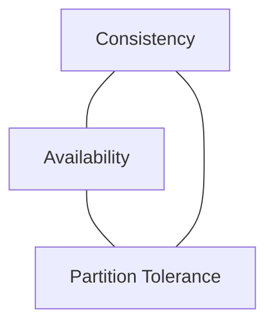
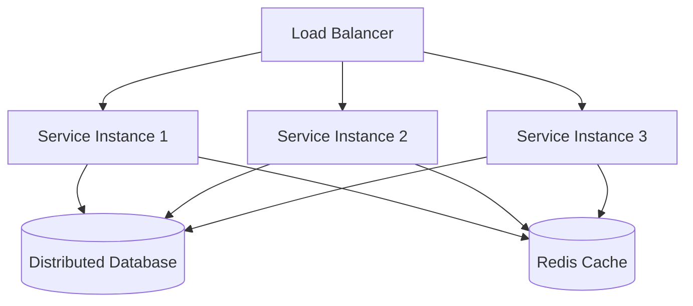

# Scalability & Availability Principles

## Introduction
Modern systems must serve **millions of users**, handle **petabytes of data**, and deliver responses in **milliseconds**.  
Achieving this requires more than good code — it requires architectural principles that balance **scalability** and **availability**.  

In this lesson, we’ll cover:  
1. The difference between scalability and availability.  
2. Vertical vs horizontal scaling.  
3. CAP theorem and its trade-offs.  
4. Strategies for consistency, availability, and partition tolerance.  
5. Java-based examples of scalable designs.  
6. Real-world case studies (Amazon, Netflix, Banking).  
7. Interview Q&A.  

---

## Scalability: What & Why
> **Scalability is a system’s ability to handle growth in workload without sacrificing performance.**  

### Two Types of Scaling
1. **Vertical Scaling (Scale Up)**  
   - Add more resources (CPU, RAM) to one machine.  
   - Example: Upgrading DB server from 16GB RAM → 64GB RAM.  
   - ✅ Simpler. ❌ Limited by hardware & cost.  

2. **Horizontal Scaling (Scale Out)**  
   - Add more machines/nodes to share the load.  
   - Example: Adding more web servers behind a load balancer.  
   - ✅ More scalable. ❌ More complex.  

### Java Example – Scaling Out (Spring Boot + Load Balancer)
```java
// Controller remains stateless for horizontal scaling
@RestController
public class OrderController {
    @PostMapping("/order")
    public ResponseEntity<String> placeOrder(@RequestBody Order order) {
        return ResponseEntity.ok("Order placed: " + order.getId());
    }
}
```

✅ Stateless design → multiple instances can handle requests independently.  

---

## Availability: What & Why
> **Availability is the percentage of time a system remains operational.**  

### Common Targets
- “Two nines” → 99% uptime (~3.65 days downtime/year).  
- “Five nines” → 99.999% uptime (~5 minutes downtime/year).  

### Achieving High Availability
- **Redundancy** (multiple servers, failover).  
- **Load Balancing** (distribute requests).  
- **Replication** (data available in multiple places).  
- **Health Checks** (automatic failover when node dies).  

---

## CAP Theorem
> Introduced by Eric Brewer: In distributed systems, you can only guarantee **two out of three** properties:  

1. **Consistency (C)** – Every read sees the latest write.  
2. **Availability (A)** – Every request gets a response (success/fail).  
3. **Partition Tolerance (P)** – The system continues despite network partitions.  



### Implications
- In distributed systems, **P is non-negotiable** (networks fail).  
- You must choose between **C or A** in presence of partitions.  

---

## Trade-offs in Practice

### CP Systems (Consistency + Partition Tolerance)
- Prioritize correctness over availability.  
- Example: **Banking systems** (better to reject a transaction than risk inconsistency).  
- Tools: Zookeeper, HBase.  

### AP Systems (Availability + Partition Tolerance)
- Prioritize uptime over strict consistency.  
- Example: **E-commerce cart** (ok if two nodes see slightly different carts).  
- Tools: Cassandra, DynamoDB.  

### CA Systems (Consistency + Availability)
- Only possible if no partitions (single node, tightly coupled).  
- Example: Traditional RDBMS on one server.  

---

## Strategies for Scalability & Availability

### 1. Caching
- Use Redis or Memcached to offload read-heavy workloads.  
- ✅ Improves latency. ❌ Must handle cache invalidation.  

### 2. Database Sharding
- Split large DB into smaller shards.  
- Example: User IDs 1–1M in DB1, 1M–2M in DB2.  
- ✅ Scale horizontally. ❌ Increases complexity.  

### 3. Replication
- Master-slave or leader-follower replication.  
- ✅ High availability. ❌ Risk of replication lag.  

### 4. Asynchronous Processing
- Use message queues (Kafka, RabbitMQ) for decoupling.  
- ✅ Smooths spikes in workload. ❌ Adds eventual consistency.  

### 5. Stateless Services
- Keep application servers stateless.  
- ✅ Easy to scale horizontally. ❌ Requires external session store if needed.  

---

## Real-World Case Studies

### 1. Amazon
- **Problem**: Handle Black Friday traffic surges.  
- **Solution**: Horizontal scaling via stateless microservices, DynamoDB for AP trade-off.  
- **Result**: Elastic scaling with high availability.  

### 2. Netflix
- **Problem**: Global availability for streaming.  
- **Solution**: Replication across multiple AWS regions. Use of Cassandra (AP).  
- **Result**: High uptime, even during regional outages.  

### 3. Banking Systems
- **Problem**: Must prioritize correctness of balances.  
- **Solution**: CP systems with strong consistency, often sacrificing availability during partitions.  
- **Result**: Reliability over speed.  

---

## Extended Java Case Study

### Scenario: Order Processing

**Non-Scalable Design**
```java
// Stateful service (hard to scale)
public class OrderService {
    private List<Order> cache = new ArrayList<>();
    public void placeOrder(Order order) { cache.add(order); }
}
```

❌ Tied to one machine.  
❌ Can’t scale horizontally.  

**Scalable Design**
```java
// Stateless service + external store
public class OrderService {
    private final OrderRepository repo;
    public OrderService(OrderRepository repo) { this.repo = repo; }
    public void placeOrder(Order order) { repo.save(order); }
}
```

✅ Stateless → multiple service instances can run behind a load balancer.  
✅ Repository backed by distributed DB.  

---

## Common Pitfalls

1. **Shared State in Services**
   - Blocks horizontal scaling.  

2. **Over-Reliance on Strong Consistency**
   - Leads to poor availability in distributed environments.  

3. **Ignoring Partition Tolerance**
   - Designing as if networks never fail.  

4. **Premature Optimization**
   - Over-engineering scalability before real demand.  

---

## Interview Prep

### Q1: *What’s the difference between vertical and horizontal scaling?*  
**Answer:** Vertical scaling adds resources to one machine. Horizontal scaling adds more machines to share the load.  

### Q2: *Explain CAP theorem.*  
**Answer:** In distributed systems, you can only guarantee two of Consistency, Availability, Partition Tolerance. Since P is unavoidable, systems must choose C or A in presence of partitions.  

### Q3: *Give an example of AP vs CP trade-off.*  
**Answer:** Banking → CP (consistency first). E-commerce carts → AP (availability first).  

### Q4: *How do you design stateless services in Java?*  
**Answer:** Keep no local state in service; rely on external DB or cache. Multiple instances behind load balancer can then handle requests independently.  

### Q5: *What are common scalability patterns?*  
**Answer:** Caching, sharding, replication, asynchronous processing, stateless design.  

---

## Visualizing Scalable Architecture


✅ Stateless services.  
✅ Distributed DB with replication.  
✅ Cache layer for performance.  

---

## Key Takeaways
- **Scalability** → ability to grow workload capacity.  
- **Availability** → ability to stay operational.  
- **CAP theorem** forces trade-offs in distributed systems.  
- Strategies: caching, sharding, replication, stateless design, async processing.  
- Real systems (Amazon, Netflix, Banking) balance principles differently based on domain.  

---

<footer>
  <p>Connect: <a href="https://www.linkedin.com/in/ravi-shankar-a725b0225/">LinkedIn</a></p>
  <p>&copy; 2025 Official CTO. All rights reserved.</p>
</footer>
