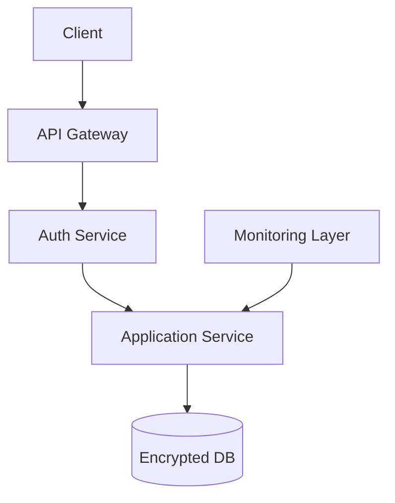

# Security Principles in Architecture

## Introduction
In today’s interconnected world, **security is no longer optional** — it is a foundational architectural concern.  
From financial systems to healthcare platforms, breaches can cost millions, damage reputations, and even endanger lives.  

**Architectural security principles** ensure that systems are built with resilience against attacks from the ground up, not as an afterthought.  

In this lesson, we’ll cover:  
1. Why security must be baked into architecture.  
2. Core principles: **Least Privilege**, **Defense in Depth**, **Fail Securely**.  
3. Java-inspired examples.  
4. Real-world case studies (Amazon, Netflix, Banking).  
5. Common pitfalls & interview prep.  

---

## Why Security Principles Matter in Architecture
- **Proactive vs Reactive**: Fixing vulnerabilities later is far more expensive.  
- **Regulatory Requirements**: GDPR, HIPAA, PCI-DSS demand secure design.  
- **Business Impact**: Security incidents cause downtime, fines, and loss of customer trust.  
- **Attack Surface Minimization**: Architectural design determines how exposed the system is.  

---

## Principle 1: Least Privilege
> **Each component, service, or user should have the minimum access needed to perform its role — nothing more.**  

### Why?
- Limits the blast radius of attacks.  
- Prevents privilege escalation.  
- Reduces insider threat risks.  

### Java Example – Violating Least Privilege
```java
// User repository grants excessive permissions
public Connection getConnection() throws SQLException {
    return DriverManager.getConnection("jdbc:mysql://db", "root", "rootpassword");
}
```

❌ Application runs as root, can drop tables.  

### Java Example – Applying Least Privilege
```java
// Restricted DB user with only necessary permissions
public Connection getConnection() throws SQLException {
    return DriverManager.getConnection("jdbc:mysql://db", "order_user", "securepassword");
}
```

✅ `order_user` only has SELECT/INSERT on `orders` table.  
✅ Even if compromised, scope of damage is limited.  

---

## Principle 2: Defense in Depth
> **Use multiple layers of security so that if one fails, others still protect the system.**  

### Why?
- No single control is perfect.  
- Attackers often exploit weakest links.  
- Redundancy increases resilience.  

### Example Layers in Distributed Systems
1. **Network Layer**: Firewalls, VPNs.  
2. **Application Layer**: Authentication, authorization.  
3. **Data Layer**: Encryption, masking.  
4. **Monitoring Layer**: Intrusion detection, anomaly detection.  

### Java Example – Defense in Depth
```java
// Web controller
@RestController
public class PaymentController {

    @PreAuthorize("hasRole('USER')")
    @PostMapping("/pay")
    public String processPayment(@RequestBody Payment payment) {
        // Even if request reaches here, DB encryption protects data
        return "Processed";
    }
}
```

✅ Authentication at gateway.  
✅ Authorization at controller.  
✅ Data encryption at DB.  

---

## Principle 3: Fail Securely
> **When systems fail, they should default to a secure state.**  

### Why?
- Failure is inevitable (network outage, code bug, DB crash).  
- Systems must fail in a way that **doesn’t compromise security**.  

### Bad Example – Insecure Fail
```java
// If auth service unavailable, bypass authentication
if(authService.isAvailable()) {
    return authService.isValid(token);
} else {
    return true; // allow access (bad!)
}
```

❌ Failure leads to unauthorized access.  

### Good Example – Secure Fail
```java
if(authService.isAvailable()) {
    return authService.isValid(token);
} else {
    throw new SecurityException("Authentication unavailable");
}
```

✅ System denies access when unsure.  

---

## Real-World Case Studies

### 1. Amazon Web Services (AWS)
- **Least Privilege**: IAM roles with minimal permissions.  
- **Defense in Depth**: Security groups, VPCs, IAM, monitoring layers.  
- **Fail Securely**: Access denied by default if IAM misconfigured.  

### 2. Netflix
- **Least Privilege**: Services use unique credentials for DB/API.  
- **Defense in Depth**: TLS everywhere, API gateways, monitoring.  
- **Fail Securely**: Circuit breakers deny unsafe fallbacks.  

### 3. Banking Systems
- **Least Privilege**: Separate accounts for teller, auditor, admin.  
- **Defense in Depth**: Firewalls, multi-factor auth, audit logs.  
- **Fail Securely**: Transactions rolled back on failure.  

---

## Common Pitfalls

1. **Over-Privileged Accounts**
   - Running apps as root/admin.  

2. **Single Point of Security**
   - Relying only on a firewall.  

3. **Insecure Fallbacks**
   - Allowing access if auth service down.  

4. **Hardcoded Secrets**
   - Storing DB passwords in code.  

---

## Extended Java Case Study

### Scenario: Online Banking

**Insecure Design**
```java
// All users share same DB account
public Connection getConnection() {
    return DriverManager.getConnection("jdbc:mysql://bank", "admin", "admin");
}
```

❌ Violates least privilege.  
❌ Any compromise gives full DB control.  

**Secure Design**
```java
// Users authenticate individually
public class BankingService {
    private final DataSource ds;
    public BankingService(DataSource ds) { this.ds = ds; }

    public void transferFunds(String userId, double amt) {
        try (Connection conn = ds.getConnection(userId, getUserPassword(userId))) {
            // execute transfer with user's privileges
        }
    }
}
```

✅ Enforces least privilege per user.  
✅ Failures roll back securely.  

---

## Interview Prep

### Q1: *What are the core security principles in architecture?*  
**Answer:** Least Privilege, Defense in Depth, and Fail Securely.  

### Q2: *Give an example of least privilege.*  
**Answer:** An order service DB account only has INSERT/SELECT on `orders`, not DROP TABLE.  

### Q3: *What is defense in depth?*  
**Answer:** Multiple layers of security (network, app, data, monitoring) so one breach doesn’t compromise all.  

### Q4: *What does fail securely mean?*  
**Answer:** Systems must default to denying access or rolling back when failure occurs, not bypassing security.  

### Q5: *How do cloud providers apply these principles?*  
**Answer:** AWS IAM (least privilege), multiple VPC/firewall layers (defense in depth), deny-by-default IAM (fail securely).  

---

## Visualizing Security Principles


✅ Gateway authentication.  
✅ Authorization at service.  
✅ Encrypted DB.  
✅ Monitoring as defense layer.  

---

## Key Takeaways
- **Least Privilege** → Minimal access per role/service.  
- **Defense in Depth** → Multiple layers of protection.  
- **Fail Securely** → Deny access by default when unsure.  
- Real-world leaders (AWS, Netflix, Banks) enforce these at scale.  

---

## Next Lesson
Next, we’ll explore **Architectural Trade-offs** — balancing performance, flexibility, complexity, and cost in real-world system design.  

[Continue to Architectural Trade-offs →](/interview-section/architectural-design-principles/architectural-tradeoffs)

---

<footer>
  <p>Connect: <a href="https://www.linkedin.com/in/ravi-shankar-a725b0225/">LinkedIn</a></p>
  <p>&copy; 2025 Official CTO. All rights reserved.</p>
</footer>
