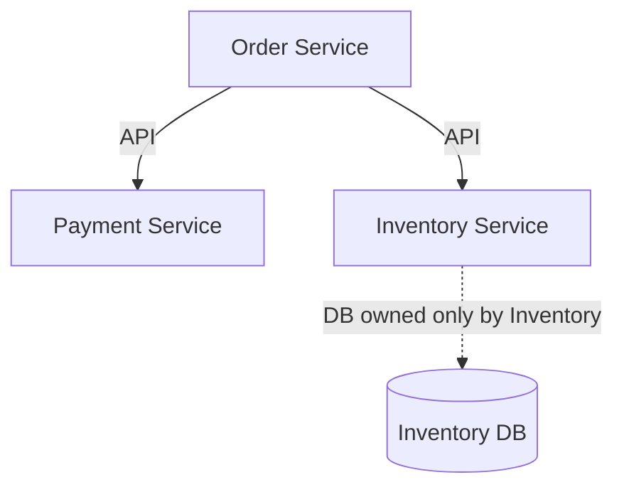

# System-Level Cohesion & Coupling

## Introduction
Developers are first taught **high cohesion** and **low coupling** at the **class level**.  
- **Cohesion**: A class should have a single, focused responsibility.  
- **Coupling**: Classes should depend on each other minimally.  

But in **large-scale systems**, these principles must be applied at higher levels:  
- **Modules** (packages, libraries).  
- **Components** (bounded contexts).  
- **Services** (microservices in distributed architectures).  

A highly cohesive and loosely coupled **system-level design** ensures that:  
- Teams can develop and deploy independently.  
- Changes remain localized.  
- The system scales with business and technical demands.  

---

## High Cohesion at the System Level
At the system level, **cohesion** means grouping related functionality within the same service/module.  
A cohesive service:  
- Encapsulates a **single domain responsibility**.  
- Owns its **data and logic**.  
- Minimizes overlap with other services.  

### Example: Order Service (Cohesive)
```java
@Service
public class OrderService {
    private final OrderRepository repository;
    private final PaymentClient paymentClient;

    public OrderService(OrderRepository repository, PaymentClient paymentClient) {
        this.repository = repository;
        this.paymentClient = paymentClient;
    }

    public void placeOrder(Order order) {
        repository.save(order);
        paymentClient.charge(order);
    }
}
```

✅ Order service manages orders only.  
❌ Does not handle unrelated domains like Inventory or Shipping.  

---

## Low Coupling at the System Level
At the system level, **low coupling** means services depend on each other through **stable contracts**, not internal details.  
- Dependencies are via APIs, not databases.  
- Failures in one service don’t cascade widely.  
- Services can evolve independently.  

### Example: Payment via Interface
```java
// Boundary contract
public interface PaymentClient {
    void charge(Order order);
}

// Stripe adapter
@Component
public class StripePaymentClient implements PaymentClient {
    public void charge(Order order) {
        // call Stripe API
    }
}
```

✅ OrderService depends on PaymentClient interface.  
✅ Stripe implementation can be swapped for Razorpay/PayPal.  

---

## Cohesion & Coupling in Monoliths vs Microservices

### In Monoliths
- Cohesion: Related domains grouped in modules/packages.  
- Coupling: Modules interact via interfaces, not shared state.  

### In Microservices
- Cohesion: Each service owns its **bounded context** (DDD).  
- Coupling: Services interact via APIs, not shared databases.  

### Bad Example (Tight Coupling)
- OrderService queries Inventory DB directly.  
- Schema change in Inventory breaks Orders.  

### Good Example (Loose Coupling)
- OrderService calls Inventory API.  
- Database schema hidden behind API boundary.  

---

## System-Level Cohesion & Coupling Metrics

### Signs of Low Cohesion
- A service has mixed responsibilities (e.g., Order + Shipping logic together).  
- Frequent cross-team ownership disputes.  

### Signs of Tight Coupling
- Services share a database.  
- Services have cyclic dependencies.  
- A small change in one service requires redeploying others.  

### Heuristics
- If a change requires edits in multiple services → **low cohesion**.  
- If a small change in one breaks others → **tight coupling**.  

---

## Real-World Case Studies

### 1. Amazon
- **High Cohesion**: “Order Service” manages only the order lifecycle.  
- **Low Coupling**: Communicates with Payment & Inventory via APIs.  
- **Result**: Independent scaling of services.  

### 2. Netflix
- **High Cohesion**: Each microservice focuses on a single concern (e.g., Recommendation, Catalog).  
- **Low Coupling**: Services communicate asynchronously via APIs and queues.  
- **Result**: Scales globally with minimal ripple effects.  

### 3. Uber
- Initially: tightly coupled monolith → “spaghetti code.”  
- Refactor: domain-driven microservices with APIs.  
- Improved deployment speed & failure isolation.  

---

## Common Pitfalls

1. **Shared Database Across Services**
   - Orders, Payments, and Inventory share one schema.  
   - Breaks cohesion (multiple domains mixed).  
   - Breaks coupling (schema change affects all).  

2. **God Services**
   - “Utility Service” doing logging, validation, notifications.  
   - Becomes bottleneck and point of failure.  

3. **Synchronous Over-Coupling**
   - Services chained via synchronous calls (Order → Payment → Inventory → Shipping).  
   - High latency and cascading failures.  

**Solution:** Introduce asynchronous communication (event-driven architecture).  

---

## Extended Java Case Study

### Scenario: Order & Inventory Services

**Bad Design (Coupling via Shared DB):**
```java
// OrderService directly queries Inventory table
public class OrderService {
    public boolean placeOrder(Order order) {
        int stock = jdbc.query("SELECT stock FROM inventory WHERE id=?", order.getId());
        if (stock > 0) { /* proceed */ }
        return false;
    }
}
```

❌ OrderService depends directly on Inventory DB schema.  
❌ Any schema change breaks OrderService.  

**Good Design (API Boundary):**
```java
// OrderService calls Inventory API
public class OrderService {
    private final InventoryClient client;

    public OrderService(InventoryClient client) {
        this.client = client;
    }

    public boolean placeOrder(Order order) {
        if (client.hasStock(order.getId())) { /* proceed */ }
        return false;
    }
}

// InventoryClient interface
public interface InventoryClient {
    boolean hasStock(String productId);
}

// Implementation (HTTP call)
public class HttpInventoryClient implements InventoryClient {
    public boolean hasStock(String productId) {
        // REST API call to Inventory service
        return true;
    }
}
```

✅ OrderService decoupled from Inventory DB schema.  
✅ Inventory evolves independently.  

---

## Interview Prep

### Q1: *What does high cohesion mean at the system level?*  
**Answer:** Each service/module owns one domain responsibility and encapsulates related data and logic.  

### Q2: *How do you achieve low coupling between services?*  
**Answer:** Use API contracts instead of direct DB access, avoid cyclic dependencies, and introduce asynchronous communication where possible.  

### Q3: *What happens when services share a database?*  
**Answer:** Tight coupling, schema fragility, loss of independence. One schema change can break multiple services.  

### Q4: *How do cohesion and coupling affect scalability?*  
**Answer:** High cohesion allows scaling the right services independently. Low coupling ensures scaling one service doesn’t require scaling others unnecessarily.  

### Q5: *Give a real-world example.*  
**Answer:** Amazon’s Order Service manages orders only (cohesion) and communicates with Payment via API (low coupling).  

---

## Visualizing Cohesion & Coupling


✅ Each service owns its data (high cohesion).  
✅ Communication via APIs (low coupling).  

---

## Key Takeaways
- **High Cohesion** → Each service/module should own one domain responsibility.  
- **Low Coupling** → Services interact via APIs, not shared DBs or internal details.  
- Together, they allow independent scaling, deployment, and evolution.  

---

## Next Lesson
Having mastered cohesion & coupling at the system level, we now turn to **Domain-Driven Design Principles (DDD Lite)** — modeling complex domains using bounded contexts and ubiquitous language.  

[Continue to DDD Principles →](/interview-section/architectural-design-principles/ddd-principles)

---

<footer>
  <p>Connect: <a href="https://www.linkedin.com/in/ravi-shankar-a725b0225/">LinkedIn</a></p>
  <p>&copy; 2025 Official CTO. All rights reserved.</p>
</footer>
