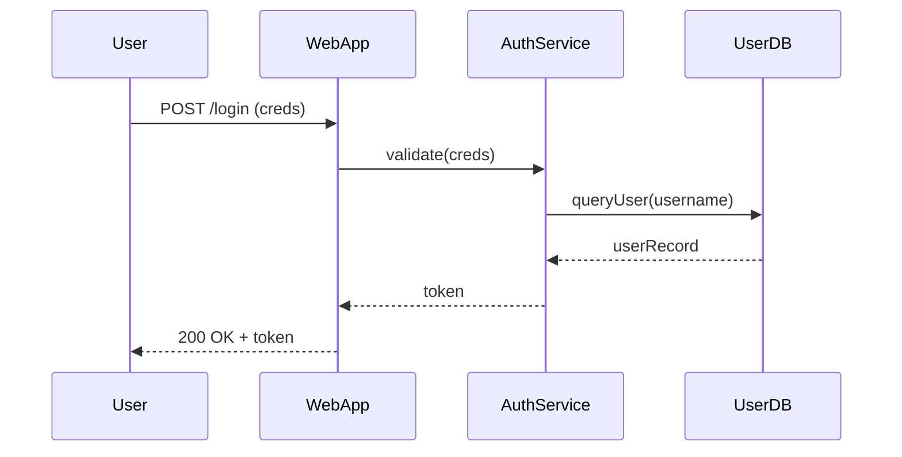

# Sequence Diagrams — Object Interactions Over Time

This article explains **sequence diagrams** (UML) — a visual tool that shows how objects interact in a system **over time**. Sequence diagrams are essential for modeling scenarios in system design, documenting flows, and explaining behavior in interviews.


## Why use sequence diagrams
- **Clarify dynamic behavior**: Show message flows, timing, and interactions between components.
- **Design & document**: Communicate step-by-step interactions for features (e.g., login, payment flow).
- **Interview-friendly**: Use them to explain request flows, concurrency, and failure handling.


## Core elements and notation
- **Lifeline**: A vertical dashed line under each participant (object, actor, system). Represents the object's existence over time.
- **Actor / Participant**: Named boxes at the top (e.g., `User`, `WebServer`, `AuthService`).
- **Activation (Execution) bar**: Narrow rectangle on a lifeline showing when an object is active/processing.
- **Messages**:
  - **Synchronous call** — solid line with filled arrow (e.g., `request()`), caller waits for a response.
  - **Asynchronous call** — solid line with open arrow or stick arrow (e.g., `publishEvent()`), no immediate response required.
  - **Return** — dashed line with open arrow showing returned data or acknowledgment (often optional on diagrams).
- **Notes**: Annotate decisions, constraints, or clarifications.
- **Fragments / Combined Fragments**: Show control flow constructs — `alt` (alternatives), `opt` (optional), `loop` (repetition), `par` (parallel), `neg`, `assert`.


## Common combined fragments
- `alt` — alternative flows (if/else). Each section shows a guard condition (e.g., `[authenticated]`).
- `opt` — optional behavior (equivalent to a single-branch `if`).
- `loop` — repetition with an iteration condition (e.g., `loop [for each item]`).
- `par` — parallel interactions (concurrent messages).


## Typical scenarios (examples)

### 1) Simple Login Flow (synchronous)
Participants: `User`, `WebApp`, `AuthService`, `UserDB`

Flow (high-level):
1. `User` → `WebApp` : `POST /login` (credentials)
2. `WebApp` → `AuthService` : `validate(credentials)`
3. `AuthService` → `UserDB` : `queryUser(username)`
4. `UserDB` → `AuthService` : `userRecord`
5. `AuthService` → `WebApp` : `token` (on success)
6. `WebApp` → `User` : `200 OK + token`

### 2) Event-driven Upload (async + callback)
Participants: `Client`, `API Gateway`, `StorageService`, `Worker`, `NotificationService`

Flow:
- `Client` → `API Gateway` : `POST /upload` (presigned URL request)
- `API Gateway` → `StorageService` : `createPresignedUrl()`
- `StorageService` → `API Gateway` : `url`
- `Client`` uploads directly to `StorageService` using `url` (async)
- `StorageService` → `Worker` : `objectCreated` (event)
- `Worker` processes object and → `NotificationService` : `notify(user)`


## Interview tips — how to use sequence diagrams
- **Start high-level**: Draw participants and lifelines first. Label them clearly.
- **Show the happy path first**, then add alternative/exception flows (`alt` fragment).
- **Annotate time-critical sections** (e.g., synchronous blocking calls vs async events).
- **Call out failure and retry behavior** (use notes or separate fragments), e.g., `retry with exponential backoff`.
- **Keep diagrams focused**: One scenario per diagram — don’t cram entire system into a single sequence diagram.


## Notation examples (Mermaid + PlantUML)

### Mermaid (useful in Markdown)



### PlantUML (richer UML features)
<!-- TODO:// use plantuml later-->
```txt
@startuml
actor User
participant WebApp
participant AuthService
database UserDB

User -> WebApp: POST /login
activate WebApp
WebApp -> AuthService: validate(credentials)
activate AuthService
AuthService -> UserDB: queryUser(username)
UserDB --> AuthService: userRecord
AuthService --> WebApp: token
deactivate AuthService
WebApp --> User: 200 OK + token
deactivate WebApp
@enduml
```


## Common mistakes to avoid
- **Too many participants** — makes the diagram hard to read.
- **Mixing multiple scenarios** — keep happy path and error handling separate (or use `alt`).
- **Forgetting async semantics** — show whether caller waits or not.
- **No guards on `alt` fragments** — always label conditions.


## Advanced topics (brief)
- **Timing constraints**: UML allows `duration` and `timing` annotations for real-time systems.
- **Sequence diagram for concurrency**: use `par` fragments or swimlanes to indicate parallel execution.
- **Reference to other diagrams**: use `ref` or notes to point to class diagrams or component diagrams.


## Quick checklist for interviews
- Draw participants and lifelines first.
- Show message direction and synchronous/asynchronous calls.
- Add `alt`/`opt` fragments for branching or exceptions.
- Annotate important constraints (timeouts, retries).
- Explain the diagram verbally — that’s often worth more than aesthetic detail.


## Further reading
- *UML Distilled* by Martin Fowler
- Mermaid docs (sequence diagrams)
- PlantUML documentation
- Examples of sequence diagrams in architecture docs (Google/Netflix engineering blogs)

<footer>
  <p>Connect: <a href="https://www.linkedin.com/in/ravi-shankar-a725b0225/">LinkedIn</a></p>
  <p>&copy; 2025 Official CTO. All rights reserved.</p>
</footer>

