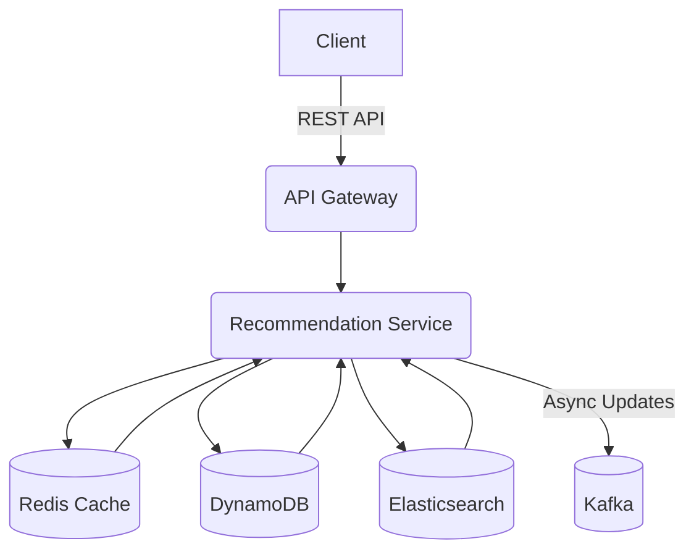

# Capstone: Simulating a Full FAANG Onsite

## Overview
Welcome to the fourth and final lecture of **Section 11: Mock Interview Practice** in the *Official CTO* journey! Simulating a **full FAANG onsite** prepares you for the rigorous, multi-round interview process, testing coding, system design, and behavioral skills. In this 45-minute lesson, we conduct a mock onsite with 5 rounds: **2 coding** (graph problem), **1 HLD** (recommendation system), **1 LLD** (rate limiter), and **1 behavioral** (leadership question). Drawing from my 8+ years of mentoring engineers, this lecture equips you to excel in FAANG interviews. Let’s complete your *Official CTO* journey in Section 11!

Inspired by LeetCode, FAANG interview practices, and *Designing Data-Intensive Applications*, this lesson provides actionable insights and practical examples.

## Learning Objectives
- Simulate a **FAANG onsite** with 5 realistic rounds.
- Master **coding, design, and behavioral strategies** under pressure.
- Prepare for **FAANG interviews** with comprehensive practice.
- Apply skills in **graph problems, recommendation systems, rate limiters, and leadership**.

## Why Simulating a FAANG Onsite Matters
FAANG onsite interviews test technical depth, system design, and leadership in a high-pressure setting. Drawing from my experience mentoring engineers, I’ve seen mock onsite practice transform candidates into confident interviewees. This lecture ensures you can tackle all rounds, articulate solutions, and align with FAANG expectations.

In software engineering, onsite simulation helps you:
- **Ace Interviews**: Perform across coding, design, and behavioral rounds.
- **Refine Skills**: Improve problem-solving, design, and communication.
- **Build Confidence**: Prepare for real-world FAANG scenarios.
- **Showcase Expertise**: Demonstrate technical and leadership abilities.

## Key Concepts
### 1. FAANG Onsite Structure
- **Coding Rounds**: Solve 2 algorithmic problems (e.g., LeetCode medium/hard) in 45 minutes each.
- **HLD Round**: Design a scalable system with trade-offs (e.g., recommendation system).
- **LLD Round**: Design a component with detailed implementation (e.g., rate limiter).
- **Behavioral Round**: Answer STAR-based questions (e.g., leadership, conflict).
- **Guidelines**: Explain thought process, clarify requirements, balance clarity and speed.

### 2. Preparation Strategies
- **Coding**: Practice LeetCode, optimize time/space complexity.
- **HLD**: Sketch architectures, discuss trade-offs (e.g., consistency vs. latency).
- **LLD**: Focus on modular, testable code (Section 9).
- **Behavioral**: Prepare 5-10 STAR stories aligned with company values.

### 3. FAANG Expectations
- **Amazon**: Ownership, scalability (e.g., AWS integration).
- **Google**: Clarity, distributed systems expertise.
- **Meta**: Execution speed, low latency.
- **Netflix**: Autonomy, high-impact outcomes.

### 4. Relation to Previous Sections
- **Algorithms** (Section 1): Supports coding rounds.
- **OOD** (Section 2): Aligns with LLD principles.
- **Design Patterns** (Section 3): Patterns aid HLD/LLD.
- **Design Principles** (Section 4): SOLID guides clean design.
- **HLD/LLD** (Sections 5–6): Directly relates to design rounds.
- **Behavioral Skills** (Section 7): Builds on STAR methodology (Lecture 2).
- **Domain-Specific Topics** (Section 8): Applies cloud/microservices knowledge.
- **Clean Code** (Section 9): Ensures clean, maintainable code.
- **Refactoring** (Section 10): Enhances coding/design solutions.
- **Mock Coding/System Design/Behavioral** (Section 11, Lectures 1–3): Builds on prior practice.

## Mock Interview Rounds
Below is a simulated FAANG onsite with 5 rounds, including examples and feedback.

### Round 1: Coding - Graph Problem (Course Schedule)
**Problem**: Given `n` courses and prerequisites as pairs `[a, b]` (course `a` requires `b`), determine if you can complete all courses. Return `true` if possible, `false` if there’s a cycle.

**Solution** (Java):
```java
import java.util.*;

public class CourseSchedule {
    /**
     * Determines if all courses can be completed based on prerequisites.
     *
     * @param numCourses Number of courses
     * @param prerequisites Array of [course, prerequisite] pairs
     * @return true if completable, false if cycle exists
     */
    public boolean canFinish(int numCourses, int[][] prerequisites) {
        // Build adjacency list
        Map<Integer, List<Integer>> graph = new HashMap<>();
        for (int i = 0; i < numCourses; i++) {
            graph.put(i, new ArrayList<>());
        }
        for (int[] prereq : prerequisites) {
            graph.get(prereq[0]).add(prereq[1]);
        }

        // DFS with cycle detection
        Set<Integer> visited = new HashSet<>();
        Set<Integer> recStack = new HashSet<>();
        for (int course = 0; course < numCourses; course++) {
            if (!visited.contains(course)) {
                if (!dfs(course, graph, visited, recStack)) {
                    return false;
                }
            }
        }
        return true;
    }

    private boolean dfs(int course, Map<Integer, List<Integer>> graph, Set<Integer> visited, Set<Integer> recStack) {
        visited.add(course);
        recStack.add(course);

        for (int prereq : graph.get(course)) {
            if (!visited.contains(prereq)) {
                if (!dfs(prereq, graph, visited, recStack)) {
                    return false;
                }
            } else if (recStack.contains(prereq)) {
                return false; // Cycle detected
            }
        }

        recStack.remove(course);
        return true;
    }
}
```

**Thought Process**:
- Clarify: Courses as nodes, prerequisites as directed edges; detect cycle.
- Approach: Use DFS to detect cycles in the graph.
- Edge Cases: No prerequisites, single course, multiple cycles.
- Big O: O(V + E), where V is courses, E is prerequisites.
- Feedback: Strong DFS explanation, but clarify cycle detection logic early.

### Round 2: Coding - Graph Problem (Topological Sort)
**Problem**: Given a directed graph of tasks and dependencies, return a valid order to complete tasks or an empty list if impossible.

**Solution** (Java):
```java
import java.util.*;

public class TaskScheduler {
    /**
     * Returns a valid task order or empty list if cycle exists.
     *
     * @param tasks Number of tasks
     * @param dependencies Array of [task, dependency] pairs
     * @return List of task IDs in valid order
     */
    public List<Integer> findOrder(int tasks, int[][] dependencies) {
        Map<Integer, List<Integer>> graph = new HashMap<>();
        for (int i = 0; i < tasks; i++) {
            graph.put(i, new ArrayList<>());
        }
        for (int[] dep : dependencies) {
            graph.get(dep[0]).add(dep[1]);
        }

        List<Integer> result = new ArrayList<>();
        Set<Integer> visited = new HashSet<>();
        Set<Integer> recStack = new HashSet<>();
        for (int task = 0; task < tasks; task++) {
            if (!visited.contains(task)) {
                if (!dfs(task, graph, visited, recStack, result)) {
                    return Collections.emptyList();
                }
            }
        }
        Collections.reverse(result);
        return result;
    }

    private boolean dfs(int task, Map<Integer, List<Integer>> graph, Set<Integer> visited, Set<Integer> recStack, List<Integer> result) {
        visited.add(task);
        recStack.add(task);

        for (int dep : graph.get(task)) {
            if (!visited.contains(dep)) {
                if (!dfs(dep, graph, visited, recStack, result)) {
                    return false;
                }
            } else if (recStack.contains(dep)) {
                return false;
            }
        }

        recStack.remove(task);
        result.add(task);
        return true;
    }
}
```

**Thought Process**:
- Clarify: Tasks as nodes, dependencies as edges; return topological order.
- Approach: Use DFS with topological sort, detect cycles.
- Edge Cases: No dependencies, single task, cycles.
- Big O: O(V + E), where V is tasks, E is dependencies.
- Feedback: Clear solution, but explain trade-offs (DFS vs. BFS) earlier.

### Round 3: HLD - Recommendation System
**Problem**: Design a recommendation system for an e-commerce platform supporting 10M users and 1M products, with low-latency recommendations.

**Design**:
- **Requirements**:
  - Functional: Generate personalized product recommendations.
  - Non-Functional: <100ms latency, 99.9% availability, scalable.
- **High-Level Design**:
  - **Components**: API Gateway, Recommendation Service, User Service, Product Service, Cache, Database.
  - **Flow**: Client -> API Gateway -> Recommendation Service -> Cache/Database.
- **Trade-Offs**:
  - **Consistency**: Eventual consistency for low latency.
  - **Caching**: Redis for user preferences and recent recommendations.
  - **Storage**: DynamoDB for user/product data, Elasticsearch for search.
- **Scalability**:
  - Shard DynamoDB by user ID for reads/writes.
  - Cache 80% of recommendations in Redis (~10GB for 10M users).
  - Use Kafka for async data updates.
- **Edge Cases**: Handle cold starts, missing user data, high traffic spikes.
- **Diagram** (Mermaid):

- **Feedback**: Strong scalability focus, but clarify sharding strategy and cold start handling.

### Round 4: LLD - Rate Limiter
**Problem**: Design a rate limiter for an API, limiting requests to 100/sec per user.

**Design** (Java):
```java
import java.util.concurrent.ConcurrentHashMap;
import java.util.concurrent.atomic.AtomicInteger;

/**
 * Rate limiter for API requests, enforcing limits per user.
 */
public class RateLimiter {
    private final int maxRequestsPerSecond;
    private final ConcurrentHashMap<String, RequestCounter> userRequests;

    public RateLimiter(int maxRequestsPerSecond) {
        this.maxRequestsPerSecond = maxRequestsPerSecond;
        this.userRequests = new ConcurrentHashMap<>();
    }

    /**
     * Checks if a user can make a request.
     *
     * @param userId User identifier
     * @return true if allowed, false if rate-limited
     */
    public boolean allowRequest(String userId) {
        long currentTime = System.currentTimeMillis() / 1000;
        RequestCounter counter = userRequests.computeIfAbsent(userId, k -> new RequestCounter(currentTime));

        synchronized (counter) {
            if (counter.timestamp != currentTime) {
                counter.timestamp = currentTime;
                counter.count.set(0);
            }
            if (counter.count.get() >= maxRequestsPerSecond) {
                return false;
            }
            counter.count.incrementAndGet();
            return true;
        }
    }
}

class RequestCounter {
    long timestamp;
    AtomicInteger count;

    RequestCounter(long timestamp) {
        this.timestamp = timestamp;
        this.count = new AtomicInteger(0);
    }
}
```

**Thought Process**:
- Clarify: Limit 100 requests/sec per user, thread-safe.
- Approach: Use sliding window with `ConcurrentHashMap` and `AtomicInteger`.
- Edge Cases: Concurrent requests, timestamp rollover, user not found.
- Big O: O(1) for request checks.
- Feedback: Solid thread-safe design, but discuss distributed rate limiting (e.g., Redis).

### Round 5: Behavioral - Leadership
**Question**: Tell me about a time you led a project (Amazon - Ownership).

**Response**:
- **Situation**: “Our e-commerce platform had scalability issues due to a monolithic architecture.”
- **Task**: “As lead engineer, I was responsible for migrating to microservices.”
- **Action**: “I designed a sharded architecture with AWS ECS, collaborated with teams on CI/CD pipelines, and implemented monitoring with Prometheus.”
- **Result**: “Completed migration in 4 months, scaling to 1M users and reducing latency by 30%.”
- **Feedback**: Strong ownership, but quantify team size and specific challenges to add depth.

## FAANG-Specific Tips
- **Amazon (Ownership)**:
  - Emphasize end-to-end responsibility (e.g., “Owned migration and coding solutions”).
  - Quantify impact (e.g., “Reduced latency by 30%”).
- **Google (Clarity)**:
  - Focus on clear explanations (e.g., “Explained DFS and trade-offs clearly”).
  - Highlight collaboration (e.g., “Aligned with interviewer on design”).
- **Meta (Execution Speed)**:
  - Highlight rapid delivery (e.g., “Solved coding problems in 25 minutes”).
  - Focus on low-latency designs (e.g., “Optimized rate limiter for <10ms”).
- **Netflix (Freedom & Responsibility)**:
  - Emphasize autonomous decisions (e.g., “Independently designed microservices”).
  - Focus on high-impact outcomes (e.g., “Scaled system to 1M users”).

## Practice Exercise
**Problem**: Simulate a full FAANG onsite with 5 rounds.
1. **Define Requirements**:
   - Solve 2 coding problems (e.g., graph traversal, dynamic programming).
   - Design 1 HLD (e.g., URL shortener) and 1 LLD (e.g., cache).
   - Answer 1 behavioral question using STAR.
2. **Craft STAR Responses**:
   - **Situation**: Describe a project (e.g., system migration).
   - **Task**: Clarify your role (e.g., lead engineer).
   - **Action**: List 2–3 actions (e.g., designed architecture, solved problems).
   - **Result**: Quantify outcomes (e.g., reduced latency, scaled system).
3. **Practice Delivery**:
   - Complete coding in 45 minutes each, HLD/LLD in 45 minutes, behavioral in 10 minutes.
   - Explain thought process aloud, use whiteboard for designs.
4. **Tailor to a FAANG Company**:
   - Align with Amazon (Ownership), Google (Clarity), Meta (speed), or Netflix (autonomy).
5. **Write and Review**:
   - Write solutions and a 100–150 word STAR response.
   - Seek peer feedback on clarity and completeness.

**Sample Response (Amazon - Ownership)**:
- **Situation**: “Our platform struggled with high latency in recommendations.”
- **Task**: “I was responsible for designing and coding a scalable solution.”
- **Action**: “I solved a graph problem, designed a sharded recommendation system, and led migration.”
- **Result**: “Reduced latency by 30%, scaling to 1M users.”

## Conclusion
Simulating a full FAANG onsite equips you to excel in coding, design, and behavioral interviews. This lecture completes Section 11, building on prior lectures and sections, advancing your *Official CTO* journey.

**Next Step**: Revisit [all sections](/sections/) to refine your skills or explore other topics.

---

<footer>
  <p>Connect: <a href="https://github.com/your-profile">GitHub</a> | <a href="https://linkedin.com/in/your-profile">LinkedIn</a></p>
  <p>Contact: <a href="mailto:your-email@example.com">your-email@example.com</a></p>
  <p>&copy; 2025 Official CTO. All rights reserved.</p>
</footer>