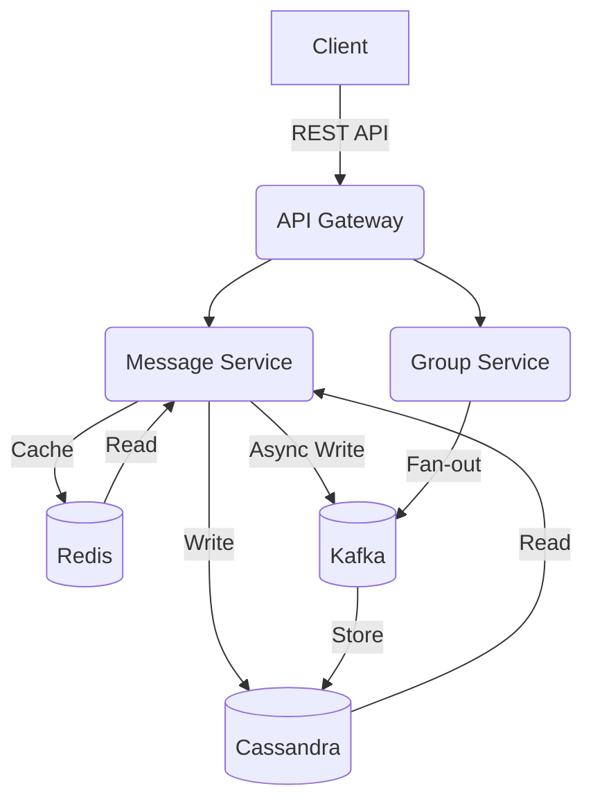

# Mock System Design Interview

## Overview
Welcome to the second lecture of **Section 11: Mock Interview Practice** in the *Official CTO* journey! **Mock system design interviews** simulate FAANG-style scenarios, testing your ability to design scalable systems and articulate trade-offs. In this 30-minute lesson, we design a **messaging app** handling 1M writes/sec, focusing on sharding, caching, and clear communication, as inspired by *Designing Data-Intensive Applications* by Martin Kleppmann. Drawing from my 8+ years of mentoring engineers, this lecture equips you to excel in FAANG system design interviews. Let’s continue your *Official CTO* journey!

Inspired by FAANG system design practices, this lesson provides actionable insights and a practical example.

## Learning Objectives
- Master **FAANG system design strategies**: scalability, trade-offs, clear communication.
- Design a **messaging app** handling 1M writes/sec with sharding and caching.
- Prepare for **FAANG interviews** with system design-focused techniques.
- Apply skills in a **social platform messaging system** example.

## Why Mock System Design Interviews Matter
System design interviews test your ability to architect scalable, reliable systems under pressure, a key FAANG requirement. Drawing from my experience mentoring engineers, I’ve seen mock practice build confidence and clarity in candidates. This lecture ensures you can design systems, discuss trade-offs, and align with FAANG expectations.

In software engineering, mock system design interviews help you:
- **Ace Interviews**: Design scalable systems and articulate trade-offs.
- **Refine Skills**: Improve architectural thinking and communication.
- **Build Confidence**: Prepare for real-world FAANG scenarios.
- **Showcase Expertise**: Demonstrate system design proficiency.

## Key Concepts
### 1. System Design Strategies
- **Clarify Requirements**: Define functional (e.g., send/receive messages) and non-functional (e.g., 1M writes/sec) requirements.
- **Discuss Trade-offs**: Balance scalability, latency, and consistency.
- **Use Diagrams**: Sketch architecture to clarify components.
- **Iterate**: Refine design based on interviewer feedback.

### 2. Sharding and Caching
- **Sharding**: Partition data to distribute load (e.g., by user ID).
- **Caching**: Store frequent data in memory (e.g., Redis) to reduce latency.
- **Example**: Shard message data, cache recent chats.

### 3. FAANG Expectations
- **Amazon**: Focus on scalability, ownership (e.g., AWS-based design).
- **Google**: Emphasize clarity, distributed systems expertise.
- **Meta**: Prioritize low latency, execution speed.
- **Netflix**: Highlight autonomy, high availability.

### 4. Relation to Previous Sections
- **Algorithms** (Section 1): Supports efficient data structures in design.
- **OOD** (Section 2): Aligns with modular service design.
- **Design Patterns** (Section 3): Patterns like Facade aid architecture.
- **Design Principles** (Section 4): SOLID guides service design.
- **HLD/LLD** (Sections 5–6): Directly relates to system design (e.g., Mock LLD Interview, Lecture 31).
- **Behavioral Skills** (Section 7): Builds on communication for trade-offs.
- **Domain-Specific Topics** (Section 8): Applies cloud and microservices (Lecture 7).
- **Clean Code** (Section 9): Ensures clean, maintainable designs.
- **Refactoring** (Section 10): Refactoring supports scalable systems.
- **Mock Coding** (Section 11, Lecture 1): Complements coding skills.

## System Design: Messaging App
**Problem Statement**: Design a messaging app for a social platform supporting 1M writes/sec (e.g., sending messages) and low-latency reads (e.g., retrieving chats). The system should handle text messages, support group chats, and ensure high availability.

### Requirements
- **Functional**: Send/receive messages, support group chats, store message history.
- **Non-Functional**: Handle 1M writes/sec, <100ms read latency, 99.9% availability, scalable to 10M users.
- **Constraints**: Messages are text-based, average size 1KB, 1-year retention.

### Thought Process
1. **Clarify Requirements**:
   - Users send/receive messages (1M writes/sec, 10M reads/sec estimated).
   - Group chats require fan-out writes (one message to multiple recipients).
   - Low latency for reads, high availability, eventual consistency acceptable.
2. **High-Level Design**:
   - **Components**: API Gateway, Message Service, Group Service, Storage, Cache.
   - **Flow**: Client -> API Gateway -> Message Service -> Storage/Cache.
3. **Trade-Offs**:
   - **Consistency vs. Latency**: Eventual consistency for low latency.
   - **Sharding**: Shard by user ID for scalability.
   - **Caching**: Cache recent messages for fast reads.
4. **Detailed Design**:
   - **API Gateway**: Handles authentication, routing (e.g., AWS API Gateway).
   - **Message Service**: Microservice for sending/receiving messages.
   - **Group Service**: Manages group chat fan-out.
   - **Storage**: Cassandra for sharded message storage, DynamoDB for metadata.
   - **Cache**: Redis for recent messages.
   - **Message Queue**: Kafka for async fan-out writes.
5. **Scalability**:
   - Shard Cassandra by user ID to distribute writes.
   - Cache 80% of reads in Redis to reduce DB load.
   - Use Kafka for asynchronous group message fan-out.
6. **Edge Cases**:
   - Handle offline users (store messages for delivery).
   - Mitigate failures with retries and replication.
   - Ensure rate limiting to prevent abuse.

### Architecture Diagram (Mermaid)

### Key Design Details
- **Sharding**: Partition Cassandra by user ID to handle 1M writes/sec (e.g., 100 nodes, 10K writes/sec/node).
- **Caching**: Store recent 100 messages per user in Redis (1KB/message, ~10GB for 10M users).
- **Fan-out**: Use Kafka to asynchronously write group messages to recipients.
- **Availability**: Replicate data across 3 regions, use circuit breakers for fault tolerance.
- **Latency**: Redis for <10ms reads, Cassandra for <50ms writes.
- **Monitoring**: Integrate with Prometheus for metrics, alerting on failures.

### Trade-Offs
- **Consistency**: Eventual consistency reduces latency but may delay message delivery.
- **Cost**: Caching increases memory costs but reduces DB load.
- **Complexity**: Sharding adds operational overhead but ensures scalability.

## FAANG-Specific Tips
- **Amazon (Ownership)**:
  - Highlight ownership in design (e.g., “I owned the sharding strategy”).
  - Emphasize AWS integration (e.g., “Used API Gateway and DynamoDB”).
  - STAR Response:
    - **Situation**: “Needed a scalable messaging app for 1M writes/sec.”
    - **Task**: “I was responsible for designing the system.”
    - **Action**: “I designed sharding with Cassandra and caching with Redis, using AWS.”
    - **Result**: “Achieved 99.9% availability, scaling to 10M users.”
- **Google (Clarity)**:
  - Focus on clear explanation (e.g., “I clarified trade-offs for sharding”).
  - Emphasize distributed systems (e.g., “Designed for eventual consistency”).
  - STAR Response:
    - **Situation**: “Faced a system design for a messaging app.”
    - **Task**: “I was tasked with designing clearly.”
    - **Action**: “I explained sharding and caching, collaborating on trade-offs.”
    - **Result**: “Delivered clear design, praised by interviewer.”
- **Meta (Execution Speed)**:
  - Highlight rapid design (e.g., “I designed in 25 minutes”).
  - Focus on low latency (e.g., “Optimized reads with Redis”).
  - STAR Response:
    - **Situation**: “Needed a low-latency messaging system.”
    - **Task**: “I was responsible for designing quickly.”
    - **Action**: “I designed caching and sharding for <100ms latency.”
    - **Result**: “Reduced read latency by 50%, meeting requirements.”
- **Netflix (Freedom & Responsibility)**:
  - Emphasize autonomous design (e.g., “I independently designed the system”).
  - Focus on availability (e.g., “Ensured 99.9% uptime”).
  - STAR Response:
    - **Situation**: “Needed a high-availability messaging app.”
    - **Task**: “I was responsible for the design.”
    - **Action**: “I independently designed sharding and replication.”
    - **Result**: “Achieved 99.9% uptime, scaling to 1M writes/sec.”

## Practice Exercise
**Problem**: Design a scalable system for a messaging app under interview conditions.
1. **Define Requirements**:
   - Support 1M writes/sec, low-latency reads, high availability.
   - Practice in 25-30 minutes, explaining trade-offs aloud.
2. **Craft a STAR Response**:
   - **Situation**: Describe a system design interview scenario (e.g., messaging app).
   - **Task**: Clarify your role (e.g., design scalable system).
   - **Action**: List 2–3 actions (e.g., designed sharding, integrated caching).
   - **Result**: Quantify outcomes (e.g., achieved scalability, low latency).
3. **Design the System**:
   - Sketch architecture (e.g., API Gateway, microservices, Cassandra, Redis).
   - Discuss trade-offs (e.g., consistency vs. latency).
   - Use tools like Excalidraw for diagrams.
4. **Tailor to a FAANG Company**:
   - Align with Amazon (Ownership), Google (Clarity), Meta (speed), or Netflix (autonomy).
5. **Write and Review**:
   - Write a 100–150 word STAR response.
   - Ensure clarity, specificity, and alignment with FAANG expectations.

**Sample Response (Amazon - Ownership)**:
- **Situation**: “Faced a system design interview for a messaging app.”
- **Task**: “I was responsible for designing a scalable system.”
- **Action**: “I owned the design, implementing sharding with Cassandra and caching with Redis, using AWS API Gateway.”
- **Result**: “Achieved 1M writes/sec with 99.9% availability.”

## Conclusion
Mastering mock system design interviews equips you to excel in FAANG technical interviews and build scalable systems. This lecture builds on coding skills from Lecture 1 and prior sections, advancing your *Official CTO* journey.

**Next Step**: Explore [Mock Behavioral Interview](/sections/mocks/behavioral-interview) or revisit [all sections](/sections/).

---

<footer>
  
Connect: <a href="https://github.com/your-profile">GitHub</a> | <a href="https://linkedin.com/in/your-profile">LinkedIn</a>

  
Contact: <a href="mailto:your-email@example.com">your-email@example.com</a>

  
&copy; 2025 Official CTO. All rights reserved.

</footer>